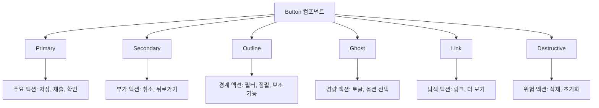

# **📌 PM PRD - 버튼 컴포넌트 (Button)**

## **1. 개요**
버튼 컴포넌트는 사용자 인터랙션을 위한 가장 기본적이고 중요한 UI 요소로, 게임 서비스 관리 도구 전반에 걸쳐 다양한 액션을 트리거하는 데 사용됩니다. 일관된 사용자 경험을 제공하면서도 다양한 상황과 문맥에 맞게 적응할 수 있는 유연한 디자인을 갖추고 있습니다. 이 컴포넌트는 ShadCN UI를 기반으로 하여 접근성과 사용자 경험을
최적화하도록 구현되었습니다.

## **2. 주요 목표**
- 사용자가 쉽게 인식하고 상호작용할 수 있는 직관적인 디자인 제공
- 다양한 상황과 중요도에 맞는 시각적 변형 지원
- 모든 사용자를 위한 접근성 고려
- 일관된 사용자 경험을 위한 표준화된 버튼 패턴 확립
- 다양한 디바이스와 화면 크기에서의 최적화된 경험 제공

## **3. 주요 기능 요구사항**
| 기능 | 우선순위 | 설명 |
|------|---------|------|
| 다양한 변형 | 상 | 기본, 윤곽선, 고스트, 링크, 위험 등 다양한 스타일 변형 |
| 크기 옵션 | 상 | sm, md, lg, icon 등 여러 크기 지원 |
| 상태 표시 | 상 | 기본, 호버, 활성, 비활성, 로딩 등 다양한 상태 시각화 |
| 아이콘 통합 | 중 | 텍스트와 함께 또는 단독으로 아이콘 표시 가능 |
| 로딩 상태 | 중 | 비동기 작업 중 로딩 상태 표시 |
| 키보드 접근성 | 중 | 키보드를 통한 탐색 및 활성화 지원 |
| 커스텀 스타일링 | 중 | 프로젝트 테마에 맞는 커스터마이징 옵션 |

## **4. 사용자 시나리오**
1. **기본 액션 트리거**: 폼 제출, 다이얼로그 열기/닫기, 데이터 저장 등
   - 명확한 레이블과 시각적 디자인으로 중요 액션 표시
   - 로딩 상태를 통해 비동기 작업 진행 상황 전달
2. **중요 결정 촉구**: 데이터 삭제, 중요 설정 변경 등
   - 위험 액션에는 빨간색 강조 버튼 사용
   - 되돌릴 수 없는 작업에 대한 시각적 경고 제공
3. **UI 탐색**: 페이지 이동, 다음/이전 단계 등
   - 방향성이 있는 액션에 적절한 아이콘 결합
   - 현재 상태에 따른 비활성화 처리
4. **보조 액션**: 필터링, 정렬, 보기 전환 등
   - 주요 액션과 구분되는 시각적 디자인
   - 작은 크기나 아이콘 버튼으로 효율적인 공간 활용

## **5. 구현 현황**
| 기능 | 구현 상태 | 비고 |
|------|----------|------|
| 기본 버튼 | ✅ 완료 | 모든 기본 기능 구현 완료 |
| 변형 스타일 | ✅ 완료 | 기본, 윤곽선, 고스트, 링크, 위험 등 |
| 크기 변형 | ✅ 완료 | sm, md, lg, icon 크기 지원 |
| 비활성화 상태 | ✅ 완료 | 시각적 피드백 및 상호작용 방지 |
| 로딩 상태 | ✅ 완료 | 스피너 애니메이션 및 텍스트 변경 |
| 아이콘 통합 | ✅ 완료 | 시작, 끝, 단독 아이콘 지원 |
| 접근성 개선 | ⚠️ 부분 구현 | 추가 ARIA 속성 개선 진행 중 |

---

# **📌 Design PRD - 버튼 컴포넌트 (Button)**

## **1. 디자인 컨셉**
- **명확성**: 사용자가 즉시 버튼임을 인식하고 그 목적을 이해할 수 있는 디자인
- **일관성**: 전체 UI에서 일관된 모양과 동작으로 예측 가능한 경험 제공
- **계층성**: 중요도와 목적에 따라 시각적으로 구분되는 변형
- **피드백**: 상호작용 시 명확한 시각적 피드백 제공
- **접근성**: 다양한 사용자와 입력 방식을 고려한 설계

## **2. 버튼 변형 및 용도**



## **3. 색상 및 스타일 가이드**
- **기본(Primary) 버튼**:
  - 배경: 보라색(bg-purple-600)
  - 텍스트: 흰색(text-white)
  - 호버: 진한 보라색(hover:bg-purple-700)
  - 활성: 더 진한 보라색(active:bg-purple-800)
  
- **보조(Secondary) 버튼**:
  - 배경: 회색(bg-gray-200)
  - 텍스트: 어두운 회색(text-gray-700)
  - 호버: 약간 더 진한 회색(hover:bg-gray-300)
  - 활성: 더 진한 회색(active:bg-gray-400)
  
- **윤곽선(Outline) 버튼**:
  - 배경: 투명(bg-transparent)
  - 테두리: 회색(border border-gray-300)
  - 텍스트: 어두운 회색(text-gray-700)
  - 호버: 연한 회색 배경(hover:bg-gray-100)
  
- **고스트(Ghost) 버튼**:
  - 배경: 투명(bg-transparent)
  - 텍스트: 어두운 회색(text-gray-700)
  - 호버: 연한 회색 배경(hover:bg-gray-100)
  - 테두리: 없음
  
- **링크(Link) 버튼**:
  - 배경: 투명(bg-transparent)
  - 텍스트: 보라색(text-purple-600)
  - 호버: 밑줄(hover:underline)
  - 테두리: 없음
  
- **위험(Destructive) 버튼**:
  - 배경: 빨간색(bg-red-600)
  - 텍스트: 흰색(text-white)
  - 호버: 진한 빨간색(hover:bg-red-700)
  - 활성: 더 진한 빨간색(active:bg-red-800)
  
- **비활성화 상태**:
  - 배경: 연한 회색(bg-gray-100)
  - 텍스트: 회색(text-gray-400)
  - 커서: 금지(cursor-not-allowed)
  - 투명도: 약간 투명(opacity-70)

## **4. 크기 변형**
- **작은(sm) 버튼**:
  - 높이: 32px(h-8)
  - 패딩: 좌우 12px(px-3)
  - 글꼴 크기: 작음(text-sm)
  - 사용: 좁은 공간, 보조 액션, 인라인 배치
  
- **중간(md, 기본) 버튼**:
  - 높이: 40px(h-10)
  - 패딩: 좌우 16px(px-4)
  - 글꼴 크기: 기본(text-base)
  - 사용: 일반적인 액션, 폼 제출, 대화상자 버튼
  
- **큰(lg) 버튼**:
  - 높이: 48px(h-12)
  - 패딩: 좌우 20px(px-5)
  - 글꼴 크기: 약간 큼(text-lg)
  - 사용: 주요 CTA, 랜딩 페이지, 강조 액션
  
- **아이콘 버튼**:
  - 정사각형: 32px/40px/48px(h-8/h-10/h-12, aspect-square)
  - 패딩: 균등(p-2/p-2.5/p-3)
  - 사용: 공간 제약, 직관적 아이콘, 도구모음

## **5. 상태 및 인터랙션**
- **기본 상태**: 중립적인 색상과 그림자로 클릭 가능함을 표시
- **호버 상태**: 약간 더 진한 색상으로 상호작용 가능성 강조
- **포커스 상태**: 링 효과로 키보드 포커스 시각화
- **활성 상태**: 약간 더 어두운 색상과 미세한 크기 축소로 클릭 피드백
- **로딩 상태**: 스피너 아이콘, 텍스트 변경, 비활성화 처리
- **비활성화 상태**: 흐린 색상과 금지 커서로 사용 불가능 표시

## **6. 아이콘 통합**
- **시작 아이콘**: 버튼 텍스트 앞에 배치(왼쪽 정렬)
- **끝 아이콘**: 버튼 텍스트 뒤에 배치(오른쪽 정렬)
- **단독 아이콘**: 아이콘만 표시, 정사각형 비율 유지
- **아이콘 크기**: 버튼 크기에 비례(sm: 16px, md: 18px, lg: 20px)
- **아이콘 간격**: 텍스트와의 적절한 간격(mr-2/ml-2)

## **7. 반응형 고려사항**
- **터치 화면**: 
  - 최소 터치 영역 44x44px 확보
  - 모바일에서는 더 큰 크기 우선 사용
  - 충분한 터치 간격 유지
- **작은 화면**: 
  - 전체 너비 옵션(w-full) 제공
  - 아이콘 버튼 활용으로 공간 효율화
- **화면 크기 조정**: 
  - 텍스트 오버플로우 방지(텍스트 줄임)
  - 적응형 패딩 및 마진

---

# **📌 Tech PRD - 버튼 컴포넌트 (Button)**

## **1. 기술 스택**
- **프레임워크**: Next.js + TypeScript
- **UI 컴포넌트**: ShadCN UI Button 컴포넌트
- **스타일링**: Tailwind CSS
- **아이콘**: Lucide React
- **애니메이션**: CSS 트랜지션

## **2. 컴포넌트 구조**

```typescript
// 버튼 컴포넌트 인터페이스
import * as React from 'react';
import { Slot } from '@radix-ui/react-slot';
import { cva, type VariantProps } from 'class-variance-authority';
import { cn } from '@/lib/utils';

// 버튼 변형 정의
const buttonVariants = cva(
  "inline-flex items-center justify-center rounded-md text-sm font-medium ring-offset-white transition-colors focus-visible:outline-none focus-visible:ring-2 focus-visible:ring-purple-500 focus-visible:ring-offset-2 disabled:pointer-events-none disabled:opacity-50",
  {
    variants: {
      variant: {
        default: "bg-purple-600 text-white hover:bg-purple-700 active:bg-purple-800",
        destructive: "bg-red-600 text-white hover:bg-red-700 active:bg-red-800",
        outline: "border border-gray-300 bg-transparent text-gray-700 hover:bg-gray-100 hover:text-gray-900",
        secondary: "bg-gray-200 text-gray-700 hover:bg-gray-300 active:bg-gray-400",
        ghost: "bg-transparent text-gray-700 hover:bg-gray-100 hover:text-gray-900",
        link: "bg-transparent text-purple-600 underline-offset-4 hover:underline",
      },
      size: {
        default: "h-10 px-4 py-2",
        sm: "h-8 rounded-md px-3 text-xs",
        lg: "h-12 rounded-md px-5 text-lg",
        icon: "h-10 w-10 p-2.5",
      },
    },
    defaultVariants: {
      variant: "default",
      size: "default",
    },
  }
);

// 버튼 컴포넌트 속성 인터페이스
export interface ButtonProps
  extends React.ButtonHTMLAttributes<HTMLButtonElement>,
    VariantProps<typeof buttonVariants> {
  asChild?: boolean;
  loading?: boolean;
  startIcon?: React.ReactNode;
  endIcon?: React.ReactNode;
}
```

## **3. 주요 기능 구현**

### **3.1 기본 버튼 컴포넌트**
```tsx
export const Button = React.forwardRef<HTMLButtonElement, ButtonProps>(
  ({ className, variant, size, asChild = false, loading = false, startIcon, endIcon, children, disabled, ...props }, ref) => {
    const Comp = asChild ? Slot : "button";
    const isDisabled = disabled || loading;
    
    return (
      <Comp
        className={cn(buttonVariants({ variant, size, className }))}
        ref={ref}
        disabled={isDisabled}
        {...props}
      >
        {loading && (
          <Loader2 className="mr-2 h-4 w-4 animate-spin" />
        )}
        {!loading && startIcon && (
          <span className="mr-2">{startIcon}</span>
        )}
        {children}
        {!loading && endIcon && (
          <span className="ml-2">{endIcon}</span>
        )}
      </Comp>
    );
  }
);
Button.displayName = "Button";
```

### **3.2 버튼 사용 예시**
```tsx
// 기본 버튼
<Button>버튼 텍스트</Button>

// 변형 버튼
<Button variant="outline">윤곽선 버튼</Button>
<Button variant="destructive">삭제 버튼</Button>

// 크기 변형
<Button size="sm">작은 버튼</Button>
<Button size="lg">큰 버튼</Button>

// 아이콘 포함 버튼
<Button startIcon={<Plus />}>항목 추가</Button>
<Button endIcon={<ArrowRight />}>다음</Button>

// 아이콘 전용 버튼
<Button size="icon" aria-label="설정">
  <Settings />
</Button>

// 로딩 상태 버튼
<Button loading>저장 중...</Button>

// 비활성화 버튼
<Button disabled>비활성화</Button>

// 링크로 작동하는 버튼
<Button asChild>
  <Link href="/dashboard">대시보드로 이동</Link>
</Button>
```

### **3.3 버튼 그룹 컴포넌트**
```tsx
export interface ButtonGroupProps extends React.HTMLAttributes<HTMLDivElement> {
  children: React.ReactNode;
  orientation?: 'horizontal' | 'vertical';
  spacing?: 'default' | 'compact';
}

export function ButtonGroup({
  children,
  orientation = 'horizontal',
  spacing = 'default',
  className,
  ...props
}: ButtonGroupProps) {
  return (
    <div
      className={cn(
        'inline-flex',
        orientation === 'horizontal' ? 'flex-row' : 'flex-col',
        spacing === 'default' 
          ? orientation === 'horizontal' ? 'space-x-2' : 'space-y-2' 
          : orientation === 'horizontal' ? 'space-x-1' : 'space-y-1',
        className
      )}
      {...props}
    >
      {children}
    </div>
  );
}
```

## **4. 상태 관리**

### **4.1 로딩 상태 처리**
```tsx
// 폼 제출 버튼 예시
function SubmitFormButton() {
  const [loading, setLoading] = React.useState(false);
  
  const handleSubmit = async () => {
    setLoading(true);
    try {
      await submitFormData();
      // 성공 처리
    } catch (error) {
      // 오류 처리
    } finally {
      setLoading(false);
    }
  };
  
  return (
    <Button 
      loading={loading} 
      onClick={handleSubmit}
      disabled={loading}
    >
      {loading ? '저장 중...' : '저장'}
    </Button>
  );
}
```

### **4.2 동적 비활성화**
```tsx
// 조건부 비활성화 버튼 예시
function ConditionalButton({ isValid, onSubmit }) {
  return (
    <Button 
      disabled={!isValid}
      onClick={onSubmit}
    >
      제출
    </Button>
  );
}
```

## **5. 성능 고려사항**
- **최소 리렌더링**: 버튼 상태 변화에만 리렌더링 발생
- **메모이제이션**: 자주 사용되는 버튼은 React.memo로 감싸 최적화
- **지연 로딩**: 아이콘은 필요할 때만 로드하도록 최적화
- **CSS 단순화**: 가능한 클래스 수를 최소화하여 CSS 오버헤드 감소
- **애니메이션 최적화**: GPU 가속 속성(transform, opacity) 활용

## **6. 확장성**
- **커스텀 변형**: 프로젝트별 추가 변형 쉽게 정의 가능
- **테마 통합**: 다크 모드 및 다양한 색상 테마 지원
- **추가 프롭**: 필요에 따라 더 많은 프롭 추가 가능(애니메이션 타입, 토글 상태 등)
- **합성 패턴**: 버튼 그룹, 드롭다운 버튼, 분할 버튼 등 구현 가능
- **플러그인 호환성**: 추가 플러그인/라이브러리와 통합 가능

## **7. 접근성 고려사항**
- **키보드 접근성**: Tab 키로 포커스 가능, Enter/Space로 활성화
- **ARIA 속성**: 
  - `aria-disabled`: 비활성화 상태 표시
  - `aria-pressed`: 토글 버튼의 상태 표시
  - `aria-busy`: 로딩 상태 표시
  - `aria-label`: 아이콘 전용 버튼에 대한 텍스트 설명
- **포커스 표시**: 확실한 포커스 스타일로 키보드 사용자 지원
- **색상 대비**: WCAG AA 이상의 대비 비율 준수
- **텍스트 크기 조정**: 사용자 텍스트 크기 설정 존중 