# **📌 PM PRD - 데이터 관리 패널 (Data Control Panel)**

## **1. 개요**
데이터 테이블과 연계되어 사용자의 화폐(Currency) 및 선수(Baller) 데이터를 기본적으로 관리할 수 있는 패널 컴포넌트입니다. 이 컴포넌트는 Users 페이지의 Select Users 카드 내 CURRENCY 탭 및 MULTI PLAY > BALLER 탭에 통합되어 있으며, 관리자가 사용자의 데이터를 생성, 수정, 삭제할 수 있는 인터페이스를 제공합니다.

## **2. 주요 목표**
- 게임 서비스 관리자가 사용자의 화폐 및 BALLER 데이터를 효율적으로 관리
- 기본적인 CRUD(Create, Read, Update, Delete) 작업을 직관적인 UI로 제공
- 데이터 변경 작업의 안전성과 사용성 보장
- 다중 DB 환경에서 사용자별 정보 관리 지원

## **3. 주요 기능 요구사항**
| 기능 | 우선순위 | 설명 |
|------|---------|------|
| CREATE 버튼 | 상 | 새로운 화폐/아이템/선수 생성 기능 |
| UPDATE 버튼 | 상 | 기존 화폐/아이템/선수 정보 업데이트 기능 |
| DELETE 버튼 | 상 | 화폐/아이템/선수 삭제 기능 |
| 새로고침 버튼 | 중 | 데이터 테이블 새로고침 기능 |
| 정보 메시지 | 중 | 사용자에게 작업 가이드 제공 |
| 데이터베이스 정보 표시 | 중 | 현재 조작 중인 DB 정보 표시 |
| 생성 모달 | 상 | 상세 정보 입력 모달 (Currency/Baller) |

## **4. 사용자 시나리오**
1. **화폐 관리**: 
   - 관리자가 CREATE 버튼을 클릭하여 특정 사용자에게 새 화폐/아이템 추가
   - 생성 모달에서 아이템 인덱스와 수량 입력
   - 화폐/아이템 수정 및 삭제
   
2. **BALLER 관리**:
   - 관리자가 CREATE 버튼을 클릭하여 특정 사용자에게 새 BALLER 추가
   - 생성 모달에서 BALLER 인덱스, 레벨, 훈련 포인트 등 정보 입력
   - BALLER 정보 수정 및 삭제

3. **데이터 새로고침**: 변경 후 새로고침 버튼으로 최신 데이터 확인

## **5. 구현 현황**
| 기능 | 구현 상태 | 비고 |
|------|----------|------|
| Currency CREATE 기능 | ✅ 완료 | 모달 다이얼로그와 API 연동 완료 |
| Currency UPDATE 기능 | ✅ 완료 | 선택한 항목 수정 가능 |
| Currency DELETE 기능 | ✅ 완료 | 삭제 확인 다이얼로그 포함 |
| BALLER CREATE 기능 | ✅ 완료 | 모달 다이얼로그 구현 |
| BALLER UPDATE 기능 | ✅ 완료 | 선택한 항목 수정 기능 |
| BALLER DELETE 기능 | ✅ 완료 | 삭제 확인 다이얼로그 포함 |
| 새로고침 | ✅ 완료 | 애니메이션 효과와 이벤트 시스템 구현 |
| 에러 처리 | ✅ 완료 | 에러 메시지 및 경고 다이얼로그 |

---

# **📌 Design PRD - 데이터 관리 패널 (Data Control Panel)**

## **1. 디자인 컨셉**
- **일관성**: ShadCN UI 컴포넌트 라이브러리 활용한 통일된 디자인
- **명확성**: 각 기능 버튼의 목적과 상태가 시각적으로 명확하게 구분
- **컴팩트함**: 작은 공간에서도 효율적으로 모든 기능에 접근 가능한 레이아웃

## **2. 레이아웃 및 구조**

```mermaid
graph TD
    A[Data Control Panel] --> B[헤더 영역]
    A --> C[버튼 그리드]
    A --> D[정보 메시지 영역]
    
    B --> B1[패널 제목]
    B --> B2[새로고침 버튼]
    
    C --> C1[CREATE 버튼]
    C --> C2[UPDATE 버튼]
    C --> C3[DELETE 버튼]
    
    C1 --> E[생성 모달]
    E --> E1[데이터 유형에 따른 입력 필드]
    E --> E2[확인/취소 버튼]
```



## **3. 색상 및 스타일 가이드**
- **패널 배경**: 밝은 회색(bg-gray-100)으로 데이터 테이블과 구분
- **제목 영역**: 보라색 계열(text-purple-900)의 텍스트로 강조
- **버튼 색상**:
  - CREATE: 녹색(bg-green-500, hover:bg-green-600)
  - UPDATE: 파란색(bg-blue-500, hover:bg-blue-600)
  - DELETE: 빨간색(bg-red-500, hover:bg-red-600)
  - 새로고침: 연한 보라색(bg-purple-50, border-purple-200)
- **정보 메시지**: 연한 보라색 배경(bg-purple-50)에 보라색 텍스트(text-purple-800)
- **모달 헤더**: 그라데이션 배경(bg-gradient-to-r from-green-600 to-teal-600)
- **모달 입력 필드**: 흰색 배경, 포커스 시 컨텍스트에 맞는 색상 강조

## **4. 컨텍스트별 모달 디자인**
- **화폐 생성 모달**: 
  - 간결한 인터페이스(아이템 인덱스, 수량)
  - 그린 계열 강조색 사용
- **BALLER 생성 모달**:
  - 테이블 형식의 다양한 입력 필드
  - 선택 필드(드롭다운)와 숫자 입력 필드 혼합
  - 퍼플 계열 강조색 사용

## **5. UI 상태**
- **기본 상태**: 모든 버튼이 활성화된 상태
- **로딩 상태**: 
  - 새로고침 버튼에 회전 애니메이션 및 텍스트 변경
  - 작업 진행 중 버튼 비활성화 및 로딩 인디케이터 표시
- **비활성화 상태**: 작업이 불가능한 버튼은 시각적으로 비활성화
- **에러 상태**: 빨간색 경고 알림으로 에러 메시지 표시

## **6. 반응형 고려사항**
- 모바일 환경에서도 모든 버튼이 접근 가능하도록 그리드 레이아웃 조정
- 작은 화면에서도 텍스트 가독성 유지
- 모달 다이얼로그는 최대 너비 900px로 제한하여 다양한 화면 크기에 대응

---

# **📌 Tech PRD - 데이터 관리 패널 (Data Control Panel)**

## **1. 기술 스택**
- **프레임워크**: Next.js + TypeScript
- **UI 라이브러리**: ShadCN UI
- **스타일링**: Tailwind CSS
- **아이콘**: Lucide React (`PlusCircle`, `Edit`, `Trash2`, `Database`, `RefreshCw`, `Info`)
- **상태 관리**: React useState 훅

## **2. 컴포넌트 구조**

```typescript
// 컨트롤 패널 버튼 정의 인터페이스
export interface ControlPanelButton {
  id: string;
  label: string;
  icon: React.ReactNode;
  variant?: 'default' | 'destructive' | 'outline' | 'secondary' | 'ghost' | 'link';
  bgColorClass?: string;
  onClick: () => void;
  disabled?: boolean;
}

// Data Control Panel 속성 정의
export interface DataControlsPanelProps {
  onCreateClick?: () => void;
  onUpdateClick?: () => void;
  onDeleteClick?: () => void;
  onRefreshClick?: () => void;
  className?: string;
  title?: string;
  showRefreshButton?: boolean;
  showInfoMessage?: boolean;
  infoMessage?: string;
  customButtons?: ControlPanelButton[];
}

// 화폐 생성 모달 속성 정의
export interface CreateCurrencyModalProps {
  open: boolean;
  onOpenChange: (open: boolean) => void;
  onConfirm: (newCurrency: { excelItemIndex: number; count: number }) => void;
  isCreating: boolean;
}

// BALLER 생성 모달 속성 정의
export interface CreateBallerModalProps {
  open: boolean;
  onOpenChange: (open: boolean) => void;
  onConfirm: (newBaller: { 
    excel_baller_index: number; 
    character_level: number;
    training_point: number;
    recruit_process: number;
    character_status: number;
  }) => void;
  isCreating: boolean;
}
```

## **3. 주요 기능 구현**

### **3.1 버튼 액션 핸들링**
```typescript
// 기본 버튼 구성
const defaultButtons: ControlPanelButton[] = [
  {
    id: 'create',
    label: 'CREATE',
    icon: <PlusCircle className="h-3.5 w-3.5 mr-1.5" />,
    bgColorClass: 'bg-green-500 hover:bg-green-600 text-white',
    variant: 'default',
    onClick: onCreateClick || (() => console.log('[DataControlsPanel] CREATE 버튼 클릭됨')),
    disabled: false
  },
  // UPDATE 및 DELETE 버튼 정의...
];
```

### **3.2 새로고침 기능**
```typescript
const handleRefresh = () => {
  setIsRefreshing(true);
  console.log('[DataControlsPanel] 데이터 새로고침 요청');
  
  // 커스텀 새로고침 핸들러가 제공된 경우 호출
  if (onRefreshClick) {
    onRefreshClick();
  }
  
  // 새로고침 시뮬레이션
  setTimeout(() => {
    // 페이지 새로고침 이벤트 발생
    window.dispatchEvent(new CustomEvent('refresh-data'));
    setIsRefreshing(false);
    console.log('[DataControlsPanel] 데이터 새로고침 완료');
  }, 1000);
};
```

### **3.3 컨텍스트 인식 연동**
```typescript
// 데이터 테이블과 컨트롤 패널 연동 - tab-content-renderer.tsx에서
<DataTable
  tableName={(contentProps.tableName as string) || '테이블'}
  data={contentProps.data as TableData[] || data}
  // 커스텀 포맷터 설정...
  onSelectionChange={isCurrencyTab ? handleCurrencyRowSelect : undefined}
  // Currency Tab 또는 Baller Tab일 경우 Control Panel을 표시하고 이벤트 핸들러를 연결
  showDataControls={contentProps.showDataControls === true || isCurrencyTab}
  onCreateCurrency={isCurrencyTab ? handleCreateCurrency : (contentProps.showDataControls === true && isBallerTab) ? handleCreateBaller : undefined}
  onUpdateCurrency={isCurrencyTab ? handleUpdateCurrency : (contentProps.showDataControls === true && isBallerTab) ? handleUpdateBaller : undefined}
  onDeleteCurrency={isCurrencyTab ? handleDeleteCurrency : (contentProps.showDataControls === true && isBallerTab) ? handleDeleteBaller : undefined}
  // Advanced Data Controls...
/>
```

### **3.4 BALLER 생성 모달 구현**
```typescript
export function CreateBallerModal({
  open,
  onOpenChange,
  onConfirm,
  isCreating,
}: CreateBallerModalProps) {
  const [excel_baller_index, setExcelBallerIndex] = useState<number | ''>('');
  const [character_level, setCharacterLevel] = useState<number>(1);
  const [training_point, setTrainingPoint] = useState<number>(0);
  const [recruit_process, setRecruitProcess] = useState<number>(0);
  const [character_status, setCharacterStatus] = useState<number>(0);
  const [error, setError] = useState<string | null>(null);

  const handleSubmit = (e: React.FormEvent) => {
    e.preventDefault();
    
    // 폼 유효성 검사
    if (excel_baller_index === '') {
      setError('BALLER 인덱스를 입력해주세요.');
      return;
    }
    
    // 확인 함수 호출
    onConfirm({
      excel_baller_index: Number(excel_baller_index),
      character_level,
      training_point,
      recruit_process,
      character_status
    });
  };
  
  // ... 모달 UI 렌더링 ...
}
```

## **4. API 연동**

컨텍스트에 따라 다른 API와 연동:

```typescript
// 화폐 생성 API 요청 예시
fetch("/api/users/currency", {
  method: "POST",
  headers: { "Content-Type": "application/json" },
  body: JSON.stringify({
    employerUid, dbName, excelItemIndex, count
  }),
})
// ...

// BALLER 생성 API 요청 예시 
fetch("/api/users/baller", {
  method: "POST",
  headers: { "Content-Type": "application/json" },
  body: JSON.stringify({
    employerUid, dbName, excel_baller_index, character_level, 
    training_point, recruit_process, character_status
  }),
})
// ...
```

## **5. 통합 및 확장성**
- 화폐와 BALLER 모두에 대응 가능한 통합 데이터 관리 패널
- 동일한 UI로 다양한 컨텍스트에서 작동하도록 설계
- BALLER 관리 시 더 복잡한 필드 입력을 위한 확장된 모달 지원
- 데이터 유형에 따라 자동으로 필요한 컨트롤과 모달을 선택하여 연결 