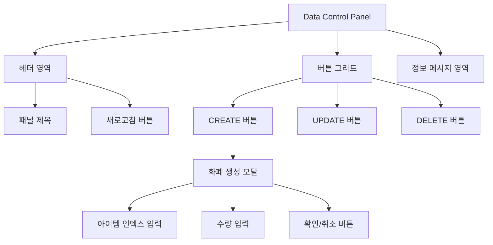

# **📌 PM PRD - 화폐 데이터 관리 패널 (Data Control Panel)**

## **1. 개요**
데이터 테이블과 연계되어 사용자의 화폐(Currency) 데이터를 기본적으로 관리할 수 있는 패널 컴포넌트입니다. 이 컴포넌트는 Users 페이지의 Select Users 카드 내 CURRENCY 탭에 통합되어 있으며, 관리자가 사용자의 화폐 정보를 생성, 수정, 삭제할 수 있는 인터페이스를 제공합니다.

## **2. 주요 목표**
- 게임 서비스 관리자가 사용자의 화폐 데이터를 효율적으로 관리
- 기본적인 CRUD(Create, Read, Update, Delete) 작업을 직관적인 UI로 제공
- 화폐 데이터 변경 작업의 안전성과 사용성 보장
- 다중 DB 환경에서 사용자별 화폐 정보 관리 지원

## **3. 주요 기능 요구사항**
| 기능 | 우선순위 | 설명 |
|------|---------|------|
| CREATE 버튼 | 상 | 새로운 화폐/아이템 생성 기능 |
| UPDATE 버튼 | 상 | 기존 화폐/아이템 정보 업데이트 기능 |
| DELETE 버튼 | 상 | 화폐/아이템 삭제 기능 |
| 새로고침 버튼 | 중 | 데이터 테이블 새로고침 기능 |
| 정보 메시지 | 중 | 사용자에게 작업 가이드 제공 |
| 데이터베이스 정보 표시 | 중 | 현재 조작 중인 DB 정보 표시 |
| 생성 모달 | 상 | 화폐 아이템 추가 시 상세 정보 입력 모달 |

## **4. 사용자 시나리오**
1. **화폐 생성**: 관리자가 CREATE 버튼을 클릭하여 특정 사용자에게 새 화폐/아이템 추가
   - 생성 모달에서 아이템 인덱스와 수량 입력
   - 해당 사용자의 DB에 화폐 데이터 추가
2. **화폐 수정**: 관리자가 테이블에서 항목을 선택한 후 UPDATE 버튼으로 수량 조정
3. **화폐 삭제**: 관리자가 테이블에서 항목을 선택한 후 DELETE 버튼으로 항목 제거
4. **데이터 새로고침**: 변경 후 새로고침 버튼으로 최신 데이터 확인

## **5. 구현 현황**
| 기능 | 구현 상태 | 비고 |
|------|----------|------|
| CREATE 기능 | ✅ 완료 | 모달 다이얼로그와 API 연동 완료 |
| UPDATE 기능 | ✅ 완료 | 선택한 항목 수정 가능 |
| DELETE 기능 | ✅ 완료 | 삭제 확인 다이얼로그 포함 |
| 새로고침 | ✅ 완료 | 애니메이션 효과와 이벤트 시스템 구현 |
| 에러 처리 | ✅ 완료 | 에러 메시지 및 경고 다이얼로그 |

---

# **📌 Design PRD - 화폐 데이터 관리 패널 (Data Control Panel)**

## **1. 디자인 컨셉**
- **일관성**: ShadCN UI 컴포넌트 라이브러리 활용한 통일된 디자인
- **명확성**: 각 기능 버튼의 목적과 상태가 시각적으로 명확하게 구분
- **컴팩트함**: 작은 공간에서도 효율적으로 모든 기능에 접근 가능한 레이아웃

## **2. 레이아웃 및 구조**



## **3. 색상 및 스타일 가이드**
- **패널 배경**: 밝은 회색(bg-gray-100)으로 데이터 테이블과 구분
- **제목 영역**: 보라색 계열(text-purple-900)의 텍스트로 강조
- **버튼 색상**:
  - CREATE: 녹색(bg-green-500, hover:bg-green-600)
  - UPDATE: 파란색(bg-blue-500, hover:bg-blue-600)
  - DELETE: 빨간색(bg-red-500, hover:bg-red-600)
  - 새로고침: 연한 보라색(bg-purple-50, border-purple-200)
- **정보 메시지**: 연한 보라색 배경(bg-purple-50)에 보라색 텍스트(text-purple-800)
- **모달 헤더**: 그라데이션 배경(bg-gradient-to-r from-green-600 to-teal-600)
- **모달 입력 필드**: 흰색 배경, 녹색 포커스(border-green-200, focus:border-green-500)

## **4. UI 상태**
- **기본 상태**: 모든 버튼이 활성화된 상태
- **로딩 상태**: 
  - 새로고침 버튼에 회전 애니메이션 및 텍스트 변경
  - 작업 진행 중 버튼 비활성화 및 로딩 인디케이터 표시
- **비활성화 상태**: 작업이 불가능한 버튼은 시각적으로 비활성화
- **에러 상태**: 빨간색 경고 알림으로 에러 메시지 표시

## **5. 반응형 고려사항**
- 모바일 환경에서도 모든 버튼이 접근 가능하도록 그리드 레이아웃 조정
- 작은 화면에서도 텍스트 가독성 유지
- 모달 다이얼로그는 최대 너비 900px로 제한하여 다양한 화면 크기에 대응

---

# **📌 Tech PRD - 화폐 데이터 관리 패널 (Data Control Panel)**

## **1. 기술 스택**
- **프레임워크**: Next.js + TypeScript
- **UI 라이브러리**: ShadCN UI
- **스타일링**: Tailwind CSS
- **아이콘**: Lucide React (`PlusCircle`, `Edit`, `Trash2`, `Database`, `RefreshCw`, `Info`)
- **상태 관리**: React useState 훅

## **2. 컴포넌트 구조**

```typescript
// 컨트롤 패널 버튼 정의 인터페이스
export interface ControlPanelButton {
  id: string;
  label: string;
  icon: React.ReactNode;
  variant?: 'default' | 'destructive' | 'outline' | 'secondary' | 'ghost' | 'link';
  bgColorClass?: string;
  onClick: () => void;
  disabled?: boolean;
}

// Data Control Panel 속성 정의
export interface DataControlsPanelProps {
  onCreateClick?: () => void;
  onUpdateClick?: () => void;
  onDeleteClick?: () => void;
  onRefreshClick?: () => void;
  className?: string;
  title?: string;
  showRefreshButton?: boolean;
  showInfoMessage?: boolean;
  infoMessage?: string;
  customButtons?: ControlPanelButton[];
}

// 화폐 생성 모달 속성 정의
export interface CreateCurrencyModalProps {
  open: boolean;
  onOpenChange: (open: boolean) => void;
  onConfirm: (newCurrency: { excelItemIndex: number; count: number }) => void;
  isCreating: boolean;
}
```

## **3. 주요 기능 구현**

### **3.1 버튼 액션 핸들링**
```typescript
// 기본 버튼 구성
const defaultButtons: ControlPanelButton[] = [
  {
    id: 'create',
    label: 'CREATE',
    icon: <PlusCircle className="h-3.5 w-3.5 mr-1.5" />,
    bgColorClass: 'bg-green-500 hover:bg-green-600 text-white',
    variant: 'default',
    onClick: onCreateClick || (() => console.log('[DataControlsPanel] CREATE 버튼 클릭됨')),
    disabled: false
  },
  // UPDATE 및 DELETE 버튼 정의...
];
```

### **3.2 새로고침 기능**
```typescript
const handleRefresh = () => {
  setIsRefreshing(true);
  console.log('[DataControlsPanel] 데이터 새로고침 요청');
  
  // 커스텀 새로고침 핸들러가 제공된 경우 호출
  if (onRefreshClick) {
    onRefreshClick();
  }
  
  // 새로고침 시뮬레이션
  setTimeout(() => {
    // 페이지 새로고침 이벤트 발생
    window.dispatchEvent(new CustomEvent('refresh-data'));
    setIsRefreshing(false);
    console.log('[DataControlsPanel] 데이터 새로고침 완료');
  }, 1000);
};
```

### **3.3 화폐 생성 모달 구현**
```typescript
export function CreateCurrencyModal({
  open,
  onOpenChange,
  onConfirm,
  isCreating,
}: CreateCurrencyModalProps) {
  const [excelItemIndex, setExcelItemIndex] = useState<number | ''>('');
  const [count, setCount] = useState<number | ''>('');
  const [error, setError] = useState<string | null>(null);

  const handleSubmit = (e: React.FormEvent) => {
    e.preventDefault();
    
    // 폼 유효성 검사
    if (excelItemIndex === '') {
      setError('아이템 인덱스를 입력해주세요.');
      return;
    }
    
    if (count === '') {
      setError('수량을 입력해주세요.');
      return;
    }
    
    // 확인 함수 호출
    onConfirm({
      excelItemIndex: Number(excelItemIndex),
      count: Number(count),
    });
  };
  
  // ... 모달 UI 렌더링 ...
}
```

### **3.4 데이터 테이블 연동**
```typescript
// DataTable 컴포넌트 내에서 화폐 컨트롤 패널 렌더링
{showDataControls && (
  <DataControlsPanel
    onCreateClick={handleCreateCurrency}
    onUpdateClick={handleUpdateCurrency}
    onDeleteClick={handleDeleteCurrency}
    className="mt-4"
  />
)}
```

## **4. API 연동**

화폐 데이터 관리 API와의 연동 인터페이스:

```typescript
// 화폐 생성 API 요청 예시
fetch("/api/user/currency", {
  method: "POST",
  headers: {
    "Content-Type": "application/json",
  },
  body: JSON.stringify({
    employerUid, // 사용자 UID
    dbName,      // 데이터베이스 이름
    excelItemIndex: newCurrency.excelItemIndex, // 아이템 인덱스
    count: newCurrency.count, // 수량
  }),
})
.then(response => {
  if (!response.ok) {
    return response.json().then(errorData => {
      throw new Error(errorData.message || "화폐 생성 중 오류가 발생했습니다.");
    });
  }
  return response.json();
})
.then(() => {
  // 성공 처리 및 데이터 새로고침
})
.catch(error => {
  // 오류 처리
});
```

## **5. 성능 고려사항**
- 다수의 아이템 동시 처리 시 병렬 요청 최적화
- 새로고침 작업 시 불필요한 전체 페이지 리로드 방지를 위한 이벤트 시스템 활용
- 상태 업데이트의 효율적 관리로 불필요한 렌더링 최소화
- 모달 다이얼로그의 효율적인 포커스 관리와 접근성 보장

## **6. 확장성**
- 커스텀 버튼 추가 기능을 통한 확장 가능성 (customButtons prop 지원)
- 버튼별 스타일 및 동작 커스터마이징 용이
- 모듈화된 구조로 다양한 데이터 타입에 대응 가능
- 테이블 컴포넌트와의 느슨한 결합으로 재사용성 강화

## **7. 통합 테스트 및 검증**
- 다양한 시나리오에서의 기능 검증
  - 아이템 생성 및 성공/실패 시나리오 테스트
  - 네트워크 지연 및 오류 상황에서의 동작 테스트
  - 다중 DB 환경에서의 데이터 일관성 검증
- 사용자 경험 측면의 UI/UX 테스트
  - 버튼 상태 전환의 명확성
  - 작업 진행 상태의 가시성
  - 오류 메시지의 명확성 및 조치 안내