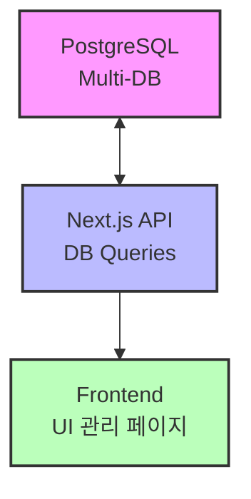

# **📌 Tech PRD - 다중 DB 테이블 검색 및 관리 페이지 (초기 버전, CRUD 포함, 컬럼 추가/수정/삭제 기능 포함)**  

---

## **📌 1. 개요**
### **1.1 프로젝트 개요**  
본 프로젝트는 **Next.js 기반의 관리 페이지**에서 **다중 PostgreSQL 데이터베이스의 특정 키워드를 포함한 테이블을 검색, 관리(CRUD)할 수 있는 기능을 제공**하는 것을 목표로 합니다.  
이를 통해 **테이블 목록 조회, 특정 테이블의 컬럼 구조 조회, 테이블 및 컬럼 CRUD 작업을 UI와 API를 통해 수행**할 수 있습니다.  

### **1.2 주요 기술 스택**
✅ **Next.js (App Router)** - API 개발 및 UI 관리  
✅ **TypeScript** - 안정적인 타입 시스템 적용  
✅ **PostgreSQL** - 다중 데이터베이스 관리  
✅ **node-postgres (`pg` 라이브러리)** - DB 연결 및 쿼리 실행  
✅ **node-shared-memory** - SHM(Shared Memory) 기반 캐싱 적용 (향후 업데이트 고려)  
✅ **TailwindCSS & ShadCN** - UI 디자인 및 컴포넌트 관리  

---

## **📌 2. 시스템 아키텍처**

✅ **다중 PostgreSQL DB에서 테이블 정보를 가져오는 구조**  
✅ **Next.js API를 통해 UI에서 테이블 검색 및 CRUD 기능 지원**  

---

## **📌 3. 주요 기능 및 상세 구현**
### **3.1 다중 DB 테이블 검색 및 관리**
💡 **기능 설명:**  
- **연결된 모든 DB에서 특정 키워드를 포함하는 테이블 목록을 조회**  
- **검색 필터 옵션 제공 (`prefix`, `suffix`, `contains`)**  
- **기본적으로 `excel_` 키워드를 사용하며, 필요 시 변경 가능**  

| 기능명 | 설명 | 구현 상태 |
|--------|--------|----------|
| **특정 키워드를 포함하는 테이블 조회** | 특정 키워드(`excel_`)가 포함된 테이블 리스트 조회 | ✅ 개발 예정 |
| **특정 DB 선택 필터링** | 특정 DB만 선택하여 테이블을 조회 가능 | ✅ 개발 예정 |
| **테이블명 검색 기능 (`prefix`, `suffix`, `contains`)** | 접두어, 접미어, 키워드 포함 검색 기능 제공 | ✅ 개발 예정 |
| **테이블 컬럼 구조 조회** | 선택한 테이블의 컬럼 정보를 조회 가능 | ✅ 개발 예정 |
| **테이블 데이터 미리보기** | 선택한 테이블의 일부 데이터를 미리보기 가능 | ✅ 개발 예정 |

---

### **3.2 다중 DB 테이블 및 컬럼 CRUD 기능**
💡 **기능 설명:**  
- **각 테이블 및 컬럼의 CRUD (생성, 읽기, 수정, 삭제) 기능 제공**  
- **새로운 테이블 생성 및 기존 테이블 삭제 가능**  
- **컬럼 추가, 컬럼 삭제, 컬럼 타입 변경 가능**  

| 기능명 | 설명 | 구현 상태 |
|--------|--------|----------|
| **테이블 생성 (Create)** | 새 테이블을 생성 (필요한 컬럼 포함) | ✅ 개발 예정 |
| **테이블 조회 (Read)** | 특정 테이블의 데이터를 조회 | ✅ 개발 예정 |
| **테이블 수정 (Update)** | 테이블명 변경 및 컬럼 변경 가능 | ✅ 개발 예정 |
| **테이블 삭제 (Delete)** | 특정 테이블 삭제 | ✅ 개발 예정 |
| **컬럼 추가 (Create Column)** | 기존 테이블에 새로운 컬럼 추가 | ✅ 개발 예정 |
| **컬럼 수정 (Modify Column)** | 특정 컬럼의 데이터 타입 변경 | ✅ 개발 예정 |
| **컬럼 삭제 (Delete Column)** | 특정 컬럼 삭제 | ✅ 개발 예정 |

---

## **📌 4. API 설계**
### **4.1 특정 키워드를 포함하는 테이블 조회 API**
#### **📌 요청**
```http
GET /api/tables
```
#### **📌 요청 파라미터**
| 파라미터 | 설명 | 필수 여부 | 기본값 |
|--------|--------|------|------|
| `db` | 특정 DB를 선택하여 검색 | ❌ | - |
| `search` | 특정 키워드(포함 검색) | ❌ | `excel_` |
| `matchType` | `prefix`, `suffix`, `contains` 중 선택 | ❌ | `prefix` |

#### **📌 응답 예시**
```json
{
    "success": true,
    "tables": [
        { "db": "db1", "table": "excel_users" },
        { "db": "db2", "table": "monthly_excel_data" },
        { "db": "db3", "table": "sales_excel_report" }
    ]
}
```

---

### **4.2 테이블 및 컬럼 CRUD API**
#### **📌 테이블 생성 API**
```http
POST /api/tables
```
```json
{
    "db": "db1",
    "tableName": "excel_new_data",
    "columns": [
        { "name": "id", "type": "SERIAL PRIMARY KEY" },
        { "name": "name", "type": "VARCHAR(255)" }
    ]
}
```

#### **📌 테이블 삭제 API**
```http
DELETE /api/tables
```
```json
{
    "db": "db1",
    "tableName": "excel_old_data"
}
```

---

### **4.3 컬럼 CRUD API**
#### **📌 컬럼 추가 API**
```http
POST /api/tables/columns
```
```json
{
    "db": "db1",
    "tableName": "excel_users",
    "column": { "name": "age", "type": "INTEGER" }
}
```

#### **📌 컬럼 수정 API (데이터 타입 변경)**
```http
PUT /api/tables/columns
```
```json
{
    "db": "db1",
    "tableName": "excel_users",
    "column": { "name": "age", "newType": "VARCHAR(100)" }
}
```

#### **📌 컬럼 삭제 API**
```http
DELETE /api/tables/columns
```
```json
{
    "db": "db1",
    "tableName": "excel_users",
    "columnName": "age"
}
```

---

## **📌 5. UI 기능**
💡 **관리자가 특정 키워드가 포함된 테이블을 검색하고, 상세 정보를 확인 및 CRUD 관리할 수 있도록 UI 제공**  

#### **📌 컬럼 추가, 수정, 삭제 UI (`ColumnManagement.tsx`)**
```tsx
import { useState } from 'react';

export default function ColumnManagement({ db, tableName }) {
    const [columns, setColumns] = useState([]);
    const [newColumn, setNewColumn] = useState({ name: "", type: "" });

    const addColumn = async () => {
        await fetch(`/api/tables/columns`, {
            method: "POST",
            body: JSON.stringify({ db, tableName, column: newColumn }),
            headers: { "Content-Type": "application/json" },
        });
    };

    const deleteColumn = async (columnName) => {
        await fetch(`/api/tables/columns`, {
            method: "DELETE",
            body: JSON.stringify({ db, tableName, columnName }),
            headers: { "Content-Type": "application/json" },
        });
    };

    return (
        <div>
            <h1>컬럼 관리</h1>
            <input type="text" placeholder="컬럼 이름" onChange={(e) => setNewColumn({ ...newColumn, name: e.target.value })} />
            <input type="text" placeholder="데이터 타입" onChange={(e) => setNewColumn({ ...newColumn, type: e.target.value })} />
            <button onClick={addColumn}>컬럼 추가</button>
            <ul>
                {columns.map(col => (
                    <li key={col.name}>
                        {col.name} ({col.type}) <button onClick={() => deleteColumn(col.name)}>삭제</button>
                    </li>
                ))}
            </ul>
        </div>
    );
}
```