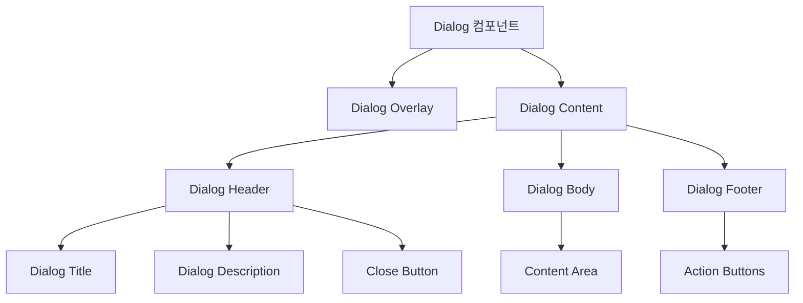

# **📌 PM PRD - 다이얼로그 컴포넌트 (Dialog)**

## **1. 개요**
다이얼로그 컴포넌트는 사용자의 주의를 끌어 중요한 정보를 표시하거나 사용자 입력을 요청하는 모달 인터페이스입니다. 게임 서비스 관리 도구에서 확인 메시지, 알림, 상세 정보 표시, 간단한 폼 제출 등 다양한 상황에서 사용됩니다. 사용자 흐름을 방해하지 않으면서도 중요한 작업에 집중할 수 있게 하는 핵심 UI 요소입니다.

## **2. 주요 목표**
- 중요한 정보나 작업에 사용자의 주의를 집중시키기
- 기본 UI와 분리된 컨텍스트에서 작업을 완료할 수 있는 환경 제공
- 접근성과 사용성을 고려한 모달 인터랙션 설계
- 다양한 유형의 콘텐츠와 액션을 지원하는 유연한 구조 제공
- 일관된 사용자 경험을 위한 표준화된 다이얼로그 패턴 확립

## **3. 주요 기능 요구사항**
| 기능 | 우선순위 | 설명 |
|------|---------|------|
| 모달 표시/숨김 | 상 | 다이얼로그의 열림/닫힘 상태 제어 |
| 배경 오버레이 | 상 | 다이얼로그 뒤 콘텐츠를 흐리게 처리하여 집중도 향상 |
| 제목 및 설명 | 상 | 다이얼로그의 목적과 내용을 명확히 전달하는 헤더 |
| 액션 버튼 | 상 | 확인, 취소, 제출 등 다양한 사용자 액션 지원 |
| 닫기 옵션 | 상 | ESC 키, 오버레이 클릭, 닫기 버튼 등 다양한 닫기 방법 |
| 다양한 컨텐츠 | 중 | 텍스트, 폼, 이미지, 목록 등 다양한 컨텐츠 표시 가능 |
| 애니메이션 | 중 | 부드러운 진입/퇴장 애니메이션으로 시각적 연속성 제공 |
| 접근성 지원 | 중 | 키보드 탐색, 스크린 리더 지원, 포커스 관리 |

## **4. 사용자 시나리오**
1. **확인 요청**: 중요한 작업 실행 전 사용자 확인
   - 데이터 삭제, 계정 변경 등 중요 작업 전 사용자에게 확인 요청
   - 명확한 액션 버튼으로 의도적인 결정 유도
2. **상세 정보 표시**: 상세 정보 확인을 위한 다이얼로그
   - 테이블이나 목록에서 항목을 클릭하여 상세 정보 확인
   - 스크롤 가능한 콘텐츠 영역으로 다양한 정보 표시
3. **간단한 입력 수집**: 짧은 폼을 통한 데이터 입력
   - 새 항목 추가나 간단한 설정 변경을 위한 폼 제공
   - 인라인 유효성 검사와 제출 버튼으로 원활한 입력 경험
4. **알림 및 메시지**: 시스템 알림이나 중요 메시지 전달
   - 작업 완료, 오류 발생, 주요 변경사항 등 알림
   - 단일 확인 버튼으로 간결한 사용자 경험 제공

## **5. 구현 현황**
| 기능 | 구현 상태 | 비고 |
|------|----------|------|
| 기본 모달 표시/숨김 | ✅ 완료 | ShadCN Dialog 컴포넌트 기반 구현 |
| 제목 및 설명 영역 | ✅ 완료 | 다양한 크기와 스타일 지원 |
| 액션 버튼 | ✅ 완료 | 다양한 버튼 구성 가능 |
| 배경 오버레이 | ✅ 완료 | 커스텀 스타일 및 클릭 이벤트 지원 |
| 키보드 상호작용 | ✅ 완료 | ESC 키 닫기 및 포커스 트래핑 구현 |
| 애니메이션 | ✅ 완료 | 부드러운 진입/퇴장 애니메이션 |
| 다양한 콘텐츠 지원 | ⚠️ 부분 구현 | 복잡한 콘텐츠 렌더링 개선 필요 |
| 접근성 개선 | ⚠️ 부분 구현 | ARIA 속성 추가 진행 중 |

---

# **📌 Design PRD - 다이얼로그 컴포넌트 (Dialog)**

## **1. 디자인 컨셉**
- **명확성**: 다이얼로그의 목적과 내용을 직관적으로 전달
- **집중성**: 배경을 흐리게 처리하여 다이얼로그 콘텐츠에 집중 유도
- **일관성**: 애플리케이션 전체 디자인 시스템과 조화로운 시각적 스타일
- **반응성**: 다양한 기기와 화면 크기에 최적화된 레이아웃
- **접근성**: 다양한 사용자와 상황을 고려한 인터페이스 설계

## **2. 레이아웃 및 구조**



## **3. 색상 및 스타일 가이드**
- **다이얼로그 오버레이**:
  - 배경: 반투명 검정(rgba(0, 0, 0, 0.5))
  - 블러 효과: 옵션에 따라 적용 가능(backdrop-filter: blur(4px))
  
- **다이얼로그 컨테이너**:
  - 배경: 흰색(bg-white)
  - 테두리: 연한 회색(border border-gray-200)
  - 그림자: 뚜렷한 그림자 효과(shadow-lg)
  - 패딩: 내부 여백(p-6)
  - 모서리: 둥근 모서리(rounded-lg)
  - 너비: 가변적(최소 300px, 최대 500px)
  - 최대 높이: 화면 높이의 80%(max-h-[80vh])
  
- **다이얼로그 헤더**:
  - 제목: 진한 글꼴(font-semibold text-lg)
  - 설명: 회색 텍스트(text-gray-500 text-sm)
  - 닫기 버튼: 회색 아이콘(text-gray-400, hover:text-gray-900)
  - 하단 경계: 연한 구분선(border-b border-gray-200)
  
- **다이얼로그 본문**:
  - 패딩: 내부 여백(py-4)
  - 최대 높이: 스크롤 가능(max-h-[60vh] overflow-y-auto)
  
- **다이얼로그 푸터**:
  - 정렬: 오른쪽 정렬(flex justify-end)
  - 버튼 간격: 작은 간격(space-x-2)
  - 상단 경계: 연한 구분선(border-t border-gray-200)
  - 패딩: 내부 여백(pt-4)
  
- **버튼**:
  - 기본 버튼: 회색 배경(bg-gray-100 text-gray-700)
  - 주요 버튼: 보라색 배경(bg-purple-600 text-white)
  - 위험 버튼: 빨간색 배경(bg-red-600 text-white)
  - 패딩: 적절한 내부 여백(px-4 py-2)
  - 모서리: 둥근 모서리(rounded-md)

## **4. 상태 및 인터랙션**
- **초기 상태**: 숨겨진 상태, 화면에 표시되지 않음
- **열림 상태**: 
  - 배경 오버레이와 함께 화면 중앙에 표시
  - 등장 애니메이션으로 부드럽게 표시
- **포커스 상태**: 
  - 다이얼로그가 열리면 첫 번째 상호작용 가능한 요소에 포커스
  - 다이얼로그 내에서 포커스가 순환되도록 트래핑
- **닫힘 상태**: 
  - 퇴장 애니메이션으로 부드럽게 사라짐
  - 이전에 포커스된 요소로 포커스 반환

## **5. 애니메이션 및 전환**
- **등장 애니메이션**: 
  - 오버레이: 투명 → 반투명(opacity: 0 → 1, 150ms)
  - 콘텐츠: 약간 축소 → 원래 크기(scale: 0.95 → 1, 150ms)
  - 약간 위로 이동(translateY: 2px → 0px)
- **퇴장 애니메이션**:
  - 오버레이: 반투명 → 투명(opacity: 1 → 0, 150ms)
  - 콘텐츠: 원래 크기 → 약간 축소(scale: 1 → 0.95, 150ms)
  - 약간 아래로 이동(translateY: 0px → 2px)

## **6. 반응형 고려사항**
- **모바일(< 640px)**:
  - 너비: 화면 너비의 90%(w-[90vw])
  - 패딩: 더 작은 패딩(p-4)
  - 전체 화면 옵션: 필요시 전체 화면으로 확장
  
- **태블릿(640px ~ 1024px)**:
  - 너비: 고정 너비(400px)
  - 중앙 정렬 유지
  
- **데스크톱(> 1024px)**:
  - 너비: 콘텐츠에 따라 가변적(최대 500px)
  - 중앙 정렬 유지

---

# **📌 Tech PRD - 다이얼로그 컴포넌트 (Dialog)**

## **1. 기술 스택**
- **프레임워크**: Next.js + TypeScript
- **UI 컴포넌트**: ShadCN UI Dialog 컴포넌트
- **애니메이션**: CSS 트랜지션 + Radix UI 애니메이션
- **접근성**: Radix UI의 접근성 기능
- **스타일링**: Tailwind CSS

## **2. 컴포넌트 구조**

```typescript
// 다이얼로그 컴포넌트 인터페이스
import * as React from 'react';
import * as DialogPrimitive from '@radix-ui/react-dialog';

// 다이얼로그 루트 컴포넌트 속성
export interface DialogProps extends DialogPrimitive.DialogProps {
  children: React.ReactNode;
}

// 다이얼로그 콘텐츠 컴포넌트 속성
export interface DialogContentProps
  extends React.ComponentPropsWithoutRef<typeof DialogPrimitive.Content> {
  className?: string;
  children: React.ReactNode;
}

// 다이얼로그 헤더 컴포넌트 속성
export interface DialogHeaderProps {
  className?: string;
  children: React.ReactNode;
}

// 다이얼로그 푸터 컴포넌트 속성
export interface DialogFooterProps {
  className?: string;
  children: React.ReactNode;
}

// 다이얼로그 제목 컴포넌트 속성
export interface DialogTitleProps
  extends React.ComponentPropsWithoutRef<typeof DialogPrimitive.Title> {
  className?: string;
  children: React.ReactNode;
}

// 다이얼로그 설명 컴포넌트 속성
export interface DialogDescriptionProps
  extends React.ComponentPropsWithoutRef<typeof DialogPrimitive.Description> {
  className?: string;
  children: React.ReactNode;
}
```

## **3. 주요 기능 구현**

### **3.1 다이얼로그 루트 및 트리거**
```tsx
// 다이얼로그 루트 컴포넌트
export function Dialog({ children, ...props }: DialogProps) {
  return <DialogPrimitive.Root {...props}>{children}</DialogPrimitive.Root>;
}

// 다이얼로그 트리거 컴포넌트
export const DialogTrigger = DialogPrimitive.Trigger;

// 다이얼로그 닫기 컴포넌트
export const DialogClose = DialogPrimitive.Close;
```

### **3.2 다이얼로그 오버레이 및 콘텐츠**
```tsx
// 다이얼로그 오버레이 컴포넌트
export const DialogOverlay = React.forwardRef<
  React.ElementRef<typeof DialogPrimitive.Overlay>,
  React.ComponentPropsWithoutRef<typeof DialogPrimitive.Overlay>
>(({ className, ...props }, ref) => (
  <DialogPrimitive.Overlay
    ref={ref}
    className={cn(
      "fixed inset-0 z-50 bg-black/50 backdrop-blur-sm data-[state=open]:animate-in data-[state=closed]:animate-out data-[state=closed]:fade-out-0 data-[state=open]:fade-in-0",
      className
    )}
    {...props}
  />
));
DialogOverlay.displayName = DialogPrimitive.Overlay.displayName;

// 다이얼로그 콘텐츠 컴포넌트
export const DialogContent = React.forwardRef<
  React.ElementRef<typeof DialogPrimitive.Content>,
  DialogContentProps
>(({ className, children, ...props }, ref) => (
  <DialogPortal>
    <DialogOverlay />
    <DialogPrimitive.Content
      ref={ref}
      className={cn(
        "fixed left-[50%] top-[50%] z-50 grid w-full max-w-lg translate-x-[-50%] translate-y-[-50%] gap-4 bg-white p-6 shadow-lg duration-200 data-[state=open]:animate-in data-[state=closed]:animate-out data-[state=closed]:fade-out-0 data-[state=open]:fade-in-0 data-[state=closed]:zoom-out-95 data-[state=open]:zoom-in-95 data-[state=closed]:slide-out-to-left-1/2 data-[state=closed]:slide-out-to-top-[48%] data-[state=open]:slide-in-from-left-1/2 data-[state=open]:slide-in-from-top-[48%] sm:rounded-lg",
        className
      )}
      {...props}
    >
      {children}
      <DialogPrimitive.Close className="absolute right-4 top-4 rounded-sm opacity-70 ring-offset-white transition-opacity hover:opacity-100 focus:outline-none focus:ring-2 focus:ring-purple-500 focus:ring-offset-2 disabled:pointer-events-none">
        <X className="h-4 w-4" />
        <span className="sr-only">닫기</span>
      </DialogPrimitive.Close>
    </DialogPrimitive.Content>
  </DialogPortal>
));
DialogContent.displayName = DialogPrimitive.Content.displayName;
```

### **3.3 다이얼로그 헤더, 푸터, 제목 및 설명**
```tsx
// 다이얼로그 헤더 컴포넌트
export function DialogHeader({ className, ...props }: DialogHeaderProps) {
  return (
    <div
      className={cn(
        "flex flex-col space-y-1.5 text-center sm:text-left",
        className
      )}
      {...props}
    />
  );
}

// 다이얼로그 푸터 컴포넌트
export function DialogFooter({ className, ...props }: DialogFooterProps) {
  return (
    <div
      className={cn(
        "flex flex-col-reverse sm:flex-row sm:justify-end sm:space-x-2",
        className
      )}
      {...props}
    />
  );
}

// 다이얼로그 제목 컴포넌트
export const DialogTitle = React.forwardRef<
  React.ElementRef<typeof DialogPrimitive.Title>,
  DialogTitleProps
>(({ className, ...props }, ref) => (
  <DialogPrimitive.Title
    ref={ref}
    className={cn(
      "text-lg font-semibold leading-none tracking-tight",
      className
    )}
    {...props}
  />
));
DialogTitle.displayName = DialogPrimitive.Title.displayName;

// 다이얼로그 설명 컴포넌트
export const DialogDescription = React.forwardRef<
  React.ElementRef<typeof DialogPrimitive.Description>,
  DialogDescriptionProps
>(({ className, ...props }, ref) => (
  <DialogPrimitive.Description
    ref={ref}
    className={cn("text-sm text-gray-500", className)}
    {...props}
  />
));
DialogDescription.displayName = DialogPrimitive.Description.displayName;
```

### **3.4 다이얼로그 사용 예시**
```tsx
// 확인 다이얼로그 사용 예시
export function ConfirmDialog({
  isOpen,
  onOpenChange,
  title,
  description,
  onConfirm,
  confirmText = "확인",
  cancelText = "취소",
  variant = "default"
}) {
  return (
    <Dialog open={isOpen} onOpenChange={onOpenChange}>
      <DialogContent className="sm:max-w-[425px]">
        <DialogHeader>
          <DialogTitle>{title}</DialogTitle>
          {description && <DialogDescription>{description}</DialogDescription>}
        </DialogHeader>
        <DialogFooter className="mt-4">
          <Button variant="outline" onClick={() => onOpenChange(false)}>
            {cancelText}
          </Button>
          <Button 
            variant={variant === "danger" ? "destructive" : "default"}
            onClick={() => {
              onConfirm();
              onOpenChange(false);
            }}
          >
            {confirmText}
          </Button>
        </DialogFooter>
      </DialogContent>
    </Dialog>
  );
}

// 폼 다이얼로그 사용 예시
export function FormDialog({
  isOpen,
  onOpenChange,
  title,
  description,
  onSubmit,
  submitText = "저장",
  cancelText = "취소",
  children
}) {
  return (
    <Dialog open={isOpen} onOpenChange={onOpenChange}>
      <DialogContent className="sm:max-w-[500px]">
        <DialogHeader>
          <DialogTitle>{title}</DialogTitle>
          {description && <DialogDescription>{description}</DialogDescription>}
        </DialogHeader>
        <form onSubmit={(e) => {
          e.preventDefault();
          onSubmit(e);
          onOpenChange(false);
        }}>
          <div className="py-4">{children}</div>
          <DialogFooter>
            <Button type="button" variant="outline" onClick={() => onOpenChange(false)}>
              {cancelText}
            </Button>
            <Button type="submit">{submitText}</Button>
          </DialogFooter>
        </form>
      </DialogContent>
    </Dialog>
  );
}
```

## **4. 상태 관리 및 제어**

### **4.1 제어 모드와 비제어 모드**
```tsx
// 비제어 모드 예시
export function UncontrolledDialog() {
  return (
    <Dialog>
      <DialogTrigger asChild>
        <Button variant="outline">다이얼로그 열기</Button>
      </DialogTrigger>
      <DialogContent>
        <DialogHeader>
          <DialogTitle>다이얼로그 제목</DialogTitle>
          <DialogDescription>다이얼로그 설명 텍스트입니다.</DialogDescription>
        </DialogHeader>
        <div className="py-4">
          <p>다이얼로그 내용이 여기에 표시됩니다.</p>
        </div>
        <DialogFooter>
          <DialogClose asChild>
            <Button>확인</Button>
          </DialogClose>
        </DialogFooter>
      </DialogContent>
    </Dialog>
  );
}

// 제어 모드 예시
export function ControlledDialog() {
  const [open, setOpen] = React.useState(false);
  
  return (
    <>
      <Button variant="outline" onClick={() => setOpen(true)}>
        다이얼로그 열기
      </Button>
      <Dialog open={open} onOpenChange={setOpen}>
        <DialogContent>
          <DialogHeader>
            <DialogTitle>제어 다이얼로그</DialogTitle>
            <DialogDescription>상태로 제어되는 다이얼로그입니다.</DialogDescription>
          </DialogHeader>
          <div className="py-4">
            <p>외부 상태를 통해 다이얼로그 열림/닫힘을 제어할 수 있습니다.</p>
          </div>
          <DialogFooter>
            <Button variant="outline" onClick={() => setOpen(false)}>취소</Button>
            <Button onClick={() => {
              // 작업 수행
              setOpen(false);
            }}>확인</Button>
          </DialogFooter>
        </DialogContent>
      </Dialog>
    </>
  );
}
```

## **5. 성능 고려사항**
- **포털 사용**: 다이얼로그 콘텐츠를 React 포털을 통해 DOM의 다른 부분에 렌더링하여 z-index 문제 해결
- **지연 로딩**: 다이얼로그 내부의 복잡한 콘텐츠는 필요시 동적으로 불러오기
- **메모이제이션**: 자주 사용되는 다이얼로그 컴포넌트는 React.memo를 사용하여 최적화
- **전환 최적화**: 애니메이션에 GPU 가속 속성 사용(transform, opacity)
- **비제어 옵션**: 가능한 경우 비제어 모드를 사용하여 불필요한 리렌더링 방지

## **6. 확장성**
- **크기 변형**: 다양한 크기(sm, md, lg, full)의 다이얼로그 지원
- **커스텀 트랜지션**: 다양한 진입/퇴장 애니메이션 옵션 제공
- **콘텐츠 타입**: 다양한 내용 유형(경고, 확인, 폼, 정보) 지원
- **시각적 변형**: 다양한 시각적 테마 및 스타일 적용 가능
- **다중 다이얼로그**: 중첩 다이얼로그 또는 다이얼로그 스택 지원

## **7. 접근성 고려사항**
- **키보드 접근성**: ESC 키로 닫기, 탭 트래핑으로 다이얼로그 내 포커스 유지
- **스크린 리더**: 적절한 ARIA 역할 및 속성 적용
  - `role="dialog"`: 다이얼로그 역할 명시
  - `aria-labelledby`: 다이얼로그 제목 연결
  - `aria-describedby`: 다이얼로그 설명 연결
- **포커스 관리**: 
  - 다이얼로그 열림 시 첫 번째 활성화 요소로 포커스 이동
  - 다이얼로그 닫힘 시 이전 활성화 요소로 포커스 반환
- **모션 감소**: prefers-reduced-motion 미디어 쿼리 지원
- **명확한 대비**: 텍스트와 배경 간 충분한 대비 제공 