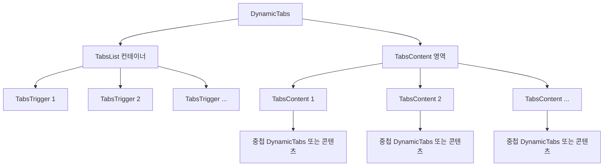

# **📌 PM PRD - 동적 탭 컴포넌트 (Dynamic Tabs)**

## **1. 개요**
동적 탭 컴포넌트(Dynamic Tabs)는 다양한 카테고리의 데이터를 구조화된 탭 형식으로 보여주는 UI 컴포넌트입니다. 이 컴포넌트는 Users 페이지의 Select Users 카드 내 아코디언에서 주로 사용되며, 사용자 관련 정보를 멀티 플레이, 스토리, 화폐, 서비스 등의 카테고리로 나누어 효율적으로 탐색할 수 있게 합니다.

## **2. 주요 목표**
- 복잡한 데이터를 논리적인 카테고리로 구분하여 사용자 친화적인 UI 제공
- 계층적 구조의 탭 시스템을 통한 직관적인 데이터 탐색 경험 제공
- 다양한 유형의 콘텐츠를 동일한 인터페이스 내에서 일관되게 표시
- 재사용 가능한 컴포넌트 설계로 애플리케이션 전반에서 사용 가능
- 사용자별 탭 상태 기억 기능을 통한 향상된 사용자 경험 제공

## **3. 주요 기능 요구사항**
| 기능 | 우선순위 | 설명 |
|------|---------|------|
| 동적 탭 생성 | 상 | 제공된 데이터 구조에 따라 동적으로 탭 생성 |
| 중첩 탭 지원 | 상 | 하위 레벨 탭 구조를 통한 계층적 데이터 표현 |
| 데이터 테이블 통합 | 상 | 각 탭에서 데이터 테이블을 효율적으로 표시 |
| 탭 상태 관리 | 중 | 사용자별 마지막 선택 탭 상태 유지 |
| 이벤트 콜백 | 중 | 탭 변경 시 상위 컴포넌트에 이벤트 전달 |
| 균등 분할 옵션 | 중 | 탭 너비를 균등하게 분할하는 옵션 제공 |
| 가로/세로 방향 지원 | 하 | 가로 또는 세로 방향의 탭 레이아웃 지원 |

## **4. 사용자 시나리오**
1. **기본 탭 탐색**: 사용자가 다양한 탭(MULTI PLAY, STORY, CURRENCY, SERVICE)을 선택하여 관련 정보 탐색
2. **중첩 탭 탐색**: 상위 탭(예: MULTI PLAY) 선택 후 하위 탭(BALLER, PUB, RECORD 등)을 선택하여 세부 정보 탐색
3. **탭 상태 유지**: 페이지 이동 후 돌아왔을 때 이전에 선택했던 탭이 활성화된 상태로 유지
4. **데이터 보기**: 각 탭에서 관련 데이터를 테이블 형태로 조회하고 분석

## **5. 구현 현황**
| 기능 | 구현 상태 | 비고 |
|------|----------|------|
| 동적 탭 생성 | ✅ 완료 | 데이터 구조 기반 자동 생성 |
| 중첩 탭 지원 | ✅ 완료 | 재귀적 구조로 다중 레벨 지원 |
| 탭 스타일 커스터마이징 | ✅ 완료 | className을 통한 스타일 지정 |
| 탭 상태 관리 | ✅ 완료 | 콜백 함수와 로컬 저장소 연동 |
| 균등 분할 탭 | ✅ 완료 | equalTabs 옵션으로 구현 |
| 방향 설정 | ✅ 완료 | 가로/세로 방향 전환 지원 |

---

# **📌 Design PRD - 동적 탭 컴포넌트 (Dynamic Tabs)**

## **1. 디자인 컨셉**
- **일관성**: ShadCN UI의 Tabs 컴포넌트를 기반으로 일관된 디자인 시스템 제공
- **계층성**: 명확한 시각적 계층 구조로 데이터의 논리적 구조를 직관적으로 표현
- **유연성**: 다양한 스타일 옵션을 통해 애플리케이션의 다른 부분과 조화 가능
- **접근성**: 모든 사용자가 쉽게 탐색할 수 있는 접근성 높은 탭 인터페이스

## **2. 레이아웃 및 구조**



## **3. 색상 및 스타일 가이드**
- **탭 컨테이너**: 투명 배경에 유연한 width 지원
- **탭 목록**: 둥근 모서리(rounded-lg)와 컨테이너 내 가운데 정렬
- **기본 탭 트리거**:
  - 비활성 상태: 연한 회색 배경에 검은색 텍스트
  - 활성 상태: 보라색 배경(bg-purple-400)에 흰색 텍스트(text-white)
- **탭 컨텐츠**: 상단 마진(mt-2)으로 컨텐츠와 탭 구분
- **트리거 옵션**:
  - 균등 분할 시: 각 탭이 동일한 너비를 차지(flex-1)
  - 가로 모드: 수평 정렬된 탭 목록
  - 세로 모드: 수직 정렬된 탭 목록(flex-col)

## **4. UI 상태**
- **기본 상태**: 첫 번째 탭이 선택된 상태로 로드
- **활성 상태**: 선택된 탭은 강조 스타일 적용 및 관련 컨텐츠 표시
- **비활성 상태**: 선택되지 않은 탭은 기본 스타일 적용
- **중첩 상태**: 하위 탭이 있는 경우 재귀적으로 하위 탭 컴포넌트 생성
- **빈 컨텐츠 상태**: 탭 내용이 없을 경우 "컨텐츠가 없습니다" 메시지 표시

## **5. 반응형 고려사항**
- **균등 탭**: 동일한 너비 배분으로 다양한 화면 크기에 적응
- **가로/세로 전환**: 좁은 화면에서 세로 모드 사용 가능
- **텍스트 줄바꿈 방지**: 탭 레이블은 공백 없이 한 줄로 표시(whitespace-nowrap)
- **스크롤 지원**: 많은 탭이 있는 경우 스크롤 가능한 인터페이스 제공

---

# **📌 Tech PRD - 동적 탭 컴포넌트 (Dynamic Tabs)**

## **1. 기술 스택**
- **프레임워크**: Next.js + TypeScript
- **UI 라이브러리**: ShadCN UI (Tabs, TabsList, TabsTrigger, TabsContent)
- **스타일링**: Tailwind CSS
- **컴포넌트 패턴**: 재귀적 컴포넌트 구조
- **상태 관리**: 로컬 상태 + 콜백 패턴

## **2. 컴포넌트 구조**

```typescript
// 탭 아이템 인터페이스
export interface TabItem {
  id: string;
  label: string;
  icon?: string;
  content?: TabContent;
  children?: TabItem[];
}

// 탭 컨텐츠 인터페이스
export interface TabContent {
  type: 'controller' | 'dataTable' | 'subTab' | 'accordion';
  component?: React.ReactNode;
  props?: Record<string, unknown>;
}

// DynamicTabs 속성 정의
interface DynamicTabsProps {
  items: TabItem[];
  defaultValue?: string;
  className?: string;
  triggerClassName?: string;
  contentClassName?: string;
  orientation?: 'horizontal' | 'vertical';
  equalTabs?: boolean;
  onValueChange?: (value: string) => void;
}
```

## **3. 주요 기능 구현**

### **3.1 동적 탭 생성 및 렌더링**
```typescript
<Tabs 
  defaultValue={activeTab} 
  className={className}
  onValueChange={onValueChange}
>
  <TabsList className={`w-full ${orientation === 'vertical' ? 'flex-col' : 'flex'}`}>
    {items.map(item => (
      <TabsTrigger
        key={item.id}
        value={item.id}
        className={`${triggerClassName} ${equalTabs ? 'flex-1' : ''}`}
        style={equalTabs ? { minWidth: `${100 / items.length}%` } : undefined}
      >
        {item.label}
      </TabsTrigger>
    ))}
  </TabsList>
  {/* 탭 컨텐츠 */}
</Tabs>
```

### **3.2 중첩 탭 처리**
```typescript
{items.map(item => (
  <TabsContent key={item.id} value={item.id} className={contentClassName}>
    {item.children && item.children.length > 0 ? (
      // 하위 탭이 있는 경우 재귀적으로 DynamicTabs 컴포넌트 호출
      <DynamicTabs
        items={item.children}
        className="w-full"
        triggerClassName={triggerClassName}
        contentClassName={contentClassName}
        equalTabs={equalTabs}
        onValueChange={onValueChange ? (value) => onValueChange(`${item.id}-${value}`) : undefined}
      />
    ) : item.content ? (
      // 컨텐츠가 있는 경우 TabContentRenderer 사용
      <TabContentRenderer content={item.content} className="" />
    ) : (
      // 둘 다 없는 경우 기본 메시지 표시
      <div className="p-4 border rounded-md">
        <p className="text-sm text-gray-500">컨텐츠가 없습니다.</p>
      </div>
    )}
  </TabsContent>
))}
```

### **3.3 탭 상태 관리 연동**
```typescript
// UserAccordion 내부에서의 사용 예시
const handleTabChange = useCallback((userId: string, tabId: string) => {
  saveTabState(userId, tabId);
}, []);

<DynamicTabs 
  items={userTabsStructure.tabs} 
  className="w-full"
  triggerClassName="data-[state=active]:bg-purple-400 data-[state=active]:text-white h-8 rounded-none font-bold text-sm"
  contentClassName="mt-0"
  equalTabs={true}
  onValueChange={(value) => handleTabChange(String(userInfo.user.uid), value)}
/>
```

## **4. 데이터 구조**

TabsStructure는 계층적인 데이터 구조로, 주요 예시는 다음과 같습니다:

```typescript
export const userTabsStructure: TabStructure = {
  tabs: [
    {
      id: 'info',
      label: 'MULTI PLAY',
      children: [
        { id: 'baller', label: 'BALLER', content: { ... } },
        { id: 'pub', label: 'PUB', content: { ... } },
        // ... 기타 하위 탭
      ]
    },
    {
      id: 'detail',
      label: 'STORY',
      children: [ ... ]
    },
    {
      id: 'currency',
      label: 'CURRENCY',
      content: { 
        type: 'dataTable',
        props: { ... }
      }
    },
    // ... 기타 상위 탭
  ]
};
```

## **5. 성능 고려사항**
- 탭 컨텐츠의 지연 로딩(lazy loading) 구현으로 초기 로딩 속도 향상
- 많은 수의 탭을 효율적으로 처리하기 위한 가상화(virtualization) 고려
- 재귀적 컴포넌트 호출의 최적화를 위한 메모이제이션 전략
- 불필요한 리렌더링 방지를 위한 콜백 함수 최적화

## **6. 확장성**
- **데이터 기반 구조**: JSON 데이터 구조를 통한 완전히 동적인 탭 생성 가능
- **스타일 커스터마이징**: 다양한 className 속성을 통한 스타일 확장성
- **방향 전환**: 가로/세로 방향 전환을 통한 레이아웃 유연성
- **이벤트 처리**: 콜백 함수를 통한 상위 컴포넌트와의 통합 용이성
- **다양한 컨텐츠 유형**: 'dataTable', 'controller' 등 다양한 컨텐츠 유형 지원

## **7. 테스트 및 검증**
- **단위 테스트**: Jest와 React Testing Library를 사용한 컴포넌트 테스트
- **기능 테스트**: 
  - 다양한 탭 구조에서의 렌더링 정확성
  - 탭 전환 시 올바른 컨텐츠 표시
  - 중첩 탭 구조 처리의 정확성
- **성능 테스트**: 
  - 대량의 탭과 컨텐츠에서의 렌더링 성능
  - 메모리 누수 확인을 위한 장기 테스트