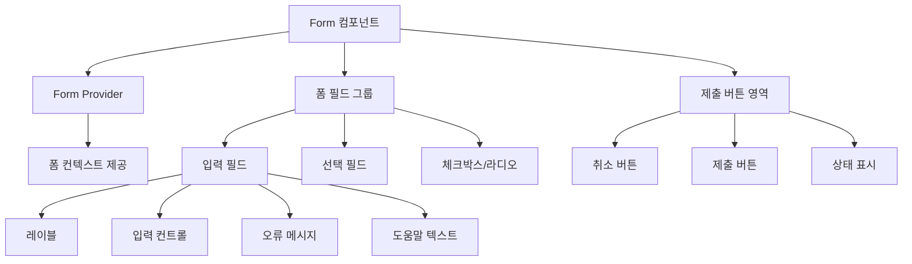

# **📌 PM PRD - 폼 컴포넌트 (Form)**

## **1. 개요**
폼 컴포넌트는 사용자로부터 데이터를 수집하고 제출하는 인터페이스를 제공하는 핵심 UI 요소입니다. 게임 서비스 관리 도구 내에서 사용자 정보 입력, 게임 데이터 수정, 설정 구성 등 다양한 데이터 입력 시나리오에 활용됩니다. 이 컴포넌트는 React Hook Form 라이브러리와 Zod 검증 라이브러리를 통합하여 강력한 타입 안전성과 사용자 경험을 제공합니다.

## **2. 주요 목표**
- 일관된 폼 입력 경험과 검증 로직 제공
- 다양한 입력 필드 유형을 지원하는 확장 가능한 구조 설계
- 사용자 오류를 최소화하는 직관적인 유효성 검사 및 피드백 제공
- 개발자 경험 향상을 위한 타입스크립트 통합 및 간결한 API 제공
- 다양한 폼 레이아웃과 스타일을 지원하는 유연한 디자인 시스템

## **3. 주요 기능 요구사항**
| 기능 | 우선순위 | 설명 |
|------|---------|------|
| 폼 상태 관리 | 상 | React Hook Form을 활용한 입력 필드 상태 관리 |
| 유효성 검증 | 상 | Zod 스키마 기반 타입 안전 유효성 검사 |
| 오류 메시지 | 상 | 사용자 친화적인 오류 메시지 표시 |
| 다양한 입력 컴포넌트 | 상 | 텍스트, 숫자, 선택, 체크박스 등 다양한 입력 유형 지원 |
| 반응형 레이아웃 | 중 | 다양한 화면 크기에 대응하는 적응형 폼 레이아웃 |
| 제출 핸들링 | 중 | 폼 제출 시 데이터 처리 및 API 연동 |
| 동적 폼 필드 | 중 | 조건에 따라 동적으로 추가/제거되는 필드 지원 |
| 접근성 지원 | 중 | ARIA 속성을 통한 스크린 리더 호환성 확보 |

## **4. 사용자 시나리오**
1. **기본 데이터 입력**: 관리자가 사용자 프로필이나 게임 아이템 정보 입력
   - 필수 필드와 선택적 필드를 명확히 구분하여 표시
   - 입력 중 실시간 유효성 검사로 즉각적인 피드백 제공
2. **데이터 수정**: 기존 데이터 불러와서 수정 작업 수행
   - 초기값 설정 및 변경 사항 추적
   - 필요한 필드만 수정할 수 있는 유연성 제공
3. **복잡한 폼 작성**: 다단계 입력이나 중첩된 데이터 구조 처리
   - 관련 필드 그룹화 및 단계별 진행 지원
   - 여러 섹션으로 구성된 복잡한 폼 구조화
4. **데이터 유효성 검증**: 입력 데이터의 정확성과 일관성 보장
   - 다양한 검증 규칙 적용 및 오류 메시지 표시
   - 제출 전 전체 폼 유효성 확인

## **5. 구현 현황**
| 기능 | 구현 상태 | 비고 |
|------|----------|------|
| 기본 폼 컴포넌트 | ✅ 완료 | React Hook Form과 통합 완료 |
| Zod 스키마 통합 | ✅ 완료 | 타입스크립트 타입 추론 지원 |
| 오류 메시지 표시 | ✅ 완료 | 인라인 및 요약 오류 메시지 지원 |
| 다양한 입력 필드 | ✅ 완료 | 텍스트, 숫자, 선택, 체크박스 등 구현 |
| 반응형 레이아웃 | ⚠️ 부분 구현 | 일부 복잡한 레이아웃에서 개선 필요 |
| 동적 폼 필드 | ⚠️ 부분 구현 | 배열 필드 지원 개선 진행 중 |
| 접근성 개선 | ⚠️ 부분 구현 | ARIA 속성 추가 진행 중 |

---

# **📌 Design PRD - 폼 컴포넌트 (Form)**

## **1. 디자인 컨셉**
- **일관성**: 모든 폼 요소에 일관된 디자인 언어 적용
- **명료함**: 레이블, 필수 필드, 오류 상태를 명확히 구분
- **피드백**: 사용자 입력에 대한 즉각적이고 명확한 시각적 피드백
- **계층적 구조**: 관련 입력 필드를 논리적으로 그룹화하는 계층 구조
- **접근성**: 모든 사용자가 쉽게 폼을 작성할 수 있는 접근성 높은 디자인

## **2. 레이아웃 및 구조**



## **3. 색상 및 스타일 가이드**
- **폼 컨테이너**:
  - 배경: 흰색(bg-white)
  - 테두리: 연한 회색(border border-gray-200)
  - 그림자: 미묘한 그림자 효과(shadow-sm)
  - 패딩: 여유 있는 패딩(p-6)
  - 모서리: 둥근 모서리(rounded-md)
  
- **레이블**:
  - 글꼴: 중간 굵기(font-medium)
  - 색상: 진한 회색(text-gray-700)
  - 마진: 하단 여백(mb-2)
  - 필수 표시: 빨간색 별표(text-red-500)
  
- **입력 필드**:
  - 배경: 흰색(bg-white)
  - 테두리: 연한 회색(border-gray-300)
  - 포커스: 보라색 테두리(focus:border-purple-500)
  - 패딩: 적절한 내부 여백(px-3 py-2)
  - 비활성화: 연한 회색 배경(bg-gray-100)
  
- **오류 상태**:
  - 테두리: 빨간색(border-red-500)
  - 텍스트: 빨간색(text-red-500)
  - 아이콘: 경고 아이콘(text-red-500)
  
- **성공 상태**:
  - 테두리: 녹색(border-green-500)
  - 아이콘: 체크 아이콘(text-green-500)
  
- **버튼**:
  - 제출 버튼: 보라색 배경(bg-purple-600)
  - 취소 버튼: 회색 배경(bg-gray-200)
  - 비활성화: 연한 회색(bg-gray-300)
  - 호버: 약간 더 진한 색상(hover:bg-purple-700)

## **4. 상태 및 인터랙션**
- **기본 상태**: 중립적인 테두리와 배경색으로 표시
- **포커스 상태**: 진한 테두리와 약간의 그림자로 현재 입력 중임을 강조
- **유효성 오류**: 빨간색 테두리와 오류 메시지로 문제 표시
- **성공 상태**: 녹색 테두리나 체크 아이콘으로 유효한 입력임을 표시
- **비활성화 상태**: 연한 회색 배경과 텍스트로 입력 불가 상태 표시
- **로딩 상태**: 제출 버튼에 로딩 인디케이터 표시

## **5. 반응형 고려사항**
- **작은 화면(모바일)**: 
  - 열 레이아웃에서 필드를 세로로 배치
  - 더 큰 터치 영역 제공
  - 레이블을 입력 필드 위에 배치
  
- **중간 화면(태블릿)**:
  - 그리드 레이아웃으로 공간 효율화
  - 적절한 여백과 간격 조정
  
- **큰 화면(데스크톱)**:
  - 다열 레이아웃으로 효율적인 공간 활용
  - 레이블과 입력 필드를 나란히 배치 가능
  - 더 넓은 폼 너비 제공

---

# **📌 Tech PRD - 폼 컴포넌트 (Form)**

## **1. 기술 스택**
- **프레임워크**: Next.js + TypeScript
- **폼 라이브러리**: React Hook Form
- **유효성 검증**: Zod 스키마
- **UI 컴포넌트**: ShadCN UI Form 컴포넌트
- **스타일링**: Tailwind CSS

## **2. 컴포넌트 구조**

```typescript
// 폼 컴포넌트 인터페이스
import { zodResolver } from '@hookform/resolvers/zod';
import { useForm } from 'react-hook-form';
import * as z from 'zod';

// 폼 루트 컴포넌트 속성
export interface FormProps<TSchema extends z.ZodType> {
  schema: TSchema;
  defaultValues?: Partial<z.infer<TSchema>>;
  onSubmit: (values: z.infer<TSchema>) => void;
  children: React.ReactNode;
  className?: string;
}

// 폼 필드 컴포넌트 속성
export interface FormFieldProps<
  TSchema extends z.ZodType,
  TName extends Path<z.infer<TSchema>>
> {
  name: TName;
  control: Control<z.infer<TSchema>>;
  render: (props: {
    field: ControllerRenderProps<z.infer<TSchema>, TName>;
    formState: FormState<z.infer<TSchema>>;
  }) => React.ReactNode;
}

// 폼 항목 컴포넌트 속성
export interface FormItemProps {
  className?: string;
  children: React.ReactNode;
}

// 폼 레이블 컴포넌트 속성
export interface FormLabelProps {
  className?: string;
  children: React.ReactNode;
  required?: boolean;
}

// 폼 메시지 컴포넌트 속성
export interface FormMessageProps {
  className?: string;
  children?: React.ReactNode;
}
```

## **3. 주요 기능 구현**

### **3.1 폼 루트 컴포넌트**
```tsx
export function Form<TSchema extends z.ZodType>({
  schema,
  defaultValues,
  onSubmit,
  children,
  className,
}: FormProps<TSchema>) {
  const methods = useForm<z.infer<TSchema>>({
    resolver: zodResolver(schema),
    defaultValues: defaultValues as DefaultValues<z.infer<TSchema>>,
  });

  return (
    <FormProvider {...methods}>
      <form
        onSubmit={methods.handleSubmit(onSubmit)}
        className={cn('space-y-6', className)}
      >
        {children}
      </form>
    </FormProvider>
  );
}
```

### **3.2 폼 필드 컴포넌트**
```tsx
export const FormField = <
  TSchema extends z.ZodType,
  TName extends Path<z.infer<TSchema>>
>({
  name,
  control,
  render,
}: FormFieldProps<TSchema, TName>) => {
  return (
    <Controller
      name={name}
      control={control}
      render={({ field, formState }) => render({ field, formState })}
    />
  );
};
```

### **3.3 폼 아이템 및 메시지 컴포넌트**
```tsx
export function FormItem({ className, children }: FormItemProps) {
  const id = React.useId();
  const { formItemId } = React.useContext(FormItemContext);
  const formDescriptionId = `${id || formItemId}-form-item-description`;
  const formMessageId = `${id || formItemId}-form-item-message`;

  return (
    <FormItemContext.Provider
      value={{
        formItemId: id,
        formDescriptionId,
        formMessageId,
      }}
    >
      <div className={cn('space-y-2', className)}>{children}</div>
    </FormItemContext.Provider>
  );
}

export function FormLabel({
  className,
  children,
  required = false,
}: FormLabelProps) {
  const { formItemId, formDescriptionId } = React.useContext(FormItemContext);
  
  return (
    <Label
      htmlFor={formItemId}
      className={cn('text-sm font-medium text-gray-700', className)}
      aria-describedby={formDescriptionId}
    >
      {children}
      {required && <span className="text-red-500 ml-1">*</span>}
    </Label>
  );
}

export function FormMessage({
  className,
  children,
}: FormMessageProps) {
  const { formMessageId } = React.useContext(FormItemContext);
  const { error } = useFormField();
  const body = error ? String(error?.message) : children;

  if (!body) return null;

  return (
    <p
      id={formMessageId}
      className={cn('text-sm font-medium text-red-500', className)}
    >
      {body}
    </p>
  );
}
```

### **3.4 폼 통합 사용 예시**
```tsx
// Zod 스키마 정의
const userFormSchema = z.object({
  username: z.string().min(2, "사용자명은 2글자 이상이어야 합니다"),
  email: z.string().email("유효한 이메일 주소를 입력해주세요"),
  age: z.number().min(1, "나이는 1 이상이어야 합니다").optional(),
  bio: z.string().max(160).optional(),
  notifications: z.boolean().default(false),
});

// 폼 컴포넌트 사용
export function UserForm({ user, onSubmit }) {
  const defaultValues = user ? {
    username: user.username,
    email: user.email,
    age: user.age,
    bio: user.bio,
    notifications: user.notifications
  } : {};

  return (
    <Form
      schema={userFormSchema}
      defaultValues={defaultValues}
      onSubmit={onSubmit}
      className="space-y-6 bg-white p-6 rounded-md shadow-sm"
    >
      <FormField
        control={form.control}
        name="username"
        render={({ field }) => (
          <FormItem>
            <FormLabel required>사용자명</FormLabel>
            <Input {...field} placeholder="사용자명 입력" className="w-full" />
            <FormMessage />
          </FormItem>
        )}
      />
      
      <FormField
        control={form.control}
        name="email"
        render={({ field }) => (
          <FormItem>
            <FormLabel required>이메일</FormLabel>
            <Input 
              {...field} 
              type="email" 
              placeholder="이메일 주소" 
              className="w-full" 
            />
            <FormMessage />
          </FormItem>
        )}
      />
      
      <div className="flex justify-end space-x-2">
        <Button variant="outline" type="button">취소</Button>
        <Button type="submit">저장</Button>
      </div>
    </Form>
  );
}
```

## **4. 폼 필드 변형 컴포넌트**

### **4.1 다양한 입력 필드 타입**
```tsx
// 텍스트 입력
<FormField
  control={form.control}
  name="name"
  render={({ field }) => (
    <FormItem>
      <FormLabel>이름</FormLabel>
      <Input {...field} />
      <FormMessage />
    </FormItem>
  )}
/>

// 텍스트 영역
<FormField
  control={form.control}
  name="description"
  render={({ field }) => (
    <FormItem>
      <FormLabel>설명</FormLabel>
      <Textarea {...field} />
      <FormMessage />
    </FormItem>
  )}
/>

// 선택 입력
<FormField
  control={form.control}
  name="category"
  render={({ field }) => (
    <FormItem>
      <FormLabel>카테고리</FormLabel>
      <Select
        onValueChange={field.onChange}
        defaultValue={field.value}
      >
        <SelectTrigger>
          <SelectValue placeholder="카테고리 선택" />
        </SelectTrigger>
        <SelectContent>
          <SelectItem value="games">게임</SelectItem>
          <SelectItem value="items">아이템</SelectItem>
          <SelectItem value="users">사용자</SelectItem>
        </SelectContent>
      </Select>
      <FormMessage />
    </FormItem>
  )}
/>

// 체크박스
<FormField
  control={form.control}
  name="terms"
  render={({ field }) => (
    <FormItem className="flex flex-row items-start space-x-3 space-y-0">
      <Checkbox
        checked={field.value}
        onCheckedChange={field.onChange}
      />
      <div className="space-y-1 leading-none">
        <FormLabel>이용 약관에 동의합니다</FormLabel>
        <FormDescription>
          서비스 이용 약관에 동의해야 계속할 수 있습니다.
        </FormDescription>
      </div>
    </FormItem>
  )}
/>
```

## **5. 성능 고려사항**
- **지연 렌더링**: 복잡한 폼의 경우 지연 로딩으로 초기 렌더링 성능 개선
- **메모이제이션**: React.memo와 useMemo를 활용한 불필요한 리렌더링 방지
- **입력 디바운싱**: 실시간 유효성 검사 시 입력 디바운싱 적용
- **스키마 최적화**: 복잡한 Zod 스키마의 경우 컴포넌트 외부에서 정의하여 재사용
- **비제어 컴포넌트**: 적절한 경우 비제어 컴포넌트 활용으로 렌더링 최소화

## **6. 확장성**
- **커스텀 폼 컨트롤**: 새로운 입력 타입을 쉽게 추가할 수 있는 확장 가능한 구조
- **폼 레이아웃 변형**: 다양한 레이아웃 변형 지원 (인라인, 그리드, 다단계 등)
- **스키마 결합**: 복잡한 데이터 구조를 위한 하위 스키마 결합 지원
- **조건부 필드**: 다른 필드 값에 따라 동적으로 표시/숨김 처리되는 필드 구현
- **폼 저장 및 복원**: 작성 중인 폼 상태를 저장하고 복원하는 기능

## **7. 접근성 고려사항**
- **키보드 탐색**: Tab 순서 최적화 및 키보드 접근성 보장
- **레이블 연결**: 모든 입력 필드에 명시적으로 연결된 레이블 제공
- **ARIA 속성**: 적절한 aria-* 속성 적용
  - `aria-required`: 필수 필드 표시
  - `aria-invalid`: 유효하지 않은 필드 표시
  - `aria-describedby`: 입력 필드와 설명/오류 메시지 연결
- **오류 알림**: 스크린 리더에 오류 메시지 적절히 전달
- **충분한 색상 대비**: WCAG 기준을 충족하는 색상 대비 비율 확보
- **포커스 관리**: 명확한 포커스 표시 및 유지 