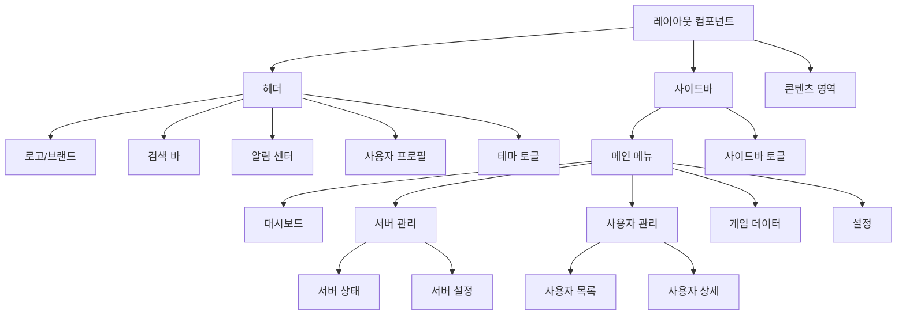

# **📌 PM PRD - 레이아웃 컴포넌트 (Header & Sidebar)**

## **1. 개요**
레이아웃 컴포넌트는 게임 서비스 관리 도구의 기본 구조를 제공하는 UI 프레임워크로, 주로 헤더(Header)와 사이드바(Sidebar)로 구성됩니다. 이 컴포넌트는 일관된 내비게이션 구조를 제공하여 사용자가 다양한 관리 기능에 쉽게 접근할 수 있게 하며, 애플리케이션 전체에 통일된 레이아웃과 사용자 경험을 제공합니다. 헤더는 상단에 위치하여 전역 기능과 정보를 제공하고, 사이드바는 주요 내비게이션 메뉴를 포함합니다.

## **2. 주요 목표**
- 일관된 내비게이션 구조를 통해 애플리케이션 전반의 접근성과 사용성 향상
- 직관적인 메뉴 체계로 복잡한 관리 기능에 쉽게 접근할 수 있는 환경 제공
- 반응형 디자인으로 다양한 화면 크기와 기기에서 최적의 사용자 경험 보장
- 현재 위치 및 상태에 대한 명확한 시각적 피드백 제공
- 확장 가능한 구조로 새로운 기능과 메뉴 항목을 쉽게 추가할 수 있는 유연성

## **3. 주요 기능 요구사항**
| 기능 | 우선순위 | 설명 |
|------|---------|------|
| 메인 내비게이션 | 상 | 사이드바를 통한 주요 기능 영역 접근 |
| 현재 위치 표시 | 상 | 현재 사용자가 위치한 페이지/메뉴 하이라이트 |
| 사이드바 접기/펼치기 | 중 | 화면 공간 최적화를 위한 사이드바 토글 기능 |
| 사용자 프로필 정보 | 중 | 헤더에 현재 로그인한 사용자 정보 표시 |
| 알림 표시 | 중 | 시스템 알림 및 중요 이벤트 표시 |
| 빠른 검색 | 중 | 애플리케이션 전체 기능 및 페이지 검색 |
| 다크 모드 토글 | 하 | 라이트/다크 테마 전환 기능 |
| 단축키 지원 | 하 | 내비게이션 및 주요 기능에 대한 키보드 단축키 |

## **4. 사용자 시나리오**
1. **기본 내비게이션**: 관리자가 사이드바의 메뉴를 통해 서버 관리, 사용자 관리 등 주요 기능에 접근
2. **컨텍스트 인식**: 관리자가 현재 작업 중인 페이지와 관련된 메뉴가 하이라이트되어 현재 위치 쉽게 파악
3. **공간 최적화**: 데이터 테이블이나 차트 등을 볼 때 사이드바를 접어 콘텐츠 영역을 최대화
4. **검색 활용**: 특정 기능이나 페이지를 빠르게 찾기 위해 헤더의 검색 기능 사용
5. **알림 확인**: 헤더의 알림 아이콘을 통해 시스템 상태나 중요 이벤트 알림 확인

## **5. 구현 현황**
| 기능 | 구현 상태 | 비고 |
|------|----------|------|
| 메인 내비게이션 | ✅ 완료 | 주요 기능별 메뉴 구성 완료 |
| 현재 위치 표시 | ✅ 완료 | 활성 메뉴 하이라이트 구현 |
| 사이드바 접기/펼치기 | ✅ 완료 | 토글 버튼 및 애니메이션 적용 |
| 사용자 프로필 정보 | ✅ 완료 | 드롭다운 메뉴 포함 |
| 알림 표시 | ⚠️ 부분 구현 | 알림 아이콘 및 카운터 구현, 상세 내용 표시 예정 |
| 빠른 검색 | ⚠️ 부분 구현 | 기본 검색 입력 구현, 검색 결과 표시 개선 필요 |
| 반응형 레이아웃 | ✅ 완료 | 모바일 및 태블릿 지원 |

---

# **📌 Design PRD - 레이아웃 컴포넌트 (Header & Sidebar)**

## **1. 디자인 컨셉**
- **일관성**: 모든 페이지에서 동일한 내비게이션 구조로 예측 가능한 사용자 경험 제공
- **계층적 구조**: 명확한 시각적 계층으로 정보와 기능의 중요도 표현
- **시각적 명료함**: 현재 위치와 사용 가능한 기능을 직관적으로 인식할 수 있는 디자인
- **공간 효율성**: 내비게이션 요소가 콘텐츠 영역을 침해하지 않도록 균형 잡힌 공간 분배
- **브랜드 정체성**: 게임 서비스 관리 도구의 특성과 브랜드 아이덴티티를 반영한 디자인 요소

## **2. 레이아웃 및 구조**



## **3. 색상 및 스타일 가이드**
- **헤더**:
  - 배경: 어두운 색상 (bg-gray-900 또는 브랜드 컬러)
  - 높이: 64px (h-16)
  - 그림자: 미묘한 그림자 효과 (shadow-sm)
  - 로고 영역: 브랜드 컬러 또는 강조색
  - 텍스트: 흰색 또는 밝은 회색 (text-white, text-gray-200)
  
- **사이드바**:
  - 배경: 어두운 배경 (bg-gray-800)
  - 너비: 접히지 않은 상태 - 240px, 접힌 상태 - 64px
  - 메뉴 항목 패딩: py-2 px-4
  - 활성 메뉴 배경: 브랜드 컬러 또는 강조색 배경 (bg-purple-600)
  - 비활성 메뉴: 흰색 텍스트 (text-gray-300)
  - 호버 상태: 약간 밝은 배경 (hover:bg-gray-700)
  
- **메뉴 아이템**:
  - 아이콘: 왼쪽 정렬, 크기 - 20px (w-5 h-5)
  - 레이블: 아이콘 오른쪽 간격 12px (ml-3)
  - 서브메뉴 들여쓰기: 왼쪽 패딩 16px (pl-4)
  - 활성 표시: 왼쪽 테두리 또는 배경색 변경
  
- **콘텐츠 영역**:
  - 배경: 밝은 색상 (bg-gray-50 또는 white)
  - 패딩: 전체 패딩 (p-6)
  - 최대 너비: 필요에 따라 제한 (max-w-screen-2xl mx-auto)

## **4. 상태 및 인터랙션**
- **사이드바 토글**:
  - 기본 상태: 데스크톱에서는 펼침, 모바일에서는 접힘
  - 전환 애니메이션: 부드러운 너비 변화 (transition-width)
  - 접힌 상태: 아이콘만 표시, 호버 시 툴팁으로 레이블 표시
  
- **메뉴 활성화 상태**:
  - 활성 메뉴: 배경색 변경, 왼쪽 하이라이트 바, 글씨 굵게
  - 호버 상태: 약간 밝은 배경색, 커서 포인터
  - 비활성 상태: 기본 배경, 보통 굵기 텍스트
  
- **드롭다운 메뉴**:
  - 기본 상태: 숨김
  - 활성화: 클릭 시 부드럽게 나타남 (fade-in, slide-down)
  - 외부 클릭: 메뉴 자동 닫힘
  
- **알림 상태**:
  - 읽지 않은 알림: 카운터 뱃지로 표시 (빨간색 원형)
  - 알림 확인: 클릭 시 알림 패널 표시, 읽음 처리

## **5. 반응형 고려사항**
- **모바일 (< 640px)**:
  - 사이드바: 기본적으로 숨김, 햄버거 메뉴 클릭 시 오버레이로 표시
  - 헤더: 간소화된 요소 (로고, 햄버거 메뉴, 사용자 아이콘만 표시)
  - 검색: 아이콘 클릭 시 확장되는 검색 입력 필드
  
- **태블릿 (640px - 1024px)**:
  - 사이드바: 기본적으로 접힌 상태 (아이콘만 표시)
  - 헤더: 모든 요소 표시, 필요 시 일부 요소 드롭다운으로 통합
  
- **데스크톱 (> 1024px)**:
  - 사이드바: 기본적으로 펼쳐진 상태, 수동으로 접기 가능
  - 헤더: 모든 요소 완전히 표시
  - 레이아웃: 사이드바와 콘텐츠 영역의 균형 잡힌 배치

---

# **📌 Tech PRD - 레이아웃 컴포넌트 (Header & Sidebar)**

## **1. 기술 스택**
- **프레임워크**: Next.js + TypeScript
- **UI 라이브러리**: ShadCN UI 컴포넌트
- **아이콘**: Lucide React 아이콘
- **스타일링**: Tailwind CSS
- **상태 관리**: React Context API + 로컬 상태

## **2. 컴포넌트 구조**

```typescript
// 레이아웃 컴포넌트 구조
export interface LayoutProps {
  children: React.ReactNode;
}

// 레이아웃 컨텍스트 인터페이스
export interface ILayoutContext {
  sidebarExpanded: boolean;
  toggleSidebar: () => void;
  isMobile: boolean;
  isDarkMode: boolean;
  toggleDarkMode: () => void;
}

// 메뉴 항목 인터페이스
export interface IMenuItem {
  id: string;
  label: string;
  icon?: React.ReactNode;
  path: string;
  children?: IMenuItem[];
  badge?: {
    text: string;
    variant: 'default' | 'secondary' | 'destructive' | 'outline';
  };
}
```

## **3. 주요 기능 구현**

### **3.1 레이아웃 구성 및 컨텍스트 제공**
```tsx
// 레이아웃 컨텍스트 생성
const LayoutContext = createContext<ILayoutContext | undefined>(undefined);

// 레이아웃 제공자 컴포넌트
export function LayoutProvider({ children }: { children: React.ReactNode }) {
  const [sidebarExpanded, setSidebarExpanded] = useState(true);
  const [isDarkMode, setIsDarkMode] = useState(false);
  const [isMobile, setIsMobile] = useState(false);
  
  // 반응형 처리를 위한 윈도우 크기 감지
  useEffect(() => {
    const checkIsMobile = () => {
      setIsMobile(window.innerWidth < 768);
      if (window.innerWidth < 768) {
        setSidebarExpanded(false);
      }
    };
    
    // 초기 체크
    checkIsMobile();
    
    // 리사이즈 이벤트 리스너
    window.addEventListener('resize', checkIsMobile);
    
    return () => {
      window.removeEventListener('resize', checkIsMobile);
    };
  }, []);
  
  // 사이드바 토글 함수
  const toggleSidebar = useCallback(() => {
    setSidebarExpanded(prev => !prev);
  }, []);
  
  // 다크 모드 토글 함수
  const toggleDarkMode = useCallback(() => {
    setIsDarkMode(prev => !prev);
    // HTML 요소에 다크 모드 클래스 토글
    document.documentElement.classList.toggle('dark');
  }, []);
  
  // 컨텍스트 값
  const contextValue: ILayoutContext = {
    sidebarExpanded,
    toggleSidebar,
    isMobile,
    isDarkMode,
    toggleDarkMode
  };
  
  return (
    <LayoutContext.Provider value={contextValue}>
      {children}
    </LayoutContext.Provider>
  );
}

// 레이아웃 훅
export function useLayout() {
  const context = useContext(LayoutContext);
  
  if (context === undefined) {
    throw new Error('useLayout must be used within a LayoutProvider');
  }
  
  return context;
}
```

### **3.2 메인 레이아웃 컴포넌트**
```tsx
export function MainLayout({ children }: LayoutProps) {
  const { sidebarExpanded, isMobile } = useLayout();

  return (
    <div className="flex h-screen overflow-hidden">
      {/* 모바일 오버레이 */}
      {isMobile && sidebarExpanded && (
        <div 
          className="fixed inset-0 z-40 bg-black/50" 
          onClick={() => toggleSidebar()}
        />
      )}
      
      {/* 사이드바 */}
      <Sidebar />
      
      {/* 메인 콘텐츠 */}
      <div className="flex flex-col flex-1 overflow-hidden">
        <Header />
        <main className="flex-1 overflow-auto bg-gray-50 dark:bg-gray-900 p-4 md:p-6">
          <div className="max-w-screen-2xl mx-auto">
            {children}
          </div>
        </main>
      </div>
    </div>
  );
}
```

### **3.3 헤더 컴포넌트**
```tsx
function Header() {
  const { toggleSidebar, isMobile, isDarkMode, toggleDarkMode } = useLayout();
  const [showSearchInput, setShowSearchInput] = useState(false);
  const searchInputRef = useRef<HTMLInputElement>(null);
  
  // 검색 입력 표시/숨김 토글
  const toggleSearchInput = useCallback(() => {
    setShowSearchInput(prev => !prev);
    // 입력 필드가 표시되면 포커스
    if (!showSearchInput && searchInputRef.current) {
      setTimeout(() => {
        searchInputRef.current?.focus();
      }, 100);
    }
  }, [showSearchInput]);
  
  return (
    <header className="h-16 bg-white dark:bg-gray-800 border-b border-gray-200 dark:border-gray-700 shadow-sm z-30 flex items-center justify-between px-4">
      {/* 왼쪽 영역 - 사이드바 토글 및 로고 */}
      <div className="flex items-center">
        <Button 
          variant="ghost" 
          size="sm" 
          className="mr-2" 
          onClick={toggleSidebar}
        >
          <Menu className="h-5 w-5" />
          <span className="sr-only">Toggle sidebar</span>
        </Button>
        
        <div className="flex items-center">
          <Image 
            src="/logo.svg" 
            alt="Game Service Manager" 
            width={32} 
            height={32} 
          />
          {(!isMobile || !showSearchInput) && (
            <span className="ml-2 font-semibold text-gray-900 dark:text-white">
              Game Service Manager
            </span>
          )}
        </div>
      </div>
      
      {/* 중앙 영역 - 검색 */}
      <div className={`flex-1 mx-4 ${isMobile ? 'transition-all' : ''}`}>
        {(!isMobile || showSearchInput) && (
          <div className="relative max-w-md mx-auto">
            <Search className="absolute left-2.5 top-2.5 h-4 w-4 text-gray-500 dark:text-gray-400" />
            <Input
              ref={searchInputRef}
              type="search"
              placeholder="검색..."
              className="pl-9 h-9"
              onBlur={() => isMobile && setShowSearchInput(false)}
            />
          </div>
        )}
      </div>
      
      {/* 오른쪽 영역 - 액션 버튼 및 프로필 */}
      <div className="flex items-center space-x-2">
        {isMobile && !showSearchInput && (
          <Button 
            variant="ghost" 
            size="sm" 
            onClick={toggleSearchInput}
          >
            <Search className="h-5 w-5" />
            <span className="sr-only">Search</span>
          </Button>
        )}
        
        {/* 알림 버튼 */}
        <Button variant="ghost" size="sm">
          <BellIcon className="h-5 w-5" />
          <span className="sr-only">Notifications</span>
        </Button>
        
        {/* 다크 모드 토글 */}
        <Button variant="ghost" size="sm" onClick={toggleDarkMode}>
          {isDarkMode ? (
            <Sun className="h-5 w-5" />
          ) : (
            <Moon className="h-5 w-5" />
          )}
          <span className="sr-only">Toggle theme</span>
        </Button>
        
        {/* 사용자 프로필 */}
        <DropdownMenu>
          <DropdownMenuTrigger asChild>
            <Button variant="ghost" size="sm" className="rounded-full">
              <Avatar>
                <AvatarImage src="/avatars/admin.jpg" alt="Admin" />
                <AvatarFallback>A</AvatarFallback>
              </Avatar>
            </Button>
          </DropdownMenuTrigger>
          <DropdownMenuContent align="end">
            <DropdownMenuLabel>관리자 계정</DropdownMenuLabel>
            <DropdownMenuSeparator />
            <DropdownMenuItem>
              <User className="mr-2 h-4 w-4" />
              <span>프로필</span>
            </DropdownMenuItem>
            <DropdownMenuItem>
              <Settings className="mr-2 h-4 w-4" />
              <span>설정</span>
            </DropdownMenuItem>
            <DropdownMenuSeparator />
            <DropdownMenuItem>
              <LogOut className="mr-2 h-4 w-4" />
              <span>로그아웃</span>
            </DropdownMenuItem>
          </DropdownMenuContent>
        </DropdownMenu>
      </div>
    </header>
  );
}
```

### **3.4 사이드바 컴포넌트**
```tsx
function Sidebar() {
  const { sidebarExpanded, isMobile } = useLayout();
  const pathname = usePathname();
  
  // 현재 활성화된 메뉴 아이템인지 확인
  const isActiveLink = (path: string) => {
    if (path === '/') {
      return pathname === path;
    }
    return pathname.startsWith(path);
  };
  
  // 메뉴 아이템 렌더링
  const renderMenuItem = (item: IMenuItem, depth = 0) => {
    const isActive = isActiveLink(item.path);
    const hasChildren = item.children && item.children.length > 0;
    
    return (
      <div key={item.id} className={depth > 0 ? 'ml-6' : ''}>
        <Link
          href={item.path}
          className={cn(
            "flex items-center py-2 px-3 rounded-md my-1 group",
            isActive 
              ? "bg-purple-600 text-white" 
              : "text-gray-300 hover:bg-gray-700 hover:text-white",
            !sidebarExpanded && "justify-center px-2"
          )}
        >
          {item.icon && (
            <div className={cn("h-5 w-5", !sidebarExpanded && "mx-auto")}>
              {item.icon}
            </div>
          )}
          
          {(sidebarExpanded || isMobile) && (
            <>
              <span className={cn("ml-3 flex-1", !item.icon && "ml-9")}>
                {item.label}
              </span>
              
              {item.badge && (
                <Badge variant={item.badge.variant} className="ml-auto">
                  {item.badge.text}
                </Badge>
              )}
              
              {hasChildren && (
                <ChevronRight 
                  className={cn(
                    "h-4 w-4 ml-1 transition-transform",
                    isActive && "rotate-90"
                  )} 
                />
              )}
            </>
          )}
        </Link>
        
        {/* 하위 메뉴 아이템 렌더링 */}
        {hasChildren && isActive && (sidebarExpanded || isMobile) && (
          <div className="mt-1">
            {item.children?.map(child => renderMenuItem(child, depth + 1))}
          </div>
        )}
      </div>
    );
  };
  
  return (
    <aside 
      className={cn(
        "bg-gray-800 text-white z-50 transition-all duration-300 h-screen overflow-y-auto",
        sidebarExpanded 
          ? "w-64" 
          : "w-16",
        isMobile && "fixed inset-y-0 left-0",
        isMobile && !sidebarExpanded && "-translate-x-full"
      )}
    >
      <div className="p-3">
        {/* 사이드바 내용 */}
        <nav className="space-y-1">
          {/* 주요 메뉴 아이템 */}
          <div className="space-y-2">
            {mainMenuItems.map(item => renderMenuItem(item))}
          </div>
          
          {/* 구분선 */}
          {(sidebarExpanded || isMobile) && (
            <Separator className="my-4 bg-gray-700" />
          )}
          
          {/* 부가 메뉴 아이템 */}
          <div className="space-y-2">
            {secondaryMenuItems.map(item => renderMenuItem(item))}
          </div>
        </nav>
      </div>
    </aside>
  );
}
```

### **3.5 메뉴 데이터 정의**
```typescript
// 기본 메뉴 항목
export const mainMenuItems: IMenuItem[] = [
  {
    id: "dashboard",
    label: "대시보드",
    icon: <Home />,
    path: "/"
  },
  {
    id: "servers",
    label: "서버 관리",
    icon: <Server />,
    path: "/servers",
    children: [
      {
        id: "servers-status",
        label: "서버 상태",
        path: "/servers/status"
      },
      {
        id: "servers-config",
        label: "서버 설정",
        path: "/servers/config"
      }
    ],
    badge: {
      text: "3",
      variant: "default"
    }
  },
  {
    id: "users",
    label: "사용자 관리",
    icon: <Users />,
    path: "/users",
    children: [
      {
        id: "users-list",
        label: "사용자 목록",
        path: "/users/list"
      },
      {
        id: "users-details",
        label: "사용자 상세",
        path: "/users/details"
      }
    ]
  },
  {
    id: "game-data",
    label: "게임 데이터",
    icon: <Database />,
    path: "/game-data"
  }
];

// 보조 메뉴 항목
export const secondaryMenuItems: IMenuItem[] = [
  {
    id: "settings",
    label: "설정",
    icon: <Settings />,
    path: "/settings"
  },
  {
    id: "help",
    label: "도움말",
    icon: <HelpCircle />,
    path: "/help"
  }
];
```

## **4. 사용 예시**

```tsx
// App 진입점에 레이아웃 프로바이더 연결
export default function App({ Component, pageProps }: AppProps) {
  return (
    <LayoutProvider>
      <MainLayout>
        <Component {...pageProps} />
      </MainLayout>
    </LayoutProvider>
  );
}

// 페이지 컴포넌트 예시
export default function DashboardPage() {
  return (
    <div>
      <h1 className="text-2xl font-bold mb-6">대시보드</h1>
      <div className="grid grid-cols-1 md:grid-cols-2 lg:grid-cols-3 gap-6">
        {/* 대시보드 카드 컴포넌트들 */}
        <Card>
          <CardHeader>
            <CardTitle>서버 상태</CardTitle>
          </CardHeader>
          <CardContent>
            {/* 서버 상태 내용 */}
          </CardContent>
        </Card>
        
        {/* 추가 카드 */}
      </div>
    </div>
  );
}
```

## **5. 성능 고려사항**
- **메모이제이션**: 컴포넌트 및 함수 메모이제이션으로 불필요한 리렌더링 방지
- **코드 분할**: Next.js의 Dynamic Import를 활용한 코드 분할로 초기 로드 성능 개선
- **이미지 최적화**: Next.js Image 컴포넌트 활용한 이미지 최적화
- **사이드바 렌더링 최적화**: 확장/축소 시 불필요한 요소 렌더링 방지
- **트랜지션 최적화**: CSS 변형(transform)과 불투명도(opacity) 위주 트랜지션으로 성능 최적화

## **6. 확장성**
- **동적 메뉴 구조**: 백엔드 API 응답 기반으로 메뉴 구성 동적 업데이트 가능
- **권한 기반 메뉴**: 사용자 역할/권한에 따른 메뉴 항목 필터링 구현 가능
- **플러그인 시스템**: 새로운 기능 영역을 플러그인으로 추가 가능한 구조
- **테마 확장**: 다양한 테마 및 스타일 변형 지원 프레임워크
- **다국어 지원**: i18n 통합으로 다국어 메뉴 및 레이블 지원

## **7. 접근성 고려사항**
- **키보드 내비게이션**: Tab, Arrow, Esc 키를 통한 완전한 키보드 접근성
- **ARIA 속성**: 스크린 리더를 위한 적절한 ARIA 레이블 및 역할 정의
  - `aria-expanded`: 사이드바 상태 전달
  - `aria-current="page"`: 현재 활성화된 메뉴 항목 표시
  - `aria-label`: 아이콘 버튼에 적절한 레이블 제공
- **색상 대비**: WCAG AA 기준을 준수하는 충분한 텍스트 대비 비율
- **포커스 표시**: 키보드 포커스 시 명확한 시각적 표시

## **8. 테스트 전략**
- **단위 테스트**: 개별 컴포넌트 및 유틸리티 함수 테스트
- **통합 테스트**: 레이아웃 컴포넌트 간 상호작용 및 컨텍스트 동작 검증
- **반응형 테스트**: 다양한 화면 크기에서의 레이아웃 정상 작동 확인
- **접근성 테스트**: axe, Lighthouse 등을 활용한 접근성 준수 여부 검증
- **크로스 브라우저 테스트**: 다양한 브라우저 환경에서의 호환성 확인 