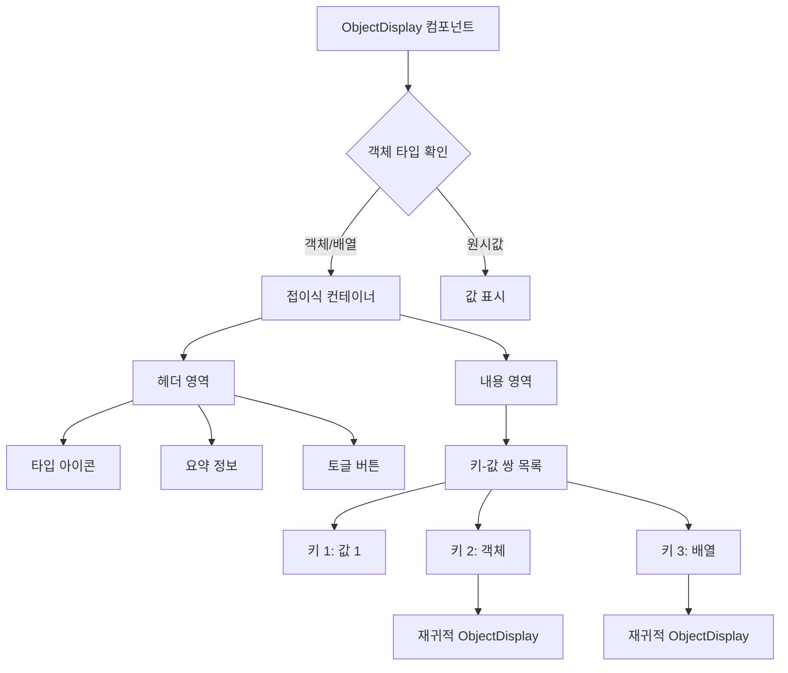

# **📌 PM PRD - 객체 디스플레이 컴포넌트 (Object Display)**

## **1. 개요**
객체 디스플레이 컴포넌트는 복잡한 중첩 객체 데이터를 시각적으로 표현하고 탐색할 수 있게 해주는 UI 컴포넌트입니다. 이 컴포넌트는 주로 데이터 테이블 내에서 객체 형태의 값을 표시하거나, API 응답 데이터, 디버깅 정보 등 구조화된 데이터를 직관적으로 보여주는 데 사용됩니다. 데이터의 구조를 보존하면서도 사용자 친화적인 인터페이스로 정보를 표현합니다.

## **2. 주요 목표**
- 복잡한 객체 데이터를 명확하고 구조화된 형태로 시각화
- 중첩된 객체 구조를 직관적으로 탐색할 수 있는 인터페이스 제공
- 다양한 데이터 타입(객체, 배열, 원시값)을 적절하게 표현
- 확장/축소 기능을 통한 정보의 계층적 표시 및 관리
- 객체 데이터 표시 시 공간 효율성 극대화

## **3. 주요 기능 요구사항**
| 기능 | 우선순위 | 설명 |
|------|---------|------|
| 객체 구조 시각화 | 상 | 중첩된 객체 구조를 들여쓰기와 계층으로 표현 |
| 확장/축소 토글 | 상 | 특정 객체/배열 노드의 확장 및 축소 기능 |
| 데이터 타입 구분 | 중 | 문자열, 숫자, 불리언 등 데이터 타입별 차별화된 표시 |
| 콤팩트 모드 | 중 | 제한된 공간에서 효율적으로 표시하는 압축 모드 |
| 복사 기능 | 중 | 특정 객체/값을 클립보드에 복사 기능 |
| 최대 표시 깊이 설정 | 중 | 초기 렌더링 시 표시할 최대 깊이 제한 |
| 커스텀 스타일링 | 하 | 테마나 컨텍스트에 맞는 스타일 적용 가능 |

## **4. 사용자 시나리오**
1. **테이블 셀에서 객체 표시**: 데이터 테이블의 셀에 객체 데이터가 있을 때 압축된 형태로 표시하고, 클릭 시 확장
2. **API 응답 검사**: 개발자가 API 응답 데이터의 구조를 쉽게 파악하고 디버깅
3. **설정 데이터 보기**: 시스템 설정이나 사용자 설정 데이터를 계층적으로 탐색
4. **중첩 데이터 탐색**: 게임 데이터나 사용자 프로필 등 복잡한 중첩 구조의 데이터 탐색

## **5. 구현 현황**
| 기능 | 구현 상태 | 비고 |
|------|----------|------|
| 객체 구조 시각화 | ✅ 완료 | 계층적 들여쓰기 구현 |
| 확장/축소 토글 | ✅ 완료 | 개별 노드 토글 지원 |
| 데이터 타입 구분 | ✅ 완료 | 타입별 색상 차별화 |
| 콤팩트 모드 | ✅ 완료 | 제한된 길이 표시 및 토글 |
| 빈 객체/배열 표시 | ✅ 완료 | 특수 표기법 적용 |
| 스타일 커스터마이징 | ✅ 완료 | className을 통한 스타일 확장 |

---

# **📌 Design PRD - 객체 디스플레이 컴포넌트 (Object Display)**

## **1. 디자인 컨셉**
- **계층적 가시성**: 들여쓰기와 접이식 구조로 데이터 계층 시각화
- **타입 차별화**: 데이터 타입별 다른 스타일 적용으로 직관적 구분
- **공간 효율성**: 제한된 공간에서 최대한의 정보 전달
- **상호작용성**: 확장/축소 등 직관적인 사용자 상호작용 제공

## **2. 레이아웃 및 구조**



## **3. 색상 및 스타일 가이드**
- **기본 컨테이너**:
  - 배경: 연한 회색(bg-gray-50)
  - 테두리: 얇은 회색 선(border border-gray-200)
  - 둥근 모서리(rounded-md)
  - 패딩: 내부 패딩(p-2)
  
- **키 영역**:
  - 글꼴: 굵게(font-medium)
  - 색상: 어두운 회색(text-gray-700)
  
- **타입별 값 스타일**:
  - 문자열: 초록색(text-green-600), 따옴표로 감싸기
  - 숫자: 파란색(text-blue-600)
  - 불리언: 보라색(text-purple-600)
  - null/undefined: 회색(text-gray-500), 기울임꼴
  - 객체/배열: 검은색(text-black)
  
- **토글 버튼**:
  - 크기: 작게(h-4 w-4)
  - 색상: 회색(text-gray-500)
  - 호버: 진한 회색(hover:text-gray-700)
  
- **확장/축소 애니메이션**:
  - 부드러운 높이 전환(transition-[height,opacity])
  - 지속 시간: 150ms
  - 타이밍 함수: ease-in-out

## **4. 상태 및 인터랙션**
- **초기 상태**: 기본적으로 축소된 상태 (설정에 따라 변경 가능)
- **확장 상태**: 모든 하위 키-값 쌍이 표시된 상태
- **반응형 호버**: 호버 시 배경색 변경 및 상호작용 요소 강조
- **클릭 인터랙션**: 헤더 영역 클릭 시 확장/축소 토글
- **깊이 표시**: 중첩 레벨에 따른 들여쓰기로 계층 구조 표현

## **5. 반응형 고려사항**
- 좁은 컨테이너에서 자동 텍스트 줄바꿈
- 모바일 화면에서 터치 영역 확대로 사용성 개선
- 화면 크기에 따른 최대 표시 깊이 자동 조정
- 작은 화면에서 콤팩트 모드 자동 활성화 옵션

---

# **📌 Tech PRD - 객체 디스플레이 컴포넌트 (Object Display)**

## **1. 기술 스택**
- **프레임워크**: Next.js + TypeScript
- **UI 컴포넌트**: 커스텀 컴포넌트
- **스타일링**: Tailwind CSS
- **아이콘**: Lucide React
- **상태 관리**: React 로컬 상태 (useState)

## **2. 컴포넌트 구조**

```typescript
// 객체 디스플레이 속성 정의
export interface ObjectDisplayProps {
  data: any; // 표시할 객체 데이터
  label?: string; // 선택적 라벨 (최상위 키 이름)
  depth?: number; // 현재 깊이 레벨
  maxDepth?: number; // 초기 표시할 최대 깊이
  maxInitialExpandedKeys?: number; // 초기에 펼칠 최대 키 수
  compact?: boolean; // 압축 모드 여부
  expandAll?: boolean; // 모두 펼치기 여부
  className?: string; // 추가 스타일 클래스
}

// 내부 상태 인터페이스
interface ObjectDisplayState {
  expanded: boolean; // 확장/축소 상태
  copySuccess: boolean; // 복사 성공 상태
}
```

## **3. 주요 기능 구현**

### **3.1 객체 타입 분석 및 렌더링**
```typescript
export function ObjectDisplay({
  data,
  label,
  depth = 0,
  maxDepth = 2,
  maxInitialExpandedKeys = 5,
  compact = false,
  expandAll = false,
  className = ""
}: ObjectDisplayProps) {
  const [expanded, setExpanded] = useState(expandAll || depth < maxDepth);
  const [copySuccess, setCopySuccess] = useState(false);
  
  // 데이터 타입 확인
  const type = getDataType(data);
  const isExpandable = type === 'object' || type === 'array';
  
  // 객체/배열이 아닌 경우 원시값 렌더링
  if (!isExpandable) {
    return <PrimitiveDisplay value={data} type={type} />;
  }
  
  // 빈 객체/배열 처리
  const isEmpty = isEmptyObject(data);
  
  // 객체 내용 렌더링
  const renderContent = () => {
    if (isEmpty) {
      return <div className="text-gray-500 italic">{type === 'array' ? '[]' : '{}'}</div>;
    }
    
    return (
      <div className="ml-4">
        {Object.entries(data).map(([key, value], index) => {
          // 최대 표시 키 수 제한 (압축 모드일 경우)
          if (compact && index >= maxInitialExpandedKeys) {
            return index === maxInitialExpandedKeys ? (
              <div key="more" className="text-gray-500">...더 보기</div>
            ) : null;
          }
          
          return (
            <div key={key} className="mt-1">
              <span className="font-medium text-gray-700">{key}: </span>
              <ObjectDisplay
                data={value}
                depth={depth + 1}
                maxDepth={maxDepth}
                compact={compact}
                expandAll={expandAll}
              />
            </div>
          );
        })}
      </div>
    );
  };
  
  // 객체 요약 정보 생성
  const summary = getSummary(data, type);
  
  return (
    <div className={`rounded-md ${className}`}>
      <div 
        className="flex items-center cursor-pointer hover:bg-gray-100 p-1 rounded"
        onClick={() => setExpanded(!expanded)}
      >
        {isExpandable && (
          <ChevronRight 
            className={`h-4 w-4 text-gray-500 mr-1 transition-transform ${expanded ? 'rotate-90' : ''}`}
          />
        )}
        <span className="text-gray-800">
          {label && <span className="font-medium">{label}: </span>}
          <span className="text-gray-600">{summary}</span>
        </span>
        
        {isExpandable && (
          <CopyButton
            data={data}
            onCopySuccess={() => {
              setCopySuccess(true);
              setTimeout(() => setCopySuccess(false), 2000);
            }}
          />
        )}
      </div>
      
      {isExpandable && expanded && renderContent()}
      
      {copySuccess && (
        <div className="text-xs text-green-500 mt-1">복사됨!</div>
      )}
    </div>
  );
}
```

### **3.2 데이터 타입 분석 및 표시**
```typescript
// 데이터 타입 확인 유틸리티
function getDataType(value: any): string {
  if (value === null) return 'null';
  if (value === undefined) return 'undefined';
  if (Array.isArray(value)) return 'array';
  return typeof value;
}

// 원시값 표시 컴포넌트
function PrimitiveDisplay({ value, type }: { value: any, type: string }) {
  switch (type) {
    case 'string':
      return <span className="text-green-600">"{value}"</span>;
    case 'number':
      return <span className="text-blue-600">{value}</span>;
    case 'boolean':
      return <span className="text-purple-600">{value.toString()}</span>;
    case 'null':
      return <span className="text-gray-500 italic">null</span>;
    case 'undefined':
      return <span className="text-gray-500 italic">undefined</span>;
    default:
      return <span>{String(value)}</span>;
  }
}
```

### **3.3 객체 요약 정보 생성**
```typescript
// 객체/배열 요약 정보 생성
function getSummary(data: any, type: string): string {
  if (type === 'array') {
    return `Array(${data.length})`;
  }
  
  if (type === 'object') {
    const keyCount = Object.keys(data).length;
    return `Object{${keyCount} ${keyCount === 1 ? 'key' : 'keys'}}`;
  }
  
  return '';
}

// 빈 객체/배열 확인
function isEmptyObject(data: any): boolean {
  return Object.keys(data).length === 0;
}
```

### **3.4 복사 기능 구현**
```typescript
// 복사 버튼 컴포넌트
function CopyButton({ data, onCopySuccess }: { data: any, onCopySuccess: () => void }) {
  const handleCopy = (e: React.MouseEvent) => {
    e.stopPropagation(); // 확장/축소 토글 방지
    
    // 객체를 JSON 문자열로 변환하여 클립보드에 복사
    const jsonString = JSON.stringify(data, null, 2);
    navigator.clipboard.writeText(jsonString)
      .then(onCopySuccess)
      .catch(err => console.error('복사 실패:', err));
  };
  
  return (
    <button
      className="ml-2 text-gray-400 hover:text-gray-600 focus:outline-none"
      onClick={handleCopy}
      title="클립보드에 복사"
    >
      <Copy className="h-3.5 w-3.5" />
    </button>
  );
}
```

## **4. 사용 예시**

```tsx
// 기본 사용법
<ObjectDisplay data={userProfile} />

// 라벨과 함께 사용
<ObjectDisplay data={paymentInfo} label="결제 정보" />

// 모든 노드 확장
<ObjectDisplay 
  data={gameStats} 
  expandAll={true} 
  className="bg-gray-50 p-3"
/>

// 테이블 셀에서 압축 모드로 사용
<td>
  <ObjectDisplay 
    data={rowData.complexField} 
    compact={true} 
    maxInitialExpandedKeys={2}
  />
</td>

// 최대 깊이 제한
<ObjectDisplay 
  data={apiResponse} 
  maxDepth={1}
/>
```

## **5. 성능 고려사항**
- **지연 렌더링**: 큰 객체의 경우 확장 시에만 하위 노드 렌더링으로 초기 로드 성능 최적화
- **메모이제이션**: 변경되지 않은 객체는 불필요한 리렌더링 방지
- **가상화 검토**: 매우 큰 객체의 경우 가상화 기술 도입 검토
- **최대 깊이 제한**: 순환 참조나 매우 깊은 객체 구조로 인한 성능 이슈 방지
- **렌더링 최적화**: React DevTools Profiler를 통한 렌더링 성능 분석 및 최적화

## **6. 확장성**
- **커스텀 렌더러**: 특정 타입의 객체에 대한 커스텀 렌더러 플러그인 시스템
- **검색 기능**: 대규모 객체 내 특정 키/값 검색 지원
- **JSON 경로 표시**: 노드 호버 시 해당 요소의 JSON 경로 표시
- **다크 모드**: 시스템 테마에 따른 다크 모드 지원
- **정렬 옵션**: 키 기준 정렬(알파벳순, 길이순 등) 기능 추가 가능

## **7. 접근성 및 국제화**
- **키보드 접근성**: 키보드만으로 객체 탐색 가능하도록 구현
- **스크린 리더 지원**: ARIA 속성을 통한 스크린 리더 접근성 보장
- **국제화 지원**: 다국어 메시지 지원 및 RTL 레이아웃 대응
- **고대비 모드**: 접근성 높은 색상 대비 제공

## **8. 테스트**
- **단위 테스트**: 각 유틸리티 함수 및 렌더링 로직 테스트
- **통합 테스트**: 다양한 데이터 구조에 대한 올바른 렌더링 검증
- **접근성 테스트**: 키보드 탐색 및 스크린 리더 호환성 테스트
- **브라우저 호환성**: 다양한 브라우저에서의 정상 작동 확인 