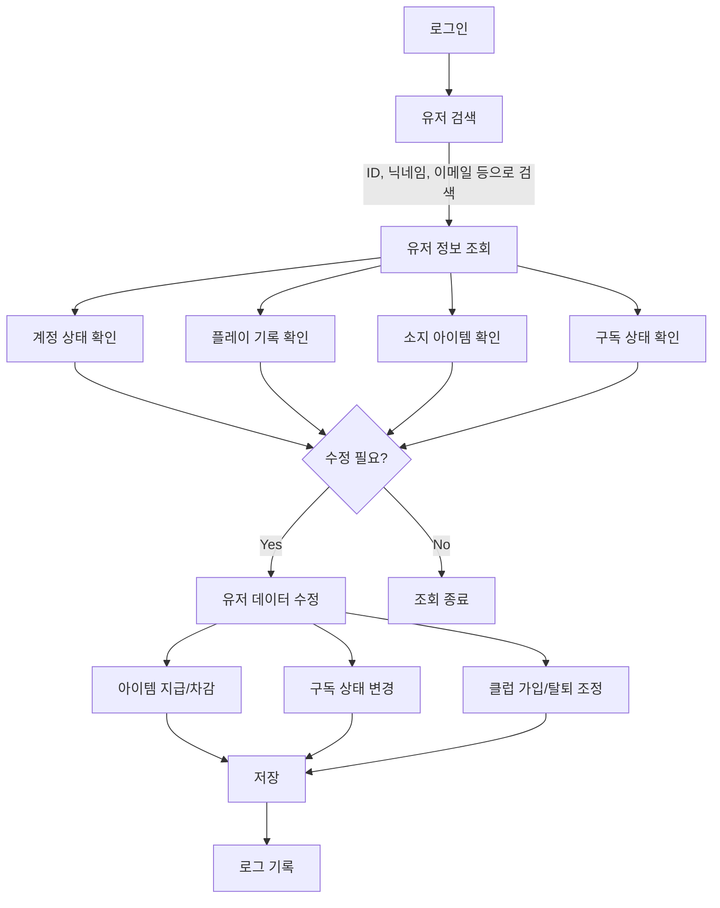
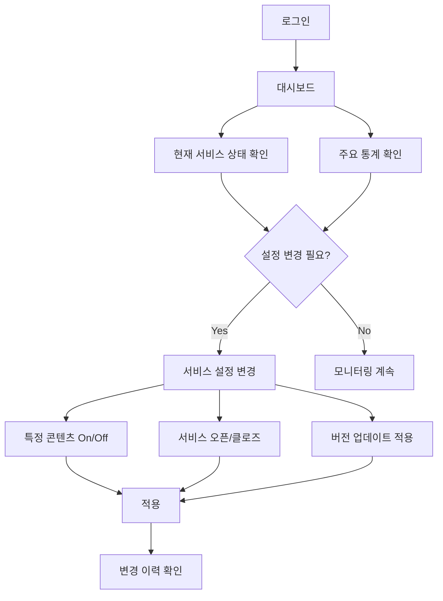
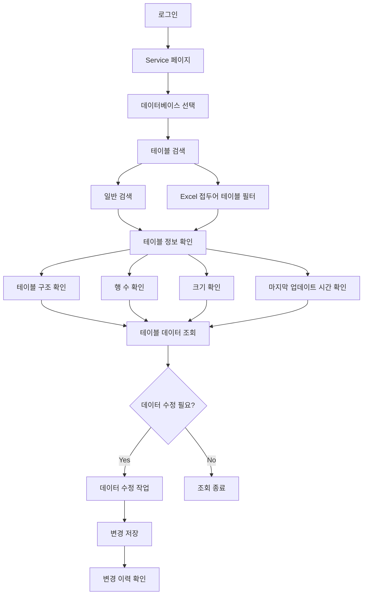

## **Product Requirements Document (PRD)**

### **Game Service Manager Tool for Soccer Game**

## **1\. 제품 개요**

### **1.1 개요**

본 문서는 축구 게임을 위한 **서비스 관리자 도구 (Game Service Manager Tool)** 개발을 위한 요구사항을 정의합니다. 이 툴은 게임 운영팀과 CS 팀이 게임 내 유저와 서비스 전반을 효율적으로 관리할 수 있도록 설계됩니다.

### **1.2 목적**

- 게임 유저 데이터 및 계정을 중앙에서 관리
- 유저의 플레이 기록, 아이템, 구독 상태 등을 손쉽게 조회 및 조작
- 서비스 운영에 필요한 통계 및 관리 기능 제공
- 버전 관리 및 서비스 상태 변경을 간편하게 수행
- QA 및 CS 프로세스를 지원하여 원활한 운영 보장
- 게임 데이터 테이블을 효율적으로 관리하고 조회할 수 있는 기능 제공

---

## **2\. 대상 사용자**

| 사용자 유형 | 니즈 및 주요 요구사항 |
| --- | --- |
| **운영팀** | 게임 내 유저 데이터 관리 및 서비스 상태 조정, 데이터 테이블 조회 및 관리 |
| **CS팀** | 유저 검색 및 계정 관련 문제 해결, 유저의 게임 데이터 확인 |
| **QA팀** | 버전 관리 및 테스트 환경 설정, 게임 기능 테스트 수행 |
| **개발팀** | 운영 및 QA 팀을 위한 서비스 관리 기능 제공, 게임 데이터 테이블 구조 분석 |

---

## **3\. 사용자 흐름 (User Flow)**

### **3.1 유저 관리 흐름 예시 (User Management Flow)**

### **3.2 서비스 관리 흐름 예시 (Service Management Flow)**

### **3.3 데이터 테이블 관리 흐름 예시 (Data Table Management Flow)**

---

## **4\. 기능 요구사항**

### **4.1 유저 관리 (User Management)**

| 기능 | 설명 | 개발 난이도 | 우선순위 |
| --- | --- | --- | --- |
| **유저 계정 관리** | 유저 계정 생성, 조회, 수정, 삭제 | 보통 | 상 |
| **유저 검색** | 닉네임, ID, 이메일 등으로 유저 검색 | 쉬움 | 상 |
| **유저 플레이 데이터 관리** | 싱글플레이, 멀티플레이, 리그 데이터 조회 및 수정 | 보통 | 상 |
| **유저 캐릭터 관리** | 유저가 보유한 캐릭터 정보 조회 및 수정 | 보통 | 중 |
| **유저 재화 (Goods) 관리** | 게임 내 화폐, 아이템 등의 지급 및 차감 | 보통 | 상 |
| **유저 구독 상태 관리** | 구독 플랜 확인 및 변경 | 보통 | 중 |
| **유저 기록 관리** | 게임 내 활동 기록 조회 (ex: 매치 기록, 랭킹 변화) | 어려움 | 중 |
| **유저 메시지 관리** | 유저에게 메일 또는 공지 발송 | 쉬움 | 중 |
| **유저 상점 구매 내역 관리** | 유저의 상점 구매 기록 확인 | 보통 | 중 |
| **유저 클럽 (길드) 관리** | 클럽 가입, 탈퇴, 생성, 수정 등 | 어려움 | 중 |

### **4.2 서비스 관리 (Service Management)**

| 기능 | 설명 | 개발 난이도 | 우선순위 |
| --- | --- | --- | --- |
| **서비스 상태 변경 (오픈/클로즈)** | 게임 서비스의 상태 변경 (유지보수, 점검 등) | 쉬움 | 상 |
| **서비스 콘텐츠 On/Off** | 특정 콘텐츠 활성화/비활성화 | 보통 | 상 |
| **서비스 접속 제한 관리** | 특정 유저 그룹 또는 지역에서 접속 제한 설정 | 보통 | 중 |
| **서비스 통계 대시보드** | 접속자 수, 유저 활동 지표, 매출 통계 제공 | 어려움 | 상 |
| **서비스 운영자 계정 관리** | 관리자 계정 생성 및 권한 설정 | 보통 | 상 |
| **버전 관리** | 게임 클라이언트 및 서버 버전 관리 | 어려움 | 상 |
| **긴급 공지 등록** | 게임 내 공지 및 팝업 설정 | 쉬움 | 중 |
| **CS 관리** | 유저 문의 티켓 조회 및 해결 | 어려움 | 상 |
| **QA 환경 설정** | QA용 테스트 환경 구성 및 설정 | 어려움 | 중 |

### **4.3 데이터 테이블 관리 (Data Table Management)**

| 기능 | 설명 | 개발 난이도 | 우선순위 |
| --- | --- | --- | --- |
| **다중 DB 연결 지원** | 여러 데이터베이스에 대한 연결 및 조회 지원 | 보통 | 상 |
| **테이블 목록 조회** | DB 내 모든 테이블 목록 조회 | 쉬움 | 상 |
| **테이블 검색 및 필터링** | 테이블 이름 또는 특성으로 검색 및 필터링 | 쉬움 | 상 |
| **Excel 접두어 테이블 전용 필터** | `excel_` 접두어를 가진 테이블 전용 필터 제공 | 쉬움 | 상 |
| **테이블 정보 표시** | 행 수, 크기, 마지막 업데이트 시간 등 표시 | 보통 | 상 |
| **테이블 데이터 조회** | 특정 테이블의 데이터 조회 및 페이징 처리 | 보통 | 상 |
| **테이블 구조 분석** | 테이블 컬럼 구조 및 데이터 타입 분석 | 보통 | 중 |
| **SHM 기반 데이터 캐싱** | Shared Memory를 활용한 빠른 데이터 접근 | 어려움 | 중 |
| **데이터 동기화** | Redis Pub/Sub을 활용한 실시간 데이터 동기화 | 어려움 | 중 |
| **데이터 편집 기능** | 테이블 데이터 직접 수정 인터페이스 제공 | 어려움 | 하 |

---

## **5\. 기타 고려사항**

### **5.1 성능 및 보안**

- 유저 검색 및 데이터 조회 속도 최적화
- 관리자 계정 접근 제어 및 보안 강화 (2FA 적용 고려)
- 유저 정보 수정 로그 저장 및 감사 기능 제공
- 대용량 테이블 데이터 처리를 위한 성능 최적화
- 서버 메모리 사용량 모니터링 및 관리

### **5.2 확장성**

- 향후 신규 콘텐츠 추가 시 관리 기능 확장 가능하도록 설계
- API 기반 서비스 연동 고려 (ex: BI 툴 연동)
- 다양한 데이터베이스 유형 지원을 위한 확장 가능한 구조 설계
- 동적 테이블 구조 변경에 대응할 수 있는 유연한 시스템 구현

---

## **6\. 결론 및 기대 효과**

### **6.1 기대 효과**

- 게임 운영팀 및 CS팀의 업무 효율 극대화
- 실시간으로 유저 및 서비스 상태 관리 가능
- 긴급 이슈 대응 속도 향상 및 운영 안정성 강화
- 서비스 데이터를 기반으로 한 운영 전략 수립 가능
- 게임 데이터 테이블에 대한 빠른 접근과 관리로 개발 효율성 증대
- SHM 캐싱을 통한 DB 쿼리 부하 감소 및 응답 속도 개선

### **6.2 향후 발전 방향**

- AI 기반 이상 유저 탐지 기능 추가
- 자동화된 CS 응대 기능 도입
- 데이터 분석 기반의 맞춤형 서비스 운영 기능 추가
- 데이터 시각화 도구 통합으로 데이터 인사이트 제공
- 데이터 마이그레이션 및 백업 자동화 기능 구현
- DynamicTable<T> 타입을 활용한 타입 안정성 강화

이 PRD를 기반으로 개발팀과 디자인팀이 명확한 목표를 설정하고, 단계별로 개발을 진행할 수 있습니다. 🚀