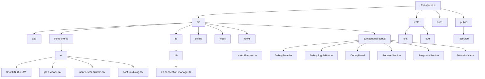
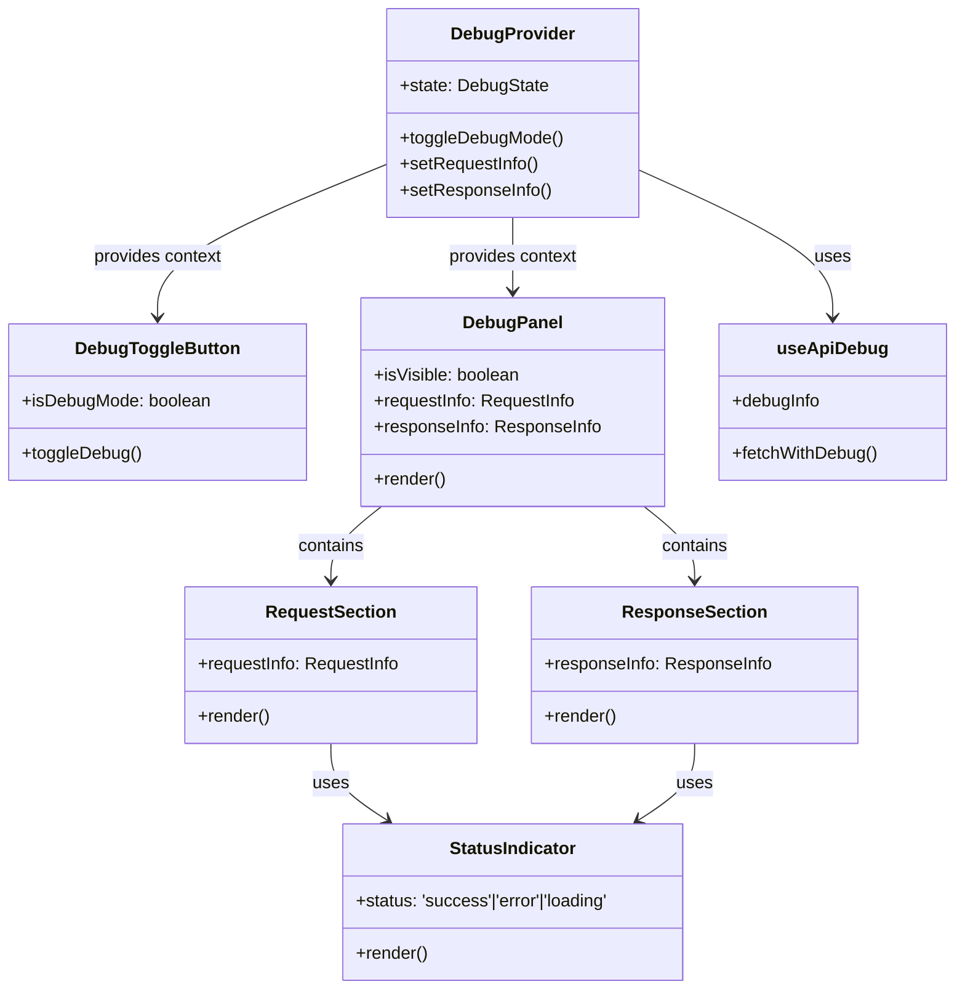

# 프로젝트 설정 가이드

## 프로젝트 개요

1Team Football Game Service Manager는 게임 서비스 관리를 위한 웹 기반 관리자 도구입니다.

### 주요 기능
- 서비스 현황 모니터링
- 서버 관리
- 게임 서비스 관리
- 유저 관리
- 어드민 관리

## 기술 스택 설정

### 1. 프레임워크 설정
```bash
# Next.js 프로젝트 생성
npx create-next-app@latest gm-tool --typescript --tailwind --eslint

# 기본 설정
- TypeScript 사용
- Tailwind CSS 사용
- ESLint 사용
- src/ 디렉토리 사용
- App Router 사용
```

### 2. 상태 관리 설정
```bash
# 서버 상태 관리
npm install @tanstack/react-query

# 전역 상태 관리
npm install zustand
```

### 3. UI 라이브러리 설정
```bash
# ShadCN 초기화
npx shadcn@latest init

# 필수 UI 컴포넌트 설치
npx shadcn@latest add button card form input label select table tabs toast dialog dropdown-menu separator sheet sidebar avatar badge calendar checkbox radio-group switch alert progress skeleton

# 아이콘 라이브러리
npm install lucide-react @radix-ui/react-icons
```

### 4. 폼 관리 설정
```bash
# 폼 유효성 검증
npm install @hookform/resolvers zod
```

### 5. 테스트 환경 설정
```bash
# Jest 설정
npm install -D jest @testing-library/react @testing-library/jest-dom

# Cypress 설정
npm install -D cypress
```

## 프로젝트 구조 설정



## 환경 설정 파일

### 1. TypeScript 설정 (tsconfig.json)
```json
{
  "compilerOptions": {
    "target": "es5",
    "lib": ["dom", "dom.iterable", "esnext"],
    "allowJs": true,
    "skipLibCheck": true,
    "strict": true,
    "forceConsistentCasingInFileNames": true,
    "noEmit": true,
    "esModuleInterop": true,
    "module": "esnext",
    "moduleResolution": "node",
    "resolveJsonModule": true,
    "isolatedModules": true,
    "jsx": "preserve",
    "incremental": true,
    "baseUrl": ".",
    "paths": {
      "@/*": ["./src/*"]
    }
  },
  "include": ["next-env.d.ts", "**/*.ts", "**/*.tsx"],
  "exclude": ["node_modules"]
}
```

### 2. ESLint 설정 (.eslintrc.json)
```json
{
  "extends": [
    "next/core-web-vitals",
    "prettier"
  ],
  "plugins": [
    "@typescript-eslint"
  ],
  "rules": {
    "@typescript-eslint/no-unused-vars": "error",
    "@typescript-eslint/no-explicit-any": "warn"
  }
}
```

### 3. Prettier 설정 (.prettierrc)
```json
{
  "semi": true,
  "trailingComma": "es5",
  "singleQuote": true,
  "tabWidth": 2,
  "useTabs": false
}
```

## 개발 환경 설정

### 1. VSCode 추천 확장 프로그램
- ESLint
- Prettier
- Tailwind CSS IntelliSense
- PostCSS Language Support
- Jest Runner
- Error Lens

### 2. Git 설정
```bash
# .gitignore 파일
node_modules/
.next/
coverage/
.env*
!.env.example
.vercel
*.log
.DS_Store
```

## 스크립트 설정 (package.json)
```json
{
  "scripts": {
    "dev": "next dev",
    "build": "next build",
    "start": "next start",
    "lint": "next lint",
    "format": "prettier --write .",
    "test": "jest",
    "test:watch": "jest --watch",
    "test:e2e": "cypress open",
    "prepare": "husky install"
  }
}
```

## 개발 가이드라인

### 1. 코드 스타일
- 파일명:
  - 컴포넌트: PascalCase (예: UserProfile.tsx)
  - 유틸리티: camelCase (예: formatDate.ts)
  - 페이지: page.tsx
  - 레이아웃: layout.tsx

- 변수/함수명:
  - 변수: camelCase
  - 상수: UPPER_SNAKE_CASE
  - 컴포넌트: PascalCase
  - 타입/인터페이스: PascalCase

### 2. 컴포넌트 개발
- Atomic Design 원칙 준수
- Props 타입 명시적 정의
- 재사용성 고려
- 성능 최적화 (useMemo, useCallback 적절히 사용)

### 3. 상태 관리
- 서버 상태: React Query
  - 캐싱 전략 수립
  - 에러 핸들링
  - 로딩 상태 관리

- 클라이언트 상태: Zustand
  - 스토어 모듈화
  - 타입 안정성 확보
  - 불변성 유지

### 4. 테스트
- 단위 테스트
  - 컴포넌트 렌더링 테스트
  - 이벤트 핸들링 테스트
  - 상태 변화 테스트

- E2E 테스트
  - 주요 사용자 시나리오 테스트
  - API 통합 테스트
  - 에러 케이스 테스트

### 5. 성능 최적화
- 이미지 최적화
- 코드 스플리팅
- 레이지 로딩
- 메모이제이션

### 6. 보안
- API 키 환경변수 관리
- XSS 방지
- CSRF 토큰 사용
- 입력값 검증

## 배포 가이드

### 1. 개발 환경
```bash
npm run dev
```

### 2. 프로덕션 빌드
```bash
npm run build
npm start
```

### 3. 환경변수 설정
```env
# .env.example
NEXT_PUBLIC_API_URL=
DATABASE_URL=
JWT_SECRET=
```

## 문제 해결

### 1. 일반적인 이슈
- node_modules 캐시 삭제: `rm -rf node_modules/.cache`
- Next.js 캐시 삭제: `rm -rf .next`
- 의존성 재설치: `rm -rf node_modules && npm install`

### 2. 타입스크립트 이슈
- 타입 체크: `tsc --noEmit`
- 타입 정의 확인: `npm run dev`

### 3. 린트 이슈
- 린트 실행: `npm run lint`
- 자동 수정: `npm run lint -- --fix`

## JSON Viewer 컴포넌트

### 설치된 패키지
- `react-json-pretty`: JSON 데이터를 시각적으로 표현하기 위한 라이브러리
- `react-json-view`: 트리 형태로 JSON 데이터를 시각화하고 조작할 수 있는 라이브러리

```bash
npm install react-json-pretty react-json-view --force
```

> **참고**: React 19와의 호환성 문제로 `--force` 옵션을 사용하여 설치해야 합니다.

### 컴포넌트 구성

1. **JsonViewer** (`src/components/ui/json-viewer.tsx`)
   - 기본 JSON 뷰어 컴포넌트
   - `react-json-view` 라이브러리 사용
   - 다음 속성을 지원:
     - `data`: 표시할 JSON 데이터
     - `className`: 추가 CSS 클래스
     - `collapsed`: 초기에 접혀있는 상태 여부
     - `displayDataTypes`: 데이터 타입 표시 여부
     - `displayObjectSize`: 객체 크기 표시 여부
     - `enableClipboard`: 클립보드 복사 기능 활성화 여부
     - `indentWidth`: 들여쓰기 너비

2. **JsonViewerCustom** (`src/components/ui/json-viewer-custom.tsx`)
   - 커스텀 테마를 지원하는 JSON 뷰어 컴포넌트
   - `react-json-pretty` 라이브러리 사용
   - 지원하는 테마: 
     - `MONOKAI`
     - `DARK`
     - `LIGHT` 
     - `CUSTOM`
   - 다음 속성을 지원:
     - `data`: 표시할 JSON 데이터
     - `className`: 추가 CSS 클래스
     - `theme`: 사용할 테마 (기본값: MONOKAI)
     - `copyable`: 클립보드 복사 버튼 표시 여부
     - `onCopy`: 복사 후 호출될 콜백 함수

### 사용 예시

```tsx
// 기본 JsonViewer 사용
<JsonViewer data={apiResponse} />

// 커스텀 테마 JsonViewer 사용
<JsonViewerCustom 
  data={apiResponse} 
  theme={JsonTheme.DARK}
  copyable
  onCopy={() => console.log('JSON이 복사되었습니다')}
/>
```

### 예제 페이지

`/json-viewer-examples` 경로에서 다양한 테마와 옵션을 적용한 JSON Viewer 예제를 확인할 수 있습니다.

## API Debug 정보 기능

### 목적
- API 요청 시 사용한 REST API 원문을 디버그 정보로 표시하여 개발과 디버깅을 용이하게 함
- 사용자 인터페이스에 통합된 디버그 정보를 통해 API 호출의 세부 정보를 쉽게 확인 가능

### 구성 요소
1. **useApiRequest 훅**: API 요청을 보내고 디버그 정보를 함께 반환하는 커스텀 훅
2. **ApiDebugInfo 컴포넌트**: 디버그 정보를 표시하는 UI 컴포넌트
3. **API 엔드포인트**: 디버그 정보 제공을 위한 백엔드 API

### 설치 방법
- 추가 패키지 설치 없이 기존 프로젝트 구조에 통합됨

### 사용법
1. API 요청 시 `useApiRequest` 훅 사용
2. 응답에서 `debugInfo` 객체 추출
3. 컴포넌트 렌더링 시 `ApiDebugInfo` 컴포넌트에 디버그 정보 전달

### 관련 파일
- `src/hooks/useApiRequest.ts`: API 요청 및 디버그 정보 수집 훅
- `src/components/ApiDebugInfo.tsx`: 디버그 정보 표시 컴포넌트
- `src/app/api/db-query/debug-info/route.ts`: 디버그 정보 API 엔드포인트
- `docs/api-debug-info.md`: 기능 상세 문서

# 프로젝트 설정 정보

## 설치된 ShadCN 컴포넌트

디버그 정보 컴포넌트 시스템을 구현하기 위해 다음 ShadCN 컴포넌트를 설치했습니다:

1. **Toggle 컴포넌트**
   - 설치 명령어: `npx shadcn@latest add toggle`
   - 목적: 디버그 모드를 토글하는 버튼 구현에 사용

2. **Button 컴포넌트**
   - 설치 명령어: `npx shadcn@latest add button`
   - 목적: 디버그 정보 패널의 버튼 및 복사 기능에 사용

3. **Card 컴포넌트**
   - 설치 명령어: `npx shadcn@latest add card`
   - 목적: 디버그 정보 패널의 섹션 구분에 사용

## 디버그 정보 컴포넌트 시스템

디버그 정보 표시를 위한 컴포넌트 시스템이 `/src/components/debug` 디렉토리에 구현되었습니다.



### 주요 컴포넌트:

1. **DebugProvider**: 
   - 디버그 상태를 관리하는 컨텍스트 프로바이더

2. **DebugToggleButton**: 
   - 디버그 모드를 켜고 끄는 토글 버튼 컴포넌트

3. **DebugPanel**: 
   - 디버그 정보를 표시하는 패널 컴포넌트

4. **RequestSection**: 
   - API 요청 정보를 표시하는 컴포넌트

5. **ResponseSection**: 
   - API 응답 정보를 표시하는 컴포넌트

6. **StatusIndicator**: 
   - 성공/실패 상태를 시각적으로 표시하는 컴포넌트

### 테스트 코드:

디버그 정보 컴포넌트 시스템에 대한 테스트 코드가 `/src/test` 디렉토리에 구현되었습니다:

1. **컴포넌트 테스트**:
   - `StatusIndicator.test.tsx`: 상태 표시 컴포넌트 테스트
   - `DebugContext.test.tsx`: 디버그 컨텍스트 프로바이더 테스트

2. **훅 테스트**:
   - `useStorageState.test.tsx`: 로컬 스토리지 상태 관리 훅 테스트

3. **테스트 데이터**:
   - `debug-test-data.ts`: 테스트에 사용되는 예제 데이터

### 사용 방법:

1. 앱 최상위 레벨에 `DebugProvider`를 포함시킵니다:
   ```tsx
   <DebugProvider>
     <App />
   </DebugProvider>
   ```

2. 디버그 토글 버튼을 원하는 위치에 추가합니다:
   ```tsx
   <DebugToggleButton />
   ```

3. 디버그 패널을 추가합니다:
   ```tsx
   <DebugPanel />
   ```

4. API 호출 시 `useApiDebug` 훅을 사용합니다:
   ```tsx
   const { fetchWithDebug } = useApiDebug();
   
   // API 호출
   const response = await fetchWithDebug('/api/endpoint', {
     method: 'POST',
     headers: {
       'Content-Type': 'application/json'
     },
     body: JSON.stringify({ key: 'value' })
   });
   ```

### 테스트 실행 방법:

테스트를 실행하려면 다음 명령어를 사용합니다:

```bash
# 모든 테스트 실행
npm test

# 특정 테스트 파일 실행
npm test -- src/test/components/debug/StatusIndicator.test.tsx

# 테스트 감시 모드로 실행
npm test -- --watch
```

## 추가 컴포넌트

### ConfirmDialog

범용적으로 사용할 수 있는 확인 다이얼로그 컴포넌트입니다. 다양한 확인 작업(삭제, 업데이트, 실행 등)에 일관된 UI를 제공하면서도 필요에 따라 커스터마이징이 가능합니다.

- **설치 방법**: `src/components/ui/confirm-dialog.tsx` 파일을 추가하여 사용
- **의존성**: ShadCN Alert Dialog (`@radix-ui/react-alert-dialog`)
- **목적**: 다양한 작업에 대한 확인 대화상자를 일관되고 재사용 가능한 방식으로 제공
- **문서**: [ConfirmDialog 컴포넌트 사용 방법](./components/gm-tool-confirm-dialog.md)

**사용 예시**:
```tsx
import { ConfirmDialog } from '@/components/ui/confirm-dialog';
import { AlertCircle } from 'lucide-react';

<ConfirmDialog
  open={showDialog}
  onOpenChange={setShowDialog}
  title="항목 삭제"
  description="이 항목을 삭제하시겠습니까?"
  secondaryDescription="이 작업은 되돌릴 수 없습니다."
  icon={AlertCircle}
  cancelText="취소"
  confirmText="삭제"
  onCancel={handleCancel}
  onConfirm={handleConfirm}
  isLoading={isLoading}
/>
```

## 타입 시스템 개선 (2024-06-XX 추가)

### 1. 공통 타입 정의 파일 추가
프로젝트 전반에 걸쳐 일관된 타입 시스템을 구현하기 위해 공통 타입 정의 파일을 추가했습니다.

```bash
# 공통 타입 정의 파일 생성
src/types/table.types.ts - 테이블 관련 공통 타입 정의
```

### 2. 타입 변환 유틸리티 추가
다양한 데이터 소스에서 가져온 데이터를 UI 컴포넌트에서 사용할 수 있는 형식으로 변환하기 위한 유틸리티 함수를 추가했습니다.

```bash
# 타입 변환 유틸리티 함수 생성
src/utils/type-converters.ts - 타입 변환 유틸리티 함수
```

### 3. 주요 타입 정의
- `IBaseTableData`: 모든 테이블 데이터 타입의 기본 인터페이스
- `IUITableData`: UI 컴포넌트용 테이블 데이터 인터페이스
- `IDBTableData`: 데이터베이스 테이블 정보 인터페이스
- `ITableColumn`: 테이블 컬럼 속성 인터페이스

### 4. 타입 변환 유틸리티 함수
- `convertToUIValue`: 알 수 없는 타입을 UI에서 사용 가능한 형식으로 변환
- `convertToUITableData`: 기본 테이블 데이터를 UI 테이블 데이터로 변환
- `convertToUITableDataArray`: 기본 테이블 데이터 배열을 UI 테이블 데이터 배열로 변환
- `convertDBToUITableData`: DB 테이블 데이터를 UI 테이블 데이터로 변환
- `convertDBToUITableDataArray`: DB 테이블 데이터 배열을 UI 테이블 데이터 배열로 변환

## 데이터 테이블 조회 기능

### 개요
게임 서비스 관리 시스템에서 데이터베이스 테이블을 조회하고 관리하기 위한 기능입니다. 특히 `excel_` 접두어를 가진 테이블을 효율적으로 관리하기 위한 기능을 제공합니다.

### 주요 기능
- 다중 DB 연결 지원
- 테이블 목록 조회 및 필터링
- Excel 접두어 테이블 전용 필터
- 테이블 정보 (행 수, 크기, 마지막 업데이트 시간) 표시

### 설치된 패키지
- `@types/pg`: PostgreSQL 데이터베이스 연결을 위한 타입 정의
- `pg`: PostgreSQL 클라이언트 라이브러리

### API 엔드포인트
- `GET /api/data-tables`: 테이블 목록 조회
  - 파라미터:
    - `db`: 데이터베이스 이름
    - `filter`: 테이블 이름 필터 (선택 사항)
  
- `POST /api/data-tables`: 특정 테이블의 데이터 조회
  - 요청 본문:
    - `dbName`: 데이터베이스 이름
    - `tableName`: 테이블 이름
    - `limit`: 조회할 행 수 (기본값: 100)
    - `offset`: 시작 위치 (기본값: 0)
    - `where`: WHERE 절 (선택 사항)
    - `orderBy`: ORDER BY 절 (선택 사항)

### 사용 방법
1. Service 페이지에서 DB 목록에서 데이터베이스 선택
2. 테이블 검색 필드에 검색어 입력 또는 "Excel 접두어 테이블만 표시" 옵션 활성화
3. "테이블 검색" 버튼 클릭하여 테이블 목록 조회
4. 테이블 목록에서 특정 테이블 클릭하여 상세 정보 확인

### 향후 개발 계획
- 테이블 데이터 직접 조회 및 편집 기능
- SHM(Shared Memory) 기반 데이터 캐싱 구현
- Redis Pub/Sub을 활용한 실시간 데이터 동기화
- DynamicTable<T> 타입을 활용한 타입 안정성 보장

## 테이블 검색 기능 목 데이터

테이블 검색 기능을 개발하고 테스트하기 위해 목 데이터가 구현되었습니다.

### 목 데이터 파일 구조

```
src/test/test-data/db-tables-mock-data.ts
```

이 파일에는 다음과 같은 목 데이터와 유틸리티 함수가 포함되어 있습니다:

1. **데이터베이스 목록 데이터**: `mockDatabases` - 시스템에서 사용 가능한 데이터베이스 목록
2. **테이블 목록 데이터**: `mockTables` - 각 데이터베이스에 포함된 테이블 목록
3. **테이블 컬럼 정보**: `mockColumns` - 테이블의 컬럼 정보 (데이터 타입, NULL 허용 여부 등)
4. **테이블 데이터 샘플**: `mockTableData` - 테이블 내용 샘플 데이터

### 유틸리티 함수

- `getGroupedTables(tables)`: 테이블 목록을 접두사(prefix)에 따라 그룹화
- `searchTables(dbName, filter, matchType)`: 데이터베이스 내에서 특정 조건에 맞는 테이블 검색
- `getTableColumns(tableName)`: 지정된 테이블의 컬럼 정보 조회
- `getTableData(tableName)`: 지정된 테이블의 데이터 샘플 조회

### 목 데이터 테스트

`src/test/table-search-mock.test.ts` 파일에는 목 데이터의 구조와 유틸리티 함수를 테스트하는 단위 테스트가 포함되어 있습니다.

테스트 실행 방법:

```bash
npm test -- table-search-mock.test.ts
```

### 목 데이터 사용 방법

실제 API 통신이 아직 구현되지 않았거나 개발/테스트 환경에서 사용할 수 있습니다:

```typescript
import { 
  mockDatabases, 
  searchTables, 
  getTableColumns, 
  getTableData 
} from '@/test/test-data/db-tables-mock-data';

// 데이터베이스 목록 가져오기
const databases = mockDatabases;

// 특정 DB의 Excel 접두사 테이블 검색하기
const excelTables = searchTables('football_service', 'excel_', 'prefix');

// 테이블 컬럼 정보 조회하기
const columns = getTableColumns('excel_player_info');

// 테이블 데이터 조회하기
const rows = getTableData('excel_player_info');
```

### 타입 정의

목 데이터와 함께 사용할 타입 정의가 `src/types/service.types.ts` 파일에 정의되어 있습니다:

```typescript
// 주요 타입 정의
interface TableInfo { ... }  // 테이블 정보
interface Column { ... }     // 컬럼 정보
interface TableRow { ... }   // 테이블 행 (동적 속성)
interface GroupedTables { ... } // 그룹화된 테이블
```

이러한 목 데이터와 유틸리티 함수를 사용하면 API가 완전히 구현되기 전에도 UI 개발과 테스트를 쉽게 진행할 수 있습니다.

## 게임 서비스 매니저 프로젝트 설정

## 설치된 라이브러리 및 패키지

### 1. UI 컴포넌트 및 디자인 시스템
- **ShadCN/UI**: 재사용 가능한 UI 컴포넌트 시스템
  - 설치 방법: `npx shadcn@latest add [component-name]`
  - 목적: 모던하고 접근성 높은 UI 컴포넌트 제공
- **Lucide React**: 아이콘 라이브러리
  - 설치 방법: `npm install lucide-react`
  - 목적: 일관된 디자인의 벡터 아이콘 제공

### 2. 데이터 관리 및 통신
- **DataControlsPanel**: 화폐 및 BALLER 데이터 관리를 위한 컨트롤 패널 컴포넌트
  - 위치: `src/components/control-panels/currency-control-panel.tsx`
  - 목적: 화폐 및 BALLER 데이터의 생성, 수정, 삭제 기능 제공
  - 특징: CREATE, UPDATE, DELETE 버튼 및 관련 모달 다이얼로그 포함
  - 사용법: 데이터 테이블의 showDataControls 속성을 true로 설정

### 3. 모달 다이얼로그
- **CreateCurrencyModal**: 화폐 생성을 위한 모달 컴포넌트
  - 위치: `src/components/control-panels/create-currency-modal.tsx`
  - 목적: 화폐 아이템 추가 시 필요한 정보 입력 인터페이스 제공
- **CreateBallerModal**: BALLER 생성을 위한 모달 컴포넌트
  - 위치: `src/components/control-panels/create-baller-modal.tsx`
  - 목적: BALLER 추가 시 필요한 정보 입력 인터페이스 제공

## 컴포넌트 구성 참고사항

### 데이터 컨트롤 패널 (DataControlsPanel)
- **용도**: 화폐 또는 BALLER 데이터 관리
- **주요 기능**: 
  - CREATE: 새 항목 생성
  - UPDATE: 선택한 항목 정보 수정
  - DELETE: 선택한 항목 삭제
- **구현 방식**: 
  - `showDataControls` 속성을 true로 설정하여 활성화
  - Currency와 BALLER 탭에서 모두 사용 가능
  - 각 탭에 맞는 핸들러 함수가 자동으로 연결됨

## API 구현 현황

### 1. 사용자 관리 API

#### 1.1. Baller API
- **구현일자**: 2024-03-19
- **기능**: 사용자의 Baller 정보 CRUD 기능
- **엔드포인트**: `/api/users/multi-play/baller`
- **구현 파일**:
  - `src/app/api/users/multi-play/baller/route.ts`: API 라우트 핸들러
  - `src/app/api/users/multi-play/baller/service.ts`: 비즈니스 로직
  - `src/app/api/db-query/queries-users-baller.ts`: DB 쿼리
- **문서**: `docs/gm-tool-api-doc.md`
- **테스트**:
  - `src/test/api/users/multi-play/baller.test.ts`: 단위 테스트
  - `src/test/api/users/multi-play/baller-api.test.ts`: 통합 테스트
- **데이터베이스 연결 방식**:
  - `DBConnectionManager`를 통한 연결 풀 관리
  - `withClient` 패턴을 사용한 자동 연결 해제
  - 명시적 `dbName` 파라미터를 통한 사용자 지정 데이터베이스 연결
  - 쿼리 실행 전/후 프로세스 표준화(쿼리 로깅, 오류 처리, 결과 가공)
- **오류 처리 전략**:
  - 구조화된 오류 응답 포맷(`success`, `message/error`, `status`)
  - 로깅 체계화(`logger.info`, `logger.warn`, `logger.error`)
  - try-catch를 통한 예외 처리
- **구현 특이사항**:
  - TypeORM 대신 네이티브 PostgreSQL 클라이언트 사용
  - 쿼리 파라미터화로 SQL 인젝션 방지
  - 다중 항목 삭제 기능(쉼표로 구분된 ID 목록 처리)

#### 1.2. Currency API (예정)
- **예정일자**: TBD
- **기능**: 사용자의 화폐 정보 CRUD 기능
- **엔드포인트**: `/api/users/multi-play/currency`
