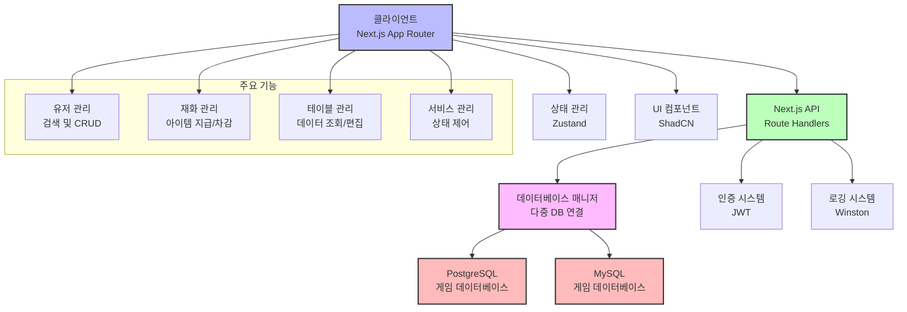

# **📌 Tech PRD - Game Service Manager Tool**

---

## **📌 1. 개요**

### **1.1 프로젝트 개요**  
Game Service Manager Tool은 축구 게임 운영을 위한 서비스 관리 도구로, 유저 데이터 관리, 서비스 운영 설정, CS 대응 기능을 포함하여 운영팀과 CS팀의 업무를 최적화하는 역할을 합니다. 이 도구는 다양한 데이터베이스에 연결하여 유저 정보를 검색하고, 게임 내 재화를 관리하며, 서비스 전반의 상태를 모니터링하고 제어할 수 있는 기능을 제공합니다.

### **1.2 주요 기술 스택**
✅ **Next.js 15.1.6 (App Router)** - 프론트엔드 및 API 개발  
✅ **TypeScript 5.7.3** - 정적 타입 시스템 적용  
✅ **React 19.0.0** - UI 컴포넌트 개발  
✅ **TailwindCSS 3.4.1** - UI 스타일링  
✅ **ShadCN UI** - UI 컴포넌트 라이브러리  
✅ **PostgreSQL & MySQL2** - 다중 데이터베이스 연결 지원  
✅ **Zustand 5.0.3** - 상태 관리  
✅ **React Query (Tanstack)** - 서버 상태 관리  
✅ **Jest & Playwright** - 테스팅 프레임워크  
✅ **Lucide React 0.473.0** - 아이콘 시스템  
✅ **Winston** - 로깅 시스템  

---

## **📌 2. 시스템 아키텍처**



✅ **Next.js App Router 기반의 클라이언트-서버 아키텍처**  
✅ **다중 데이터베이스 연결 관리 모듈 구현**  
✅ **컴포넌트 기반 UI 시스템과 상태 관리 분리**

---

## **📌 3. 주요 기능 및 상세 구현**

### **3.1 유저 관리 (User Management)**

💡 **기능 설명:**  
- **데이터베이스에서 유저 검색 및 조회**  
- **유저 정보 및 관련 데이터(재화, 아이템 등) 관리**  
- **유저 데이터 시각화 및 탭 기반 정보 조직화**  

| 기능명 | 설명 | 구현 상태 |
|--------|--------|----------|
| **유저 검색** | 닉네임, ID, UID 등으로 유저 검색 | ✅ 구현 완료 |
| **유저 정보 조회** | 선택한 유저의 기본 정보 및 게임 데이터 조회 | ✅ 구현 완료 |
| **유저 재화 관리** | 유저의 게임 내 재화 조회 및 수정(지급/차감) | ✅ 구현 완료 |
| **멀티플레이 데이터 관리** | 유저의 멀티플레이 관련 기록 조회 및 관리 | ⚠️ 일부 구현 |
| **스토리 모드 데이터 관리** | 유저의 스토리 모드 진행 상태 조회 및 관리 | ⚠️ 일부 구현 |
| **클럽 데이터 관리** | 유저의 클럽(길드) 정보 조회 및 관리 | ⚠️ 일부 구현 |
| **시즌 패스 데이터 관리** | 유저의 시즌 패스 진행 상태 조회 및 관리 | ⚠️ 일부 구현 |

#### **코드 구현 예시 (유저 검색 API)**

```typescript
// src/app/api/user-search/route.ts
export async function GET(request: NextRequest) {
    const searchParams = request.nextUrl.searchParams;
    const userId = searchParams.get('userId');
    const dbName = searchParams.get('dbName');

    logger.info('[User Search] 검색 시작:', { userId, dbName });

    if (!userId || !dbName) {
        return NextResponse.json({ 
            success: false,
            error: '사용자 ID와 데이터베이스 이름이 필요합니다.' 
        }, { status: 400 });
    }

    try {
        const dbManager = DBConnectionManager.getInstance();
        
        // 검색 쿼리 실행
        const result = await dbManager.withClient(dbName, async (client) => {
            return await client.query(DB_QUERIES.SELECT_USER_INFO.query, [userId]);
        });

        return NextResponse.json({
            success: true,
            users: result.rows
        });
    } catch (error) {
        return NextResponse.json({
            success: false,
            error: '사용자 검색 중 오류가 발생했습니다.'
        }, { status: 500 });
    }
}
```

---

### **3.2 재화 관리 (Currency Management)**

💡 **기능 설명:**  
- **유저의 게임 내 재화(통화, 아이템) 조회 및 관리**  
- **재화 지급, 차감, 업데이트 등 CRUD 작업 지원**  
- **재화 변경 이력 기록 및 로깅**  

| 기능명 | 설명 | 구현 상태 |
|--------|--------|----------|
| **재화 조회** | 유저가 보유한 모든 재화 목록 조회 | ✅ 구현 완료 |
| **특정 재화 조회** | 특정 아이템 ID 기준 재화 상세 정보 조회 | ✅ 구현 완료 |
| **재화 지급** | 특정 재화를 유저에게 지급 | ✅ 구현 완료 |
| **재화 차감** | 유저 보유 재화 차감 | ✅ 구현 완료 |
| **재화 수정** | 재화 수량 직접 수정 | ✅ 구현 완료 |
| **재화 이력 조회** | 재화 변동 기록 조회 | ⚠️ 개발 중 |

#### **코드 구현 예시 (재화 관리 API)**

```typescript
// src/app/api/users/currency/route.ts
// PUT: 사용자 재화 업데이트
export async function PUT(request: NextRequest) {
  try {
    const body = await request.json();
    const { employerUid, excelItemIndex, count, dbName } = body;
    
    const result = await updateUserCurrency({ 
      employerUid, 
      excelItemIndex, 
      count, 
      dbName 
    });
    
    const { status, ...responseData } = result;
    return NextResponse.json(responseData, { status: status || 500 });
  } catch (error) {
    return NextResponse.json({
      success: false,
      message: '요청 처리 중 오류가 발생했습니다.',
      error: error instanceof Error ? error.message : '알 수 없는 오류',
    }, { status: 400 });
  }
}
```

---

### **3.3 데이터 테이블 관리 (Data Table Management)**

💡 **기능 설명:**  
- **다중 데이터베이스에서 테이블 목록 조회 및 관리**  
- **테이블 구조 분석 및 데이터 조회**  
- **테이블 필터링 및 검색 기능**  

| 기능명 | 설명 | 구현 상태 |
|--------|--------|----------|
| **다중 DB 테이블 조회** | 여러 DB의 테이블 목록 조회 및 필터링 | ✅ 구현 완료 |
| **테이블 데이터 조회** | 선택한 테이블의 데이터 페이징 조회 | ✅ 구현 완료 |
| **테이블 구조 분석** | 테이블 컬럼 및 구조 정보 조회 | ✅ 구현 완료 |
| **데이터 필터링 및 검색** | 테이블 내 특정 조건 검색 및 정렬 | ✅ 구현 완료 |
| **Excel 접두어 테이블 필터링** | `excel_` 접두어 테이블 전용 필터 제공 | ⚠️ 개발 중 |
| **테이블 데이터 편집** | 테이블 데이터 수정 기능 | ⚠️ 개발 중 |

#### **코드 구현 예시 (데이터 테이블 UI 컴포넌트)**

```tsx
// src/components/ui/data-table.tsx (일부)
export function DataTable({ 
  tableName = '', 
  data = [], 
  isLoading = false,
  onRowClick,
  onSelectionChange,
  onSort,
  onPageChange,
  showActions = true,
  dbName,
  // ... 기타 props
}: DataTableProps) {
  const [selectedRows, setSelectedRows] = useState<string[]>([]);
  const [currentPage, setCurrentPage] = useState(1);
  const [columns, setColumns] = useState<TableColumn[]>([]);
  const [searchTerm, setSearchTerm] = useState('');
  const [filteredData, setFilteredData] = useState<TableData[]>([]);
  const [sortConfig, setSortConfig] = useState<{
    key: string;
    direction: 'asc' | 'desc' | null;
  }>({ key: '', direction: null });
  
  // ... 구현 로직
  
  return (
    <div className="w-full">
      {/* 테이블 헤더 및 검색 UI */}
      <Table>
        <TableHeader>
          {/* 컬럼 헤더 */}
        </TableHeader>
        <TableBody>
          {/* 데이터 로우 */}
        </TableBody>
      </Table>
      {/* 페이지네이션 */}
    </div>
  );
}
```

---

## **📌 4. API 설계**

### **4.1 유저 검색 API**

#### **📌 요청**
```http
GET /api/user-search?userId={userId}&dbName={dbName}
```

#### **📌 요청 파라미터**
| 파라미터 | 설명 | 필수 여부 |
|--------|--------|------|
| `userId` | 검색할 유저 ID/닉네임/UUID | ✅ |
| `dbName` | 검색할 데이터베이스 이름 | ✅ |

#### **📌 응답 예시**
```json
{
  "success": true,
  "isExactMatch": true,
  "message": "검색에 일치하는 1명의 사용자를 찾았습니다.",
  "users": [
    {
      "uid": "12345",
      "uuid": "abcde-12345-fghij",
      "login_id": "user123",
      "display_id": "player123",
      "nickname": "축구왕",
      "role": "user",
      "nation_index": 1,
      "create_at": "2023-01-01T00:00:00Z",
      "update_at": "2023-01-01T00:00:00Z"
    }
  ]
}
```

### **4.2 유저 재화 관리 API**

#### **📌 재화 조회 API**
```http
GET /api/users/currency?employerUid={uid}&dbName={dbName}
```

#### **📌 재화 생성/지급 API**
```http
POST /api/users/currency
```
```json
{
  "employerUid": "12345",
  "excelItemIndex": 100,
  "count": 1000,
  "dbName": "game_db"
}
```

#### **📌 재화 수정 API**
```http
PUT /api/users/currency
```
```json
{
  "employerUid": "12345",
  "excelItemIndex": 100,
  "count": 500,
  "dbName": "game_db"
}
```

#### **📌 재화 삭제 API**
```http
DELETE /api/users/currency?employerUid={uid}&excelItemIndex={itemId}&dbName={dbName}
```

---

## **📌 5. 데이터베이스 관리**

### **5.1 다중 데이터베이스 연결 관리**

💡 **DBConnectionManager 클래스를 통한 다중 DB 연결 관리**

- **PostgreSQL 및 MySQL 데이터베이스 지원**
- **DB 풀 관리 및 효율적인 연결 재사용**
- **쿼리 실행 최적화 및 오류 처리**

```typescript
// 데이터베이스 연결 관리자 클래스 구현 예시
export class DBConnectionManager {
  private static instance: DBConnectionManager;
  private pools: Map<string, Pool> = new Map();
  
  // 싱글톤 패턴
  public static getInstance(): DBConnectionManager {
    if (!DBConnectionManager.instance) {
      DBConnectionManager.instance = new DBConnectionManager();
    }
    return DBConnectionManager.instance;
  }
  
  // DB 풀 가져오기
  public getPool(dbName: string): Pool {
    const pool = this.pools.get(dbName);
    if (!pool) {
      throw new Error(`${dbName} 데이터베이스에 대한 연결을 찾을 수 없습니다.`);
    }
    return pool;
  }
  
  // 클라이언트로 쿼리 실행
  public async withClient<T>(dbName: string, callback: (client: PoolClient) => Promise<T>): Promise<T> {
    const pool = this.getPool(dbName);
    const client = await pool.connect();
    try {
      return await callback(client);
    } finally {
      client.release();
    }
  }
}
```

---

## **📌 6. UI 구현**

### **6.1 유저 관리 페이지 UI**

💡 **유저 검색 및 정보 관리를 위한 직관적인 UI**

- **DB 선택 및 유저 검색 인터페이스**
- **검색 결과 데이터 테이블**
- **아코디언 기반 유저 정보 디스플레이**
- **탭 기반 컨텐츠 구성 및 CRUD 기능**

```tsx
// src/app/(main)/users/page.tsx (일부)
export default function UsersPage() {
  const [data, setData] = useState<TableData[]>([])
  const [isLoading, setIsLoading] = useState(true)
  const [selectedDB, setSelectedDB] = useState<string>("")
  const [searchQuery, setSearchQuery] = useState<string>("")
  const [tableData, setTableData] = useState<TableData[]>([])
  const [selectedUsers, setSelectedUsers] = useState<SelectedUserInfo[]>([])
  const { queryResult: userSearchResult, isLoading: isSearching, searchUser } = useUserSearch()

  // ... 구현 로직

  return (
    <PageContainer path="users">
      <div className="flex flex-col gap-4">
        {/* DB 리스트 카드 */}
        <Card>
          <CardHeader className="py-4 bg-gray-50">
            <CardTitle className="text-lg font-semibold text-gray-900">
              DB List
            </CardTitle>
          </CardHeader>
          <Separator className="bg-gray-200" />
          <CardContent className="py-6">
            <DataTable
              tableName="DB List"
              data={data}
              isLoading={isLoading}
              onRowClick={handleRowClick}
              onSelectionChange={handleDBListSelectionChange}
              onSort={handleSort}
              onPageChange={handlePageChange}
              dbName="DB List"
            />
          </CardContent>
        </Card>

        {/* 유저 검색 카드 */}
        <Card>
          {/* ... 카드 내용 ... */}
        </Card>

        {/* 선택된 유저 정보 */}
        {selectedUsers.length > 0 && (
          <Card>
            {/* ... 유저 정보 표시 ... */}
            <UserAccordion
              selectedUsers={selectedUsers}
              onRemoveUser={handleRemoveUser}
            />
          </Card>
        )}
      </div>
    </PageContainer>
  );
}
```

### **6.2 유저 아코디언 UI 컴포넌트**

```tsx
// src/components/users/user-accordion.tsx (일부)
export function UserAccordion({ selectedUsers, onRemoveUser }: UserAccordionProps) {
  return (
    <Accordion type="multiple" className="w-full space-y-2">
      {selectedUsers.map((userInfo, index) => (
        <AccordionItem 
          key={String(userInfo.user.uid)} 
          value={String(userInfo.user.uid)}
          className="border rounded-none first:rounded-t-lg last:rounded-b-lg bg-white overflow-hidden"
        >
          <AccordionTrigger>
            {/* 아코디언 헤더 */}
          </AccordionTrigger>
          <AccordionContent className="border-t">
            {/* 유저 정보 테이블 */}
            <Table>
              {/* ... 테이블 컨텐츠 ... */}
            </Table>
            
            {/* 컨트롤 버튼 및 탭 */}
            <div className="flex flex-col gap-2 mt-4">
              <div className="flex items-center gap-2 mb-2">
                <Button>Filter</Button>
                <Button>PopUp</Button>
                <Button>Remove</Button>
              </div>
              <DynamicTabs 
                items={userTabsStructure.tabs} 
                className="w-full"
                equalTabs={true}
                onValueChange={(value) => handleTabChange(String(userInfo.user.uid), value)}
              />
            </div>
          </AccordionContent>
        </AccordionItem>
      ))}
    </Accordion>
  );
}
```

---

## **📌 7. 테스트 전략**

### **7.1 Jest를 활용한 단위 테스트**

- **API 핸들러 테스트**
- **DB 연결 및 쿼리 기능 테스트**
- **유틸리티 함수 테스트**

### **7.2 Playwright를 활용한 E2E 테스트**

- **주요 사용자 흐름 테스트**
- **유저 검색 및 정보 조회 테스트**
- **재화 관리 기능 테스트**

---

## **📌 8. 결론 및 향후 계획**

### **8.1 현재 구현 상태**

✅ **유저 검색 및 조회 기능** - 구현 완료  
✅ **재화 관리 CRUD 기능** - 구현 완료  
✅ **다중 DB 연결 및 관리** - 구현 완료  
✅ **UI 프레임워크 및 컴포넌트** - 구현 완료  
⚠️ **유저 관련 데이터 관리** - 일부 구현 (데이터 연동 작업 중)  
⚠️ **서비스 관리 기능** - 기본 UI 구현  
⚠️ **대시보드 기능** - 기본 구조 구현  

### **8.2 향후 개발 계획**

1. **CS 모듈 개발** - 티켓 시스템 및 문의 관리 기능 구현
2. **대시보드 기능 확장** - 실시간 모니터링 및 데이터 시각화
3. **서비스 관리 기능 구현** - 서비스 상태 제어 및 버전 관리
4. **데이터 테이블 관리 기능 고도화** - 테이블 CRUD 기능 강화
5. **성능 최적화** - 대용량 데이터 처리 및 캐싱 시스템 구축
6. **다크 모드 지원** - UI 테마 확장
7. **API 문서화 시스템 구축** - Swagger 통합

---