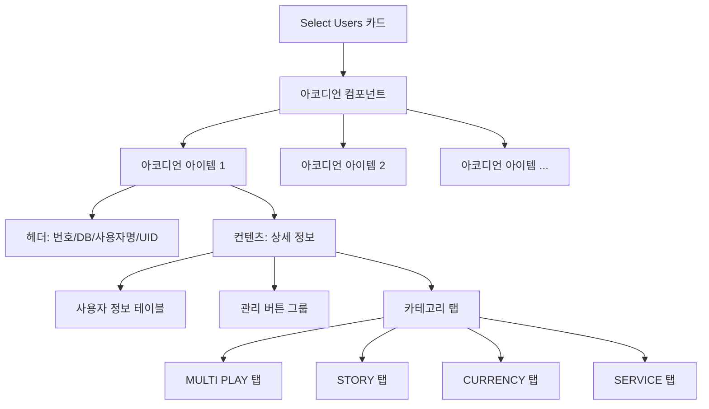

# **📌 PM PRD - 사용자 선택 아코디언 컴포넌트**

## **1. 개요**
사용자 관리 시스템(Users 페이지)에서 선택된 사용자 목록을 효율적으로 표시하고 관리하기 위한 확장형 아코디언 컴포넌트입니다. 이 컴포넌트는 다중 DB 환경에서 여러 사용자 정보를 직관적으로 관리할 수 있게 합니다.

## **2. 주요 목표**
- 여러 DB에서 선택된 사용자 정보를 통합 관리
- 사용자 정보의 상세 내용을 확장/축소 가능한 형태로 제공
- 사용자별 다양한 정보를 탭 형태로 구조화하여 접근성 향상
- 사용자 상세 정보 팝업, 필터링, 목록에서 제거 등 관리 기능 제공

## **3. 사용자 시나리오**
1. **사용자 검색 및 선택**: 관리자가 특정 DB에서 사용자를 검색하고 선택
2. **선택 사용자 정보 확인**: 선택된 사용자 정보를 아코디언 패널로 확인
3. **상세 정보 탐색**: 아코디언을 확장하여 상세 정보와 다양한 탭 내용 탐색
4. **사용자 관리 작업**: 팝업으로 더 상세한 정보 확인 또는 목록에서 제거

## **4. 주요 기능 요구사항**
| 기능 | 우선순위 | 설명 |
|------|---------|------|
| 다중 확장 지원 | 상 | 여러 사용자 패널을 동시에 열어볼 수 있는 기능 |
| DB 출처 표시 | 상 | 각 사용자가 속한 DB 이름 표시 |
| 상세 정보 테이블 | 상 | 기본 사용자 정보를 테이블 형태로 제공 |
| 탭 기반 구조화 | 상 | 다양한 사용자 관련 정보를 탭으로 구분하여 제공 |
| 관리 버튼 | 중 | 필터, 팝업, 제거 등 관리 기능 제공 |
| 탭 상태 유지 | 중 | 사용자별 마지막 선택 탭 상태 저장 |

---

# **📌 Design PRD - 사용자 선택 아코디언 컴포넌트**

## **1. 디자인 컨셉**
- **일관성**: ShadCN UI 컴포넌트 라이브러리를 활용한 통일된 디자인 
- **직관성**: 중요 정보 강조와 계층적 구조로 정보 탐색 용이
- **효율성**: 확장/축소 메커니즘으로 공간 효율적 사용

## **2. 레이아웃 및 구조**



## **3. 색상 및 스타일 가이드**
- **헤더 영역**: 보라색 계열(bg-purple-400, hover:bg-purple-600)로 강조
- **테이블 헤더**: 연한 보라색 배경(bg-purple-50/80)으로 구분
- **테이블 내용**: 흰색 배경에 hover 시 연한 보라색(hover:bg-purple-50/30)
- **사용자 닉네임**: 보라색 텍스트(text-purple-600)와 연한 보라색 배경(bg-purple-50)의 둥근 배지
- **버튼 색상**:
  - Filter: 파란색(bg-blue-500)
  - PopUp: 녹색(bg-green-500)
  - Remove: 빨간색(bg-red-500)
- **탭 활성화 상태**: 보라색 배경에 흰색 텍스트(data-[state=active]:bg-purple-400 data-[state=active]:text-white)

## **4. 반응형 디자인 요구사항**
- 다양한 화면 크기에서 내용 가독성 유지
- 좁은 화면에서도 테이블 내용 스크롤 가능하도록 구현
- 텍스트 오버플로우 처리로 레이아웃 유지

---

# **📌 Tech PRD - 사용자 선택 아코디언 컴포넌트**

## **1. 기술 스택**
- **프레임워크**: Next.js + TypeScript
- **UI 라이브러리**: ShadCN UI (Radix UI 기반)
- **스타일링**: Tailwind CSS
- **상태 관리**: React useState, useCallback 훅

## **2. 컴포넌트 구조**

```typescript
// 사용자 정보 인터페이스
interface SelectedUserInfo {
  user: TableData; // 사용자 기본 정보
  dbName: string;  // 데이터베이스 이름
}

// 컴포넌트 Props 인터페이스
interface UserAccordionProps {
  selectedUsers: SelectedUserInfo[]; // 선택된 사용자 목록
  onRemoveUser: (uid: string) => void; // 사용자 제거 핸들러
}
```

## **3. 주요 기능 구현**

### **3.1 다중 패널 확장**
- Accordion 컴포넌트의 `type="multiple"` 속성 사용으로 여러 패널 동시 확장 지원
- 각 AccordionItem에 고유 key와 value로 사용자 UID 사용

### **3.2 팝업 기능**
```typescript
const handleOpenPopup = (userInfo: SelectedUserInfo) => {
  // 사용자 정보를 sessionStorage에 저장
  sessionStorage.setItem('popupUserInfo', JSON.stringify(userInfo));
  
  // 새 창 생성 및 크기/위치 설정
  const width = 1000;
  const height = 800;
  // ... 창 생성 코드 ...
};
```

### **3.3 탭 상태 관리**
```typescript
const handleTabChange = useCallback((userId: string, tabId: string) => {
  saveTabState(userId, tabId);
}, []);
```

### **3.4 다중 DB 데이터 캐싱 연동**
- `data-cashing-tech-prd.md`에 명시된 다중 DB 테이블 캐싱 시스템과 연동
- SHM(Shared Memory) 기반 데이터 캐싱으로 대량 사용자 정보 조회 시 성능 최적화
- Redis Pub/Sub을 통한 실시간 데이터 변경 감지 및 반영

## **4. 성능 고려사항**
- 다수의 사용자 선택 시 렌더링 성능 최적화
- 테이블 데이터의 가상화 스크롤 고려
- 탭 컨텐츠의 지연 로딩으로 초기 로딩 속도 향상

## **5. 확장성**
- 컴포넌트 구조 모듈화로 재사용성 확보
- 추가 관리 기능 쉽게 통합 가능
- 다른 엔티티(예: 게임, 아이템)에도 적용 가능한 패턴 제공

---

## **📌 연관 문서**
- [다중 DB 테이블 캐싱 시스템 Tech PRD](./data-cashing-tech-prd.md)
- [사용자 관리 시스템 PRD](./user-management-prd.md)