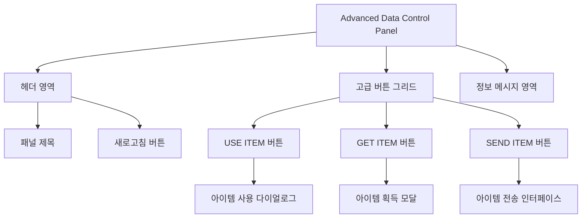

# **📌 PM PRD - 고급 화폐 관리 패널 (Advanced Data Control Panel)**

## **1. 개요**
Advanced Data Control Panel은 게임 서비스 관리 도구의 확장된 화폐/아이템 관리 기능을 제공하는 UI 컴포넌트입니다. 기본 CRUD 작업을 넘어서 게임 내 비즈니스 로직에 해당하는 아이템 사용(USE), 획득(GET), 전송(SEND) 기능을 통합적으로 제공합니다. Users 페이지의 Select Users 카드 내 CURRENCY 탭에서 기본 화폐 관리 패널과 함께 활용되어 고급 아이템 관리 작업을 수행합니다.

## **2. 주요 목표**
- 게임 내 아이템 경제 관리를 위한 고급 기능 제공
- 사용자별 아이템 사용/획득/전송 작업의 효율적 처리
- 아이템 관련 운영 업무 자동화 및 UI 통합
- 아이템 운영 관련 작업 이력 관리 및 추적성 확보

## **3. 주요 기능 요구사항**
| 기능 | 우선순위 | 설명 |
|------|---------|------|
| USE ITEM 버튼 | 상 | 사용자가 아이템을 사용하는 기능 시뮬레이션 |
| GET ITEM 버튼 | 상 | 사용자에게 아이템 지급 기능 |
| SEND ITEM 버튼 | 상 | 사용자 간 또는 시스템에서 사용자로 아이템 전송 |
| 새로고침 버튼 | 중 | 데이터 테이블 새로고침 기능 |
| 정보 메시지 | 중 | 사용자에게 고급 기능 사용 가이드 제공 |
| 작업 이력 추적 | 중 | 아이템 조작 이력의 로깅 및 추적 |

## **4. 사용자 시나리오**
1. **아이템 사용 시뮬레이션**: 관리자가 특정 사용자 행 선택 후 USE ITEM 버튼으로 아이템 사용 효과 시뮬레이션
2. **아이템 지급**: 관리자가 GET ITEM 버튼으로 특정 사용자에게 아이템 추가 지급
3. **아이템 전송**: 관리자가 SEND ITEM 버튼으로 다른 사용자나 시스템에 아이템 전송
4. **데이터 동기화**: 작업 후 새로고침 버튼으로 화폐 데이터 최신화

## **5. 구현 현황**
| 기능 | 구현 상태 | 비고 |
|------|----------|------|
| USE ITEM 기능 | ✅ 완료 | 다이얼로그 및 API 연동 |
| GET ITEM 기능 | ✅ 완료 | 모달 인터페이스 구현 |
| SEND ITEM 기능 | ✅ 완료 | 송신자/수신자 선택 UI 포함 |
| 새로고침 | ✅ 완료 | 이벤트 시스템으로 테이블 갱신 |
| 경고 다이얼로그 | ✅ 완료 | 작업 전/후 경고 및 확인 메시지 |

## **6. 확장 가능성**
- **아이템 거래 내역 조회**: 사용자의 아이템 거래 이력 관리
- **일괄 지급 기능**: 다수 사용자에게 동시에 아이템 지급
- **기간 한정 아이템 관리**: 유효기간이 있는 아이템의 특수 관리 기능

---

# **📌 Design PRD - 고급 화폐 관리 패널 (Advanced Data Control Panel)**

## **1. 디자인 컨셉**
- **차별화**: 기본 Data Control Panel과 구분되는 디자인으로 고급 기능임을 시각적으로 강조
- **일관성**: 전체 UI 스타일과 조화를 이루되 기능적 특성을 반영한 디자인
- **직관성**: 버튼 색상과 아이콘을 통해 기능의 목적을 직관적으로 전달

## **2. 레이아웃 및 구조**



## **3. 색상 및 스타일 가이드**
- **패널 배경**: 기본 패널과 동일한 밝은 회색(bg-gray-100) 사용
- **제목 영역**: 보라색 계열(text-purple-900)로 통일성 유지, 단 '고급' 표시 추가
- **버튼 색상**:
  - USE ITEM: 인디고색(bg-indigo-500, hover:bg-indigo-600)
  - GET ITEM: 황색/호박색(bg-amber-500, hover:bg-amber-600)
  - SEND ITEM: 청록색(bg-cyan-500, hover:bg-cyan-600)
  - 새로고침: 연한 보라색(bg-purple-50, border-purple-200)
- **정보 메시지**: 연한 보라색 배경(bg-purple-50)에 보라색 텍스트(text-purple-800)
- **아이콘 테마**: 옅은 색조의 아이콘과 더 큰 포인트 색상의 버튼 조합

## **4. UI 상태**
- **기본 상태**: 모든 버튼 활성화
- **로딩 상태**: 
  - 새로고침 버튼 및 작업 중인 버튼에 로딩 애니메이션 적용
  - 작업 중 비활성화된 버튼 시각적 표시
- **완료 상태**: 작업 완료 시 성공/실패 피드백 제공
- **선택 필요 상태**: 행이 선택되지 않은 경우 버튼 비활성화
- **에러 상태**: 빨간색 경고 알림으로 오류 메시지 표시

## **5. 아이콘 시스템**
- USE ITEM: 쇼핑백 아이콘(ShoppingBag) - 인디고색 배경
- GET ITEM: 다운로드 아이콘(Download) - 호박색 배경
- SEND ITEM: 전송 아이콘(Send) - 청록색 배경
- 새로고침: 회전 화살표 아이콘(RefreshCw) - 투명 배경에 보라색 테두리

---

# **📌 Tech PRD - 고급 화폐 관리 패널 (Advanced Data Control Panel)**

## **1. 기술 스택**
- **프레임워크**: Next.js + TypeScript
- **UI 라이브러리**: ShadCN UI
- **스타일링**: Tailwind CSS
- **아이콘**: Lucide React (`ShoppingBag`, `Download`, `Send`, `RefreshCw`, `Database`, `Info`)
- **상태 관리**: React useState 훅
- **이벤트 시스템**: CustomEvent API

## **2. 컴포넌트 구조**

```typescript
// Advanced Data Control Panel 속성 정의
export interface AdvancedDataControlsPanelProps {
  onUseItemClick?: () => void;
  onGetItemClick?: () => void;
  onSendItemClick?: () => void;
  onRefreshClick?: () => void;
  className?: string;
  title?: string;
  showRefreshButton?: boolean;
  showInfoMessage?: boolean;
  infoMessage?: string;
  customButtons?: ControlPanelButton[];
}

// 기본 버튼 타입 재사용 (Data Control Panel과 공통)
export interface ControlPanelButton {
  id: string;
  label: string;
  icon: React.ReactNode;
  variant?: 'default' | 'destructive' | 'outline' | 'secondary' | 'ghost' | 'link';
  bgColorClass?: string;
  onClick: () => void;
  disabled?: boolean;
}
```

## **3. 주요 기능 구현**

### **3.1 버튼 액션 핸들링**
```typescript
// 고급 기능 버튼 구성
const defaultButtons: ControlPanelButton[] = [
  {
    id: 'use-item',
    label: 'USE ITEM',
    icon: <ShoppingBag className="h-3.5 w-3.5 mr-1.5" />,
    bgColorClass: 'bg-indigo-500 hover:bg-indigo-600 text-white',
    variant: 'default',
    onClick: onUseItemClick || (() => console.log('[AdvancedDataControlsPanel] USE ITEM 버튼 클릭됨')),
    disabled: false
  },
  {
    id: 'get-item',
    label: 'GET ITEM',
    icon: <Download className="h-3.5 w-3.5 mr-1.5" />,
    bgColorClass: 'bg-amber-500 hover:bg-amber-600 text-white',
    variant: 'default',
    onClick: onGetItemClick || (() => console.log('[AdvancedDataControlsPanel] GET ITEM 버튼 클릭됨')),
    disabled: false
  },
  {
    id: 'send-item',
    label: 'SEND ITEM',
    icon: <Send className="h-3.5 w-3.5 mr-1.5" />,
    bgColorClass: 'bg-cyan-500 hover:bg-cyan-600 text-white',
    variant: 'default',
    onClick: onSendItemClick || (() => console.log('[AdvancedDataControlsPanel] SEND ITEM 버튼 클릭됨')),
    disabled: false
  }
];
```

### **3.2 새로고침 및 이벤트 시스템**
```typescript
const handleRefresh = () => {
  setIsRefreshing(true);
  console.log('[AdvancedDataControlsPanel] 데이터 새로고침 요청');
  
  // 커스텀 새로고침 핸들러가 제공된 경우 호출
  if (onRefreshClick) {
    onRefreshClick();
  }
  
  // 새로고침 시뮬레이션
  setTimeout(() => {
    // 페이지 새로고침 이벤트 발생
    window.dispatchEvent(new CustomEvent('refresh-data'));
    setIsRefreshing(false);
    console.log('[AdvancedDataControlsPanel] 데이터 새로고침 완료');
  }, 1000);
};
```

### **3.3 아이템 사용 기능 처리**
```typescript
// TabContentRenderer에서 구현된 아이템 사용 기능
const handleUseItem = () => {
  console.log("handleUseItem");
  
  // 선택된 행 확인
  if (selectedRows.length === 0) {
    setWarningTitle('선택된 아이템 없음');
    setWarningMessage('아이템을 사용하려면 먼저 행을 선택해주세요.');
    setShowWarningDialog(true);
    return;
  }

  // 사용자 정보 및 아이템 정보 가져오기
  const employerInfo = sessionStorage.getItem('employerStorage');
  if (!employerInfo) {
    setWarningTitle('사용자 정보 없음');
    setWarningMessage('사용자 정보가 없습니다. 로그인 후 다시 시도해주세요.');
    setShowWarningDialog(true);
    return;
  }

  try {
    // 선택된 행의 데이터를 기반으로 아이템 사용 다이얼로그 표시
    const selectedItem = data.find(item => selectedRows.includes(item.id.toString()));
    if (selectedItem) {
      setUsingItem({
        id: Number(selectedItem.excel_item_index),
        info: selectedItem
      });
      setShowUseItemDialog(true);
    }
  } catch (error) {
    console.error("데이터 파싱 오류:", error);
    setWarningTitle("오류 발생");
    setWarningMessage("데이터 처리 중 오류가 발생했습니다. 다시 시도해주세요.");
    setShowWarningDialog(true);
  }
};
```

### **3.4 데이터 테이블 통합**
```typescript
// DataTable 컴포넌트 내부에서 Advanced Data Controls 패널 렌더링
{showAdvancedDataControls && (
  <AdvancedDataControlsPanel
    onUseItemClick={handleUseItem}
    onGetItemClick={handleGetItem}
    onSendItemClick={handleSendItem}
    className="mt-4" // Currency Control Panel과의 간격을 위한 margin-top 추가
  />
)}
```

## **4. API 연동**

고급 화폐 관리를 위한 API 인터페이스:

```typescript
// 아이템 사용 API 호출 예시
fetch("/api/users/item/use", {
  method: "POST",
  headers: {
    "Content-Type": "application/json",
  },
  body: JSON.stringify({
    employerUid,
    dbName,
    excelItemIndex: usingItem.id,
    useCount: useCount,
  }),
})
.then(response => {
  if (!response.ok) {
    return response.json().then(errorData => {
      throw new Error(errorData.message || "아이템 사용 중 오류가 발생했습니다.");
    });
  }
  return response.json();
})
.then(data => {
  // 성공 처리 및 데이터 새로고침
  console.log("아이템이 성공적으로 사용되었습니다.");
  fetchData(); // 데이터 새로고침
})
.catch(error => {
  // 오류 처리
  console.error("아이템 사용 오류:", error);
  setWarningTitle("아이템 사용 실패");
  setWarningMessage(error.message || "아이템 사용 중 오류가 발생했습니다.");
  setShowWarningDialog(true);
})
.finally(() => {
  setIsUsingItem(false);
  setShowUseItemDialog(false);
});
```

## **5. 성능 및 보안 고려사항**
- **아이템 조작 검증**: 모든 요청 전 클라이언트측 검증 수행
  - 유효하지 않은 아이템 인덱스 차단
  - 사용 불가능한 아이템 유형 식별
  - 충분하지 않은 아이템 수량 체크
- **트랜잭션 관리**: 서버측 트랜잭션을 통한 안전한 데이터 처리
- **로깅 및 감사**: console.log를 통한 디버그 정보 기록
- **에러 처리**: 다양한 에러 케이스에 대한 사용자 친화적 피드백
  - 네트워크 오류
  - 서버 내부 오류
  - 비즈니스 규칙 위반

## **6. 확장성 및 통합**
- **커스텀 버튼 지원**: customButtons prop을 통한 확장 기능
- **재사용 가능한 구조**: 모든 패널 로직의 모듈화로 코드 재사용성 향상
- **기본 패널과의 통합**: 기본 Control Panel과 동일한 구조 사용으로 일관성 유지
- **이벤트 기반 통신**: CustomEvent API를 통한 컴포넌트 간 느슨한 결합

## **7. 통합 테스트 및 검증**
- **기능 검증 테스트**:
  - 아이템 사용 시나리오: 정상 케이스 및 예외 케이스
  - 아이템 획득 시나리오: 다양한 수량과 아이템 유형
  - 아이템 전송 시나리오: 다양한 송신자/수신자 조합
- **UI/UX 테스트**:
  - 작업 진행 중 로딩 상태의 명확한 표시
  - 에러 메시지의 가독성 및 정확성
  - 작업 성공 시 적절한 피드백