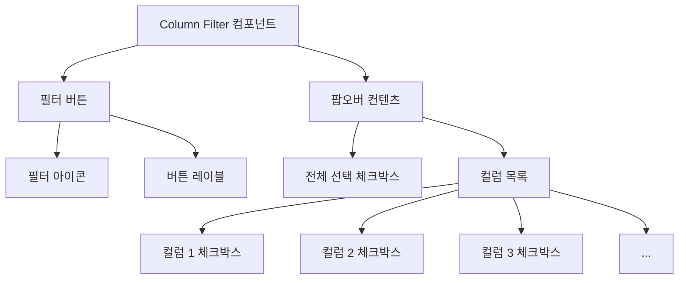

# **📌 PM PRD - 컬럼 필터 컴포넌트 (Column Filter)**

## **1. 개요**
컬럼 필터 컴포넌트는 데이터 테이블에서 사용자가 보고자 하는 컬럼(열)을 선택적으로 표시하거나 숨길 수 있게 해주는 UI 요소입니다. 이 컴포넌트는 대량의 데이터를 표시하는 테이블에서 사용자가 필요한 정보만 집중적으로 볼 수 있도록 도와줍니다. 데이터 테이블 상단에 위치하여 직관적인 필터링 기능을 제공하며, 사용자가 쉽게 접근하고 조작할 수 있도록 설계되었습니다.

## **2. 주요 목표**
- 데이터 테이블의 가독성과 사용자 경험 향상
- 사용자가 필요한 컬럼만 선택하여 정보 과부하 방지
- 다양한 데이터 유형과 환경에서 일관된 필터링 경험 제공
- 직관적인 UI로 사용자가 쉽게 컬럼을 관리할 수 있는 환경 구성
- 복잡한 데이터 구조에서도 효과적인 정보 탐색 지원

## **3. 주요 기능 요구사항**
| 기능 | 우선순위 | 설명 |
|------|---------|------|
| 컬럼 토글 | 상 | 개별 컬럼의 표시/숨김 설정 기능 |
| 전체 컬럼 토글 | 상 | 모든 컬럼을 한 번에 표시하거나 숨기는 기능 |
| 필터 상태 시각화 | 중 | 현재 표시 중인 컬럼을 시각적으로 구분하는 기능 |
| 컬럼 레이블 표시 | 중 | 사용자 친화적인 컬럼 이름 표시 |
| 필터 버튼 UI | 중 | 필터 기능을 직관적으로 표현하는 버튼 |
| 컴팩트한 디자인 | 중 | 테이블 공간을 효율적으로 사용하는 UI 구조 |
| 컨텍스트 유지 | 하 | 페이지 새로고침 후에도 필터 설정 유지 |

## **4. 사용자 시나리오**
1. **기본 컬럼 필터링**: 사용자가 필요하지 않은 컬럼을 숨겨 테이블 가독성 향상
   - 필터 버튼 클릭하여 팝오버 메뉴 열기
   - 필요한 컬럼만 체크하여 선택적으로 표시
2. **전체 컬럼 토글**: 모든 데이터를 한번에 보거나 숨기고자 할 때
   - '전체' 옵션을 통해 모든 컬럼 표시/숨김 한번에 전환
3. **데이터 분석 최적화**: 특정 데이터 분석 시 관련 컬럼만 선택적으로 표시
4. **화면 공간 최적화**: 좁은 화면에서 중요 컬럼만 표시하여 가로 스크롤 최소화

## **5. 구현 현황**
| 기능 | 구현 상태 | 비고 |
|------|----------|------|
| 컬럼 토글 | ✅ 완료 | 개별 컬럼 선택 기능 구현 |
| 전체 컬럼 토글 | ✅ 완료 | 모든 컬럼 표시/숨김 전환 구현 |
| 필터 상태 시각화 | ✅ 완료 | 선택된 컬럼 강조 표시 구현 |
| 팝오버 UI | ✅ 완료 | 클릭 시 나타나는 컬럼 목록 구현 |
| 테이블 연동 | ✅ 완료 | 데이터 테이블과의 연동 구현 |
| 반응형 지원 | ⚠️ 부분 구현 | 모바일 환경 최적화 필요 |

---

# **📌 Design PRD - 컬럼 필터 컴포넌트 (Column Filter)**

## **1. 디자인 컨셉**
- **직관성**: 사용자가 즉시 용도를 이해할 수 있는 명확한 아이콘과 레이블
- **일관성**: ShadCN UI 컴포넌트 디자인 시스템과의 통일성
- **효율성**: 최소한의 클릭으로 컬럼을 관리할 수 있는 간결한 인터페이스
- **시각적 피드백**: 선택 상태를 명확히 나타내는 시각적 표현
- **컴팩트함**: 테이블 헤더에 자연스럽게 통합되는 컴팩트한 디자인

## **2. 레이아웃 및 구조**



## **3. 색상 및 스타일 가이드**
- **필터 버튼**:
  - 배경: 연한 보라색(bg-purple-50/50)
  - 테두리: 연한 보라색(border-purple-200)
  - 아이콘: 보라색(text-purple-700)
  - 크기: 높이 9(h-9), 너비 100px(w-[100px])
  - 호버 상태: 약간 더 진한 보라색(hover:bg-purple-50 hover:text-purple-800)
  
- **팝오버**:
  - 배경: 흰색(bg-white)
  - 테두리: 연한 회색(border-gray-200)
  - 그림자: 미묘한 그림자 효과(shadow-md)
  - 패딩: 작은 패딩(p-2)
  
- **체크박스**:
  - 기본 상태: 회색 테두리(border-gray-200)
  - 선택 상태: 진한 회색(bg-gray-600)
  - 크기: 작은 크기(h-4 w-4)
  
- **레이블**:
  - 기본 텍스트: 작은 글씨(text-[10px]), 회색(text-gray-700)
  - 선택된 텍스트: 볼드체(font-bold), 보라색(text-purple-600)
  - 커서: 포인터(cursor-pointer)

## **4. 상태 및 인터랙션**
- **필터 버튼**:
  - 기본 상태: 기본 스타일로 표시
  - 호버 상태: 배경색 약간 변경, 텍스트 색상 진하게
  - 클릭 상태: 팝오버 표시/숨김 전환
  
- **체크박스**:
  - 비선택 상태: 빈 체크박스
  - 선택 상태: 체크 표시, 배경색 변경
  - 전체 선택 시: 모든 체크박스 선택됨
  - 일부 선택 시: 해당 체크박스만 선택됨
  
- **레이블**:
  - 선택 상태: 볼드체 및 색상 변경으로 강조
  - 호버 상태: 커서 포인터로 변경

## **5. 반응형 고려사항**
- **좁은 화면 최적화**: 모바일 기기에서 버튼 텍스트 크기 조정
- **터치 인터페이스**: 모바일 기기에서 터치 친화적인 크기의 체크박스 및 간격
- **팝오버 위치**: 화면 크기에 따라 팝오버 위치 자동 조정
- **스크롤 지원**: 컬럼이 많을 경우 팝오버 내 스크롤 제공

---

# **📌 Tech PRD - 컬럼 필터 컴포넌트 (Column Filter)**

## **1. 기술 스택**
- **프레임워크**: Next.js + TypeScript
- **UI 라이브러리**: ShadCN UI
- **스타일링**: Tailwind CSS
- **아이콘**: Lucide React (Filter 아이콘)
- **상태 관리**: React useState 및 props를 통한 상태 관리

## **2. 컴포넌트 구조**

```typescript
// 컬럼 인터페이스 정의
export interface Column {
  key: string;
  label: string;
}

// Column Filter 속성 정의
interface ColumnFilterProps {
  columns: Column[];               // 필터링 가능한 컬럼 목록
  visibleColumns: Set<string>;     // 현재 표시 중인 컬럼 집합
  isAllColumnsVisible: boolean;    // 모든 컬럼이 표시 중인지 여부
  onToggleColumn: (columnKey: string) => void;  // 컬럼 표시/숨김 토글 함수
  onToggleAllColumns: () => void;  // 모든 컬럼 표시/숨김 토글 함수
  className?: string;              // 추가 CSS 클래스
}
```

## **3. 주요 기능 구현**

### **3.1 컬럼 필터 컴포넌트**
```tsx
export function ColumnFilter({
  columns,
  visibleColumns,
  isAllColumnsVisible,
  onToggleColumn,
  onToggleAllColumns,
  className = ''
}: ColumnFilterProps) {
  return (
    <div className={className}>
      <Popover>
        <PopoverTrigger asChild>
          <Button 
            variant="outline" 
            className="text-purple-700 border-purple-200 hover:bg-purple-50 hover:text-purple-800 w-[100px] h-9"
          >
            <Filter className="h-4 w-4 mr-2" />
            Filter
          </Button>
        </PopoverTrigger>
        <PopoverContent className="w-[100px] p-2">
          <div className="space-y-2">
            {/* 전체 컬럼 토글 체크박스 */}
            <div className="flex items-center space-x-2">
              <Checkbox
                checked={isAllColumnsVisible}
                onCheckedChange={onToggleAllColumns}
                id="all-columns"
                className="data-[state=checked]:border-gray-600 data-[state=checked]:bg-gray-600"
              />
              <label 
                htmlFor="all-columns"
                className={`text-[10px] cursor-pointer ${
                  isAllColumnsVisible ? 'font-bold text-purple-600' : ''
                }`}
              >
                All
              </label>
            </div>
            {/* 개별 컬럼 체크박스 목록 */}
            <div className="space-y-2">
              {columns.map((column) => (
                <div key={column.key} className="flex items-center space-x-2">
                  <Checkbox
                    checked={visibleColumns.has(column.key)}
                    onCheckedChange={() => onToggleColumn(column.key)}
                    id={`column-${column.key}`}
                    className="data-[state=checked]:border-gray-600 data-[state=checked]:bg-gray-600"
                  />
                  <label 
                    htmlFor={`column-${column.key}`}
                    className={`text-[10px] cursor-pointer ${
                      visibleColumns.has(column.key) ? 'font-bold text-purple-600' : ''
                    }`}
                  >
                    {column.label}
                  </label>
                </div>
              ))}
            </div>
          </div>
        </PopoverContent>
      </Popover>
    </div>
  );
}
```

### **3.2 데이터 테이블과의 통합**
```tsx
// DataTable 컴포넌트 내부에서의 상태 관리
const [visibleColumns, setVisibleColumns] = useState<Set<string>>(
  new Set(columns.map(col => col.key))
);
const [isAllColumnsVisible, setIsAllColumnsVisible] = useState<boolean>(true);

// 개별 컬럼 토글 함수
const toggleColumn = (columnKey: string) => {
  const newVisibleColumns = new Set(visibleColumns);
  
  if (newVisibleColumns.has(columnKey)) {
    newVisibleColumns.delete(columnKey);
  } else {
    newVisibleColumns.add(columnKey);
  }
  
  setVisibleColumns(newVisibleColumns);
  setIsAllColumnsVisible(newVisibleColumns.size === columns.length);
};

// 모든 컬럼 토글 함수
const toggleAllColumns = () => {
  if (isAllColumnsVisible) {
    // 모든 컬럼이 표시 중일 때는 모두 숨김
    setVisibleColumns(new Set());
    setIsAllColumnsVisible(false);
  } else {
    // 일부 컬럼만 표시 중일 때는 모두 표시
    setVisibleColumns(new Set(columns.map(col => col.key)));
    setIsAllColumnsVisible(true);
  }
};

// 컴포넌트 렌더링
<ColumnFilter
  columns={columns.filter(col => col.key !== 'id')} // ID 컬럼은 필터 목록에서 제외
  visibleColumns={visibleColumns}
  isAllColumnsVisible={isAllColumnsVisible}
  onToggleColumn={toggleColumn}
  onToggleAllColumns={toggleAllColumns}
/>

// 테이블 헤더 및 바디 렌더링 시 필터링 적용
{columns.map(column => 
  visibleColumns.has(column.key) && (
    <TableHead key={column.key}>
      {column.label}
    </TableHead>
  )
)}
```

## **4. 컴포넌트 사용 예시**

```tsx
// 기본 사용법
const columns = [
  { key: 'name', label: '이름' },
  { key: 'age', label: '나이' },
  { key: 'email', label: '이메일' },
  { key: 'phone', label: '전화번호' },
  { key: 'address', label: '주소' }
];

const [visibleColumns, setVisibleColumns] = useState<Set<string>>(
  new Set(columns.map(col => col.key))
);
const [isAllColumnsVisible, setIsAllColumnsVisible] = useState<boolean>(true);

const handleToggleColumn = (columnKey: string) => {
  // 상태 업데이트 로직
};

const handleToggleAllColumns = () => {
  // 전체 토글 로직
};

return (
  <div>
    <ColumnFilter
      columns={columns}
      visibleColumns={visibleColumns}
      isAllColumnsVisible={isAllColumnsVisible}
      onToggleColumn={handleToggleColumn}
      onToggleAllColumns={handleToggleAllColumns}
    />
    
    <Table>
      <TableHeader>
        <TableRow>
          {columns.map(column => 
            visibleColumns.has(column.key) && (
              <TableHead key={column.key}>{column.label}</TableHead>
            )
          )}
        </TableRow>
      </TableHeader>
      <TableBody>
        {/* 테이블 데이터 */}
      </TableBody>
    </Table>
  </div>
);
```

## **5. 성능 고려사항**
- **메모이제이션**: 불필요한 리렌더링 방지를 위한 React.memo 및 useCallback 사용
- **Set 자료구조 활용**: 컬럼 표시 상태 확인을 위한 효율적인 Set 자료구조 활용
- **지연 렌더링**: 컬럼이 많을 경우 지연 렌더링을 통한 성능 최적화
- **이벤트 최적화**: 체크박스 이벤트 핸들링 최적화
- **컴포넌트 분리**: 복잡한 테이블에서 필터 컴포넌트를 분리하여 렌더링 성능 개선

## **6. 확장성**
- **커스텀 필터 로직**: 기본 필터 외에 사용자 정의 필터링 로직 지원 가능
- **필터 프리셋**: 자주 사용하는 컬럼 조합을 프리셋으로 저장/불러오기 기능
- **검색 기능 통합**: 대량의 컬럼이 있을 경우 검색 기능 추가 가능
- **필터 상태 저장**: 로컬 스토리지를 활용한 필터 설정 유지 기능
- **다양한 필터 유형**: 컬럼 필터 외에도 다양한 필터 유형으로 확장 가능

## **7. 접근성 고려사항**
- **키보드 접근성**: 키보드만으로 모든 기능 사용 가능
- **스크린 리더 지원**: 적절한 aria 속성 추가로 스크린 리더 호환성 확보
  - `aria-label`: 버튼과 체크박스에 적절한 레이블 제공
  - `aria-checked`: 체크박스 상태 전달
- **충분한 색상 대비**: 텍스트와 배경색 간의 적절한 대비 비율 유지
- **포커스 관리**: 명확한 포커스 표시 및 적절한 포커스 이동
- **확대 시 사용성**: 텍스트 확대 시에도 UI 구조 유지 