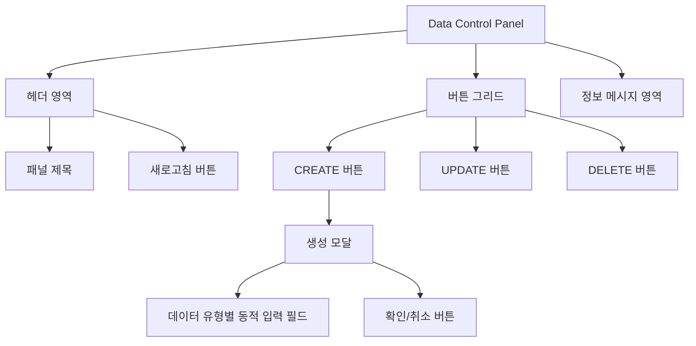

# **📌 PM PRD - 범용 데이터 관리 패널 (Data Control Panel)**

## **1. 개요**
데이터 테이블과 연계되어 다양한 게임 데이터(화폐, 아이템, 캐릭터, 선수 등)를 기본적으로 관리할 수 있는 범용 패널 컴포넌트입니다. 이 컴포넌트는 다양한 데이터 관리 페이지에 통합되어 있으며, 관리자가 사용자의 데이터를 생성, 수정, 삭제할 수 있는 인터페이스를 제공합니다. 현재는 Users 페이지의 Select Users 카드 내 CURRENCY 탭 및 MULTI PLAY > BALLER 탭에 구현되어 있으며, 추후 다양한 데이터 유형으로 확장 가능합니다.

## **2. 주요 목표**
- 게임 서비스 관리자가 다양한 유형의 게임 데이터를 효율적으로 관리
- 기본적인 CRUD(Create, Read, Update, Delete) 작업을 직관적인 UI로 제공
- 데이터 변경 작업의 안전성과 사용성 보장
- 다중 DB 환경에서 사용자별 정보 관리 지원
- 다양한 데이터 유형에 대응 가능한 유연한 인터페이스 제공

## **3. 주요 기능 요구사항**
| 기능 | 우선순위 | 설명 |
|------|---------|------|
| CREATE 버튼 | 상 | 새로운 데이터 엔트리 생성 기능 |
| UPDATE 버튼 | 상 | 기존 데이터 엔트리 업데이트 기능 |
| DELETE 버튼 | 상 | 데이터 엔트리 삭제 기능 |
| 새로고침 버튼 | 중 | 데이터 테이블 새로고침 기능 |
| 정보 메시지 | 중 | 사용자에게 작업 가이드 제공 |
| 데이터베이스 정보 표시 | 중 | 현재 조작 중인 DB 정보 표시 |
| 생성 모달 | 상 | 데이터 유형에 따른 상세 정보 입력 모달 |

## **4. 사용자 시나리오**
1. **데이터 생성**: 
   - 관리자가 CREATE 버튼을 클릭하여 특정 사용자에게 새 데이터 엔트리 추가
   - 데이터 유형에 맞는 생성 모달에서 필요한 정보 입력
   - 예: 화폐의 경우 아이템 인덱스와 수량 입력, 캐릭터의 경우 캐릭터 인덱스와 속성 값 입력
   
2. **데이터 수정**: 
   - 관리자가 UPDATE 버튼을 클릭하여 기존 데이터 엔트리의 속성 수정
   - 데이터 유형에 따라 수정 가능한 필드 제공
   
3. **데이터 삭제**:
   - 관리자가 DELETE 버튼을 클릭하여 데이터 엔트리 삭제
   - 삭제 전 확인 다이얼로그 표시

4. **데이터 새로고침**: 변경 후 새로고침 버튼으로 최신 데이터 확인

## **5. 구현 현황**
| 기능 | 구현 상태 | 비고 |
|------|----------|------|
| Currency 관련 CRUD 기능 | ✅ 완료 | 모달 다이얼로그와 API 연동 완료 |
| BALLER 관련 CRUD 기능 | ✅ 완료 | 모달 다이얼로그와 API 연동 완료 |
| 새로고침 | ✅ 완료 | 애니메이션 효과와 이벤트 시스템 구현 |
| 에러 처리 | ✅ 완료 | 에러 메시지 및 경고 다이얼로그 |
| 범용 데이터 타입 지원 | 🚧 진행중 | 다양한 데이터 유형에 대한 인터페이스 확장 |

---

# **📌 Design PRD - 범용 데이터 관리 패널 (Data Control Panel)**

## **1. 디자인 컨셉**
- **일관성**: ShadCN UI 컴포넌트 라이브러리 활용한 통일된 디자인
- **명확성**: 각 기능 버튼의 목적과 상태가 시각적으로 명확하게 구분
- **컴팩트함**: 작은 공간에서도 효율적으로 모든 기능에 접근 가능한 레이아웃
- **확장성**: 다양한 데이터 유형에 적용 가능한 유연한 디자인 시스템

## **2. 레이아웃 및 구조**



## **3. 색상 및 스타일 가이드**
- **패널 배경**: 밝은 회색(bg-gray-100)으로 데이터 테이블과 구분
- **제목 영역**: 보라색 계열(text-purple-900)의 텍스트로 강조
- **버튼 색상**:
  - CREATE: 녹색(bg-green-500, hover:bg-green-600)
  - UPDATE: 파란색(bg-blue-500, hover:bg-blue-600)
  - DELETE: 빨간색(bg-red-500, hover:bg-red-600)
  - 새로고침: 연한 보라색(bg-purple-50, border-purple-200)
- **정보 메시지**: 연한 보라색 배경(bg-purple-50)에 보라색 텍스트(text-purple-800)
- **모달 헤더**: 그라데이션 배경(bg-gradient-to-r from-green-600 to-teal-600)
- **모달 입력 필드**: 흰색 배경, 포커스 시 컨텍스트에 맞는 색상 강조

## **4. 데이터 유형별 모달 디자인**
- **기본 모달 템플릿**: 
  - 일관된 헤더 및 버튼 레이아웃
  - 데이터 유형에 따라 내부 필드만 변경
  
- **예시 - 화폐 생성 모달**: 
  - 간결한 인터페이스(아이템 인덱스, 수량)
  - 그린 계열 강조색 사용

- **예시 - BALLER 생성 모달**:
  - 테이블 형식의 다양한 입력 필드
  - 선택 필드(드롭다운)와 숫자 입력 필드 혼합
  - 퍼플 계열 강조색 사용

- **확장 가능성**:
  - 임의의 데이터 유형을 위한 동적 필드 생성 지원
  - 필드 템플릿 시스템을 통한 새로운 데이터 유형 쉽게 추가 가능

## **5. UI 상태**
- **기본 상태**: 모든 버튼이 활성화된 상태
- **로딩 상태**: 
  - 새로고침 버튼에 회전 애니메이션 및 텍스트 변경
  - 작업 진행 중 버튼 비활성화 및 로딩 인디케이터 표시
- **비활성화 상태**: 작업이 불가능한 버튼은 시각적으로 비활성화
- **에러 상태**: 빨간색 경고 알림으로 에러 메시지 표시
- **컨텍스트 인식 상태**: 현재 선택된 데이터 유형에 따라 UI 요소 조정

## **6. 반응형 고려사항**
- 모바일 환경에서도 모든 버튼이 접근 가능하도록 그리드 레이아웃 조정
- 작은 화면에서도 텍스트 가독성 유지
- 모달 다이얼로그는 최대 너비 900px로 제한하여 다양한 화면 크기에 대응
- 복잡한 데이터 유형의 경우 모바일에서 최적화된 입력 폼 제공

---

# **📌 Tech PRD - 범용 데이터 관리 패널 (Data Control Panel)**

## **1. 기술 스택**
- **프레임워크**: Next.js + TypeScript
- **UI 라이브러리**: ShadCN UI
- **스타일링**: Tailwind CSS
- **아이콘**: Lucide React (`PlusCircle`, `Edit`, `Trash2`, `Database`, `RefreshCw`, `Info`)
- **상태 관리**: React useState 훅
- **폼 관리**: React Hook Form (복잡한 데이터 유형용)

## **2. 컴포넌트 구조**

```typescript
// 컨트롤 패널 버튼 정의 인터페이스
export interface ControlPanelButton {
  id: string;
  label: string;
  icon: React.ReactNode;
  variant?: 'default' | 'destructive' | 'outline' | 'secondary' | 'ghost' | 'link';
  bgColorClass?: string;
  onClick: () => void;
  disabled?: boolean;
}

// Data Control Panel 속성 정의
export interface DataControlsPanelProps {
  onCreateClick?: () => void;
  onUpdateClick?: () => void;
  onDeleteClick?: () => void;
  onRefreshClick?: () => void;
  className?: string;
  title?: string;
  showRefreshButton?: boolean;
  showInfoMessage?: boolean;
  infoMessage?: string;
  customButtons?: ControlPanelButton[];
  dataType?: string; // 데이터 유형 식별자 (예: 'currency', 'baller', 'item' 등)
}

// 범용 데이터 생성 모달 속성 정의
export interface CreateDataModalProps<T> {
  open: boolean;
  onOpenChange: (open: boolean) => void;
  onConfirm: (newData: T) => void;
  isCreating: boolean;
  dataType: string;
  schema?: any; // 데이터 유형에 따른 유효성 검증 스키마
  initialValues?: Partial<T>; // 초기값
}

// 예시: 화폐 데이터 타입
export interface CurrencyData {
  excelItemIndex: number;
  count: number;
}

// 예시: BALLER 데이터 타입
export interface BallerData {
  excel_baller_index: number; 
  character_level: number;
  training_point: number;
  recruit_process: number;
  character_status: number;
}
```

## **3. 주요 기능 구현**

### **3.1 범용 버튼 액션 핸들링**
```typescript
// 기본 버튼 구성
const defaultButtons: ControlPanelButton[] = [
  {
    id: 'create',
    label: 'CREATE',
    icon: <PlusCircle className="h-3.5 w-3.5 mr-1.5" />,
    bgColorClass: 'bg-green-500 hover:bg-green-600 text-white',
    variant: 'default',
    onClick: onCreateClick || (() => console.log(`[DataControlsPanel] CREATE 버튼 클릭됨 (${dataType})`)),
    disabled: false
  },
  // UPDATE 및 DELETE 버튼 정의...
];
```

### **3.2 데이터 타입 인식 및 컨텍스트 전환**
```typescript
// 데이터 타입에 따른 모달 및 API 설정
const getModalConfig = (dataType: string) => {
  switch(dataType) {
    case 'currency':
      return {
        title: '화폐 추가',
        apiEndpoint: '/api/users/currency',
        component: CreateCurrencyModal,
      };
    case 'baller':
      return {
        title: 'BALLER 추가',
        apiEndpoint: '/api/users/baller',
        component: CreateBallerModal,
      };
    // 추가 데이터 타입에 대한 설정...
    default:
      return {
        title: '데이터 추가',
        apiEndpoint: '/api/data',
        component: CreateGenericDataModal,
      };
  }
};
```

### **3.3 새로고침 기능**
```typescript
const handleRefresh = () => {
  setIsRefreshing(true);
  console.log(`[DataControlsPanel] ${dataType} 데이터 새로고침 요청`);
  
  // 커스텀 새로고침 핸들러가 제공된 경우 호출
  if (onRefreshClick) {
    onRefreshClick();
  }
  
  // 새로고침 시뮬레이션
  setTimeout(() => {
    // 페이지 새로고침 이벤트 발생
    window.dispatchEvent(new CustomEvent('refresh-data', { detail: { dataType } }));
    setIsRefreshing(false);
    console.log(`[DataControlsPanel] ${dataType} 데이터 새로고침 완료`);
  }, 1000);
};
```

### **3.4 범용 데이터 생성 모달 구현**
```typescript
export function CreateGenericDataModal<T>({
  open,
  onOpenChange,
  onConfirm,
  isCreating,
  dataType,
  schema,
  initialValues,
}: CreateDataModalProps<T>) {
  const [formData, setFormData] = useState<Partial<T>>(initialValues || {});
  const [error, setError] = useState<string | null>(null);

  // 스키마를 기반으로 동적 필드 생성
  const renderFields = () => {
    if (!schema) return null;
    
    return Object.entries(schema.properties).map(([key, field]: [string, any]) => (
      <div key={key} className="mb-4">
        <Label htmlFor={key}>{field.title || key}</Label>
        <Input
          id={key}
          type={field.type === 'number' ? 'number' : 'text'}
          value={formData[key as keyof T] || ''}
          onChange={(e) => {
            const value = field.type === 'number' ? Number(e.target.value) : e.target.value;
            setFormData({...formData, [key]: value});
          }}
          placeholder={field.description || ''}
          required={schema.required?.includes(key)}
        />
        {field.description && (
          <p className="text-sm text-gray-500 mt-1">{field.description}</p>
        )}
      </div>
    ));
  };

  const handleSubmit = (e: React.FormEvent) => {
    e.preventDefault();
    
    // 스키마 기반 유효성 검사
    try {
      if (schema) {
        // 유효성 검사 로직
      }
      onConfirm(formData as T);
    } catch (err) {
      setError(`유효성 검사 오류: ${err.message}`);
    }
  };
  
  // 모달 UI 렌더링...
}
```

## **4. API 연동**

데이터 유형에 따른 동적 API 연동:

```typescript
// 범용 데이터 생성 함수
const createData = async <T>(
  dataType: string, 
  data: T, 
  employerUid: string, 
  dbName: string
) => {
  const config = getApiConfig(dataType);
  
  try {
    const response = await fetch(config.endpoint, {
      method: "POST",
      headers: {
        "Content-Type": "application/json",
      },
      body: JSON.stringify({
        employerUid,
        dbName,
        ...data
      }),
    });

    if (!response.ok) {
      const errorData = await response.json();
      throw new Error(errorData.message || `${dataType} 생성 중 오류가 발생했습니다.`);
    }

    return await response.json();
  } catch (error) {
    console.error(`[${dataType}] 생성 오류:`, error);
    throw error;
  }
};

// 화폐 데이터 생성 예시
const createCurrency = async (newCurrency: CurrencyData, employerUid: string, dbName: string) => {
  return createData<CurrencyData>('currency', newCurrency, employerUid, dbName);
};

// BALLER 생성 예시
const createBaller = async (newBaller: BallerData, employerUid: string, dbName: string) => {
  return createData<BallerData>('baller', newBaller, employerUid, dbName);
};
```

## **5. 성능 고려사항**
- 데이터 유형에 따른 동적 컴포넌트 로딩으로 초기 번들 크기 최적화
- 다수의 아이템 동시 처리 시 병렬 요청 최적화
- 새로고침 작업 시 불필요한 전체 페이지 리로드 방지를 위한 이벤트 시스템 활용
- 상태 업데이트의 효율적 관리로 불필요한 렌더링 최소화
- 모달 다이얼로그의 효율적인 포커스 관리와 접근성 보장
- API 요청 중복 방지 및 캐싱 전략 적용으로 서버 부하 감소

## **6. 통합 및 확장성**
- 다양한 데이터 유형을 단일 컴포넌트로 관리하는 통합 인터페이스
- 데이터 타입 정의를 통한 타입 안전성 보장
- 스키마 기반 동적 폼 생성으로 새로운 데이터 타입 쉽게 추가 가능
- 데이터 유형별 API 엔드포인트 설정 시스템
- 커스텀 버튼과 액션 추가 기능을 통한 확장 가능성
- 버튼별 스타일 및 동작 커스터마이징 용이
- 모듈화된 구조로 다양한 데이터 컨텍스트에 적용 가능
- 테이블 컴포넌트와의 느슨한 결합으로 재사용성 강화

## **7. 통합 테스트 및 검증**
- 다양한 데이터 유형에 대한 통합 기능 검증
  - 다양한 데이터 유형의 생성, 수정, 삭제 테스트
  - 복잡한 데이터 구조 처리 테스트
  - 네트워크 지연 및 오류 상황에서의 동작 테스트
  - 다중 DB 환경에서의 데이터 일관성 검증
- 사용자 경험 측면의 UI/UX 테스트
  - 데이터 유형 전환 시 UI 적응성
  - 버튼 상태 전환의 명확성
  - 작업 진행 상태의 가시성
  - 오류 메시지의 명확성 및 조치 안내
- 성능 테스트
  - 다양한 데이터 유형 처리 시 응답성
  - 대량 데이터 처리 시 응답성
  - 다중 요청 처리 시 안정성
  - 모바일 환경에서의 반응형 UI 검증