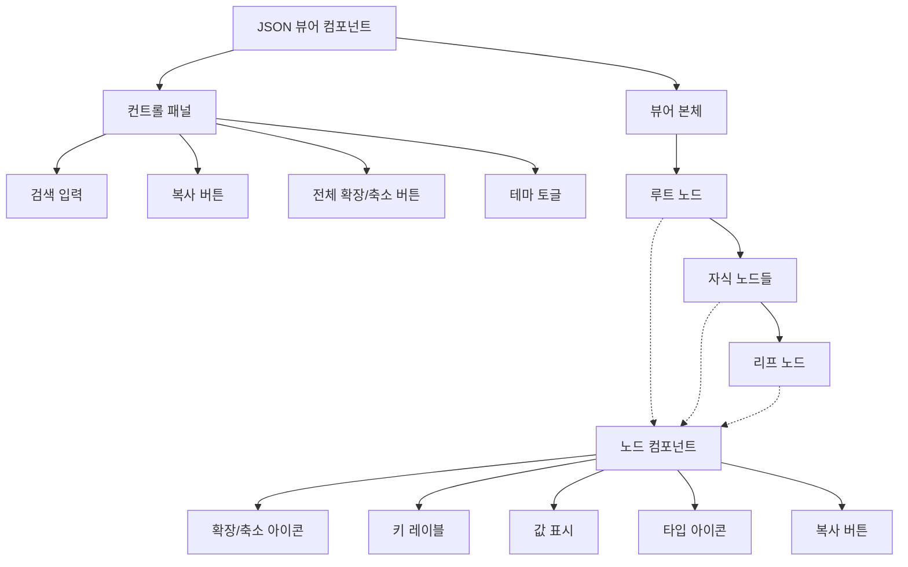

# **📌 PM PRD - JSON 뷰어 컴포넌트 (JSON Viewer)**

## **1. 개요**
JSON 뷰어 컴포넌트는 복잡한 JSON 데이터 구조를 시각적으로 표현하고, 사용자가 쉽게 탐색하고 이해할 수 있도록 하는 UI 컴포넌트입니다. API 응답 데이터, 설정 파일, 데이터베이스 쿼리 결과 등과 같은 구조화된 JSON 데이터를 계층적으로 표시하며, 필요에 따라 확장/축소하고 검색할 수 있는 기능을 제공합니다. 주로 개발자 도구, 디버깅 화면, 데이터 탐색기 등에서 활용됩니다.

## **2. 주요 목표**
- 복잡한 JSON 구조를 직관적이고 가독성 높게 시각화
- 중첩된 데이터를 계층적으로 표현하여 데이터 구조 이해도 향상
- 대용량 JSON 데이터도 효율적으로 처리하여 성능 저하 방지
- 사용자가 데이터를 쉽게 탐색하고 특정 값을 찾을 수 있는 기능 제공
- 데이터 타입별 시각적 구분으로 데이터 의미 파악 용이성 제공

## **3. 주요 기능 요구사항**
| 기능 | 우선순위 | 설명 |
|------|---------|------|
| 트리 구조 표시 | 상 | JSON 데이터를 계층적 트리 구조로 표시 |
| 확장/축소 | 상 | 노드 수준에서 데이터 확장 및 축소 기능 |
| 데이터 타입 시각화 | 상 | 문자열, 숫자, 불리언, 배열, 객체 등 데이터 타입별 구분 표시 |
| 복사 기능 | 중 | 특정 노드 또는 전체 JSON 데이터를 클립보드에 복사 |
| 검색 기능 | 중 | 키 또는 값으로 JSON 데이터 내 검색 |
| 경로 표시 | 중 | 현재 선택된 노드의 경로 표시 |
| 필터링 | 하 | 특정 조건에 맞는 노드만 표시 |
| 다크/라이트 모드 | 하 | 사용자 선호에 따른 테마 변경 지원 |

## **4. 사용자 시나리오**
1. **API 응답 데이터 검사**: 개발자가 API 응답을 시각적으로 검사하고 특정 필드 값 확인
2. **설정 파일 탐색**: 시스템 관리자가 복잡한 설정 JSON 파일의 구조를 탐색하고 특정 설정 확인
3. **데이터 디버깅**: 개발자가 오류 발생 시 JSON 형태의 상태 데이터를 검사하여 문제 원인 파악
4. **데이터 분석**: 데이터 분석가가 대량의 JSON 데이터를 탐색하여 중요한 인사이트 발견
5. **대시보드 데이터 시각화**: 대시보드에서 사용자가 생성된 리포트 데이터 구조 시각적으로 확인

## **5. 구현 현황**
| 기능 | 구현 상태 | 비고 |
|------|----------|------|
| 트리 구조 표시 | ✅ 완료 | 중첩 수준별 인덴트 적용 |
| 확장/축소 | ✅ 완료 | 모든 레벨에서 개별 노드 확장/축소 가능 |
| 데이터 타입 시각화 | ✅ 완료 | 색상 및 아이콘으로 타입 구분 |
| 복사 기능 | ✅ 완료 | 노드별 및 전체 복사 기능 구현 |
| 검색 기능 | ⚠️ 부분 구현 | 기본 키워드 검색만 구현, 정규식 검색 미구현 |
| 경로 표시 | ✅ 완료 | 선택된 노드의 전체 경로 표시 |
| 접근성 지원 | ⚠️ 부분 구현 | 기본 키보드 탐색 지원, 스크린 리더 최적화 필요 |

---

# **📌 Design PRD - JSON 뷰어 컴포넌트 (JSON Viewer)**

## **1. 디자인 컨셉**
- **계층 구조**: 들여쓰기와 연결선을 통해 데이터의 계층 구조를 명확하게 표현
- **타입 시각화**: 다양한 색상과 아이콘을 사용하여 데이터 타입을 직관적으로 구분
- **상호작용성**: 확장/축소, 선택, 복사 등의 상호작용을 통해 사용자 경험 향상
- **가독성**: 적절한 간격과 폰트를 사용하여 복잡한 데이터도 읽기 쉽게 표현
- **일관성**: 전체 애플리케이션의 디자인 시스템과 조화를 이루는 스타일링

## **2. 레이아웃 및 구조**



## **3. 색상 및 스타일 가이드**
- **컨테이너**:
  - 배경: 흰색(bg-white) 또는 다크 모드에서 진한 회색(bg-gray-900)
  - 테두리: 얇은 경계선(border), 둥근 모서리(rounded-md)
  - 여백: 적절한 패딩(p-4)
  - 최대 높이: 필요에 따라 스크롤 가능(max-h-[500px] overflow-auto)
  
- **키/값 표시**:
  - 키: 중간 굵기(font-medium), 파란색(text-blue-600), 다크 모드에서 연한 파란색(dark:text-blue-400)
  - 문자열: 녹색(text-green-600), 다크 모드에서 연한 녹색(dark:text-green-400), 따옴표로 감싸기
  - 숫자: 주황색(text-orange-600), 다크 모드에서 연한 주황색(dark:text-orange-400)
  - 불리언/null: 빨간색(text-red-600), 다크 모드에서 연한 빨간색(dark:text-red-400)
  - 배열/객체: 기본 텍스트 색상, 항목 수 표시(회색, text-gray-500)
  
- **노드 스타일**:
  - 들여쓰기: 각 레벨마다 일관된 들여쓰기(pl-4)
  - 연결선: 왼쪽 테두리로 계층 구조 표현(border-l-2 border-gray-200)
  - 간격: 노드 간 적절한 간격(my-1)
  - 호버 상태: 배경색 변경(hover:bg-gray-50), 다크 모드에서(dark:hover:bg-gray-800)
  
- **아이콘**:
  - 확장/축소: 화살표 아이콘(ChevronRight/ChevronDown), 크기(w-4 h-4)
  - 타입 아이콘: 각 데이터 타입별 아이콘(String, Number, Boolean, Array, Object)
  - 복사 버튼: 클립보드 아이콘(w-4 h-4), 회색(text-gray-400), 호버 시 진한 회색(hover:text-gray-600)
  
- **컨트롤 패널**:
  - 배경: 연한 회색(bg-gray-50), 다크 모드에서 약간 더 진한 회색(dark:bg-gray-800)
  - 테두리: 하단 경계선(border-b)
  - 패딩: 적절한 여백(p-2)
  - 버튼: 작은 크기(size="sm"), 윤곽선 스타일(variant="outline")

## **4. 상태 및 반응**
- **노드 확장/축소**:
  - 확장 상태: 아래 방향 화살표, 하위 노드 표시
  - 축소 상태: 오른쪽 방향 화살표, 하위 노드 숨김
  - 전환 애니메이션: 부드러운 높이 전환(transition-all duration-200)
  
- **선택 상태**:
  - 선택된 노드: 연한 파란색 배경(bg-blue-50), 다크 모드에서 진한 파란색(dark:bg-blue-900/30)
  - 경로 하이라이트: 선택된 노드까지의 경로 상의 모든 노드에 약한 하이라이트 적용
  
- **검색 결과**:
  - 일치 항목: 노란색 배경(bg-yellow-100), 다크 모드에서 어두운 노란색(dark:bg-yellow-900/30)
  - 현재 선택된 일치 항목: 더 진한 노란색 배경(bg-yellow-200)
  
- **복사 동작**:
  - 기본 상태: 회색 아이콘
  - 호버 상태: 진한 회색으로 변경
  - 복사 완료: 체크 아이콘으로 잠시 변경 후 원래 아이콘으로 복귀(애니메이션)

## **5. 반응형 고려사항**
- **모바일 뷰**: 작은 화면에서도 가독성을 유지하기 위한 조정된 패딩 및 폰트 크기
- **수평 공간 제한**: 키가 길 경우 말줄임표(...) 처리 및 호버 시 전체 텍스트 표시
- **제어 패널 적응**: 작은 화면에서는 제어 패널을 수직으로 배치
- **터치 최적화**: 터치 기기에서 더 넓은 히트 영역으로 쉬운 확장/축소

---

# **📌 Tech PRD - JSON 뷰어 컴포넌트 (JSON Viewer)**

## **1. 기술 스택**
- **프레임워크**: Next.js + TypeScript
- **UI 라이브러리**: ShadCN UI의 기본 컴포넌트(Button, Input, ScrollArea 등)
- **아이콘**: Lucide React 아이콘 라이브러리
- **스타일링**: Tailwind CSS
- **상태 관리**: React 컴포넌트 로컬 상태 및 컨텍스트 API

## **2. 컴포넌트 구조**

```typescript
// JSON 뷰어 컴포넌트 props 인터페이스
export interface IJSONViewerProps {
  data: any;
  initialExpandLevel?: number; // 초기 확장 수준 (0 = 루트만)
  sortKeys?: boolean; // 키 알파벳순 정렬 여부
  enableClipboard?: boolean; // 복사 기능 활성화 여부
  theme?: 'light' | 'dark' | 'auto'; // 테마 설정
  rootName?: string; // 루트 노드 이름
  className?: string; // 추가 CSS 클래스
  displayDataTypes?: boolean; // 데이터 타입 표시 여부
  displayObjectSize?: boolean; // 객체/배열 크기 표시 여부
  onSelect?: (path: string, value: any) => void; // 노드 선택 콜백
}

// JSON 노드 컴포넌트 props 인터페이스
export interface IJSONNodeProps {
  name: string;
  value: any;
  path: string;
  depth: number;
  expanded: boolean;
  onToggleExpand: (path: string) => void;
  onSelect: (path: string, value: any) => void;
  isSelected: boolean;
  displayDataTypes: boolean;
  displayObjectSize: boolean;
  enableClipboard: boolean;
  searchMatch?: boolean;
}
```

## **3. 주요 기능 구현**

### **3.1 JSON 구조의 재귀적 렌더링**
```tsx
export const JSONNode: React.FC<IJSONNodeProps> = ({
  name,
  value,
  path,
  depth,
  expanded,
  onToggleExpand,
  onSelect,
  isSelected,
  displayDataTypes,
  displayObjectSize,
  enableClipboard,
  searchMatch
}) => {
  const valueType = getValueType(value);
  const isExpandable = ['object', 'array'].includes(valueType) && value !== null;
  
  // 값에 따른 아이콘 결정
  const TypeIcon = useMemo(() => {
    switch (valueType) {
      case 'string': return MessageSquare;
      case 'number': return Hash;
      case 'boolean': return ToggleLeft;
      case 'object': return Briefcase;
      case 'array': return List;
      case 'null': return Ban;
      default: return File;
    }
  }, [valueType]);
  
  // 노드 크기 표시 (객체 및 배열)
  const sizeDisplay = useMemo(() => {
    if (!displayObjectSize || !isExpandable || value === null) return null;
    
    const count = Object.keys(value).length;
    return (
      <span className="text-xs text-gray-500 ml-1">
        {valueType === 'array' ? `[${count}]` : `{${count}}`}
      </span>
    );
  }, [displayObjectSize, isExpandable, value, valueType]);
  
  // 노드 컨텐츠 렌더링
  const renderContent = () => {
    if (!isExpandable || !expanded) {
      // 기본 값 표시 (문자열, 숫자, 불리언, null 등)
      return (
        <span 
          className={`${getValueColor(valueType)} ml-1`}
          onClick={() => onSelect(path, value)}
        >
          {formatValue(value, valueType)}
        </span>
      );
    }
    
    // 확장된 객체/배열 표시
    return (
      <div className="pl-4 border-l-2 border-gray-200 dark:border-gray-700 mt-1">
        {Object.keys(value).map((key) => (
          <JSONNode 
            key={`${path}.${key}`}
            name={key}
            value={value[key]}
            path={`${path}.${key}`}
            depth={depth + 1}
            expanded={/* ... */}
            onToggleExpand={onToggleExpand}
            onSelect={onSelect}
            isSelected={/* ... */}
            displayDataTypes={displayDataTypes}
            displayObjectSize={displayObjectSize}
            enableClipboard={enableClipboard}
            searchMatch={/* ... */}
          />
        ))}
      </div>
    );
  };
  
  return (
    <div 
      className={`my-1 ${isSelected ? 'bg-blue-50 dark:bg-blue-900/30' : ''} 
                 ${searchMatch ? 'bg-yellow-100 dark:bg-yellow-900/30' : ''}`}
    >
      <div className="flex items-center">
        {/* 확장/축소 아이콘 */}
        {isExpandable ? (
          <Button 
            variant="ghost" 
            size="sm" 
            className="h-6 w-6 p-0"
            onClick={() => onToggleExpand(path)}
          >
            {expanded ? 
              <ChevronDown className="h-4 w-4" /> : 
              <ChevronRight className="h-4 w-4" />
            }
          </Button>
        ) : (
          <div className="w-6" />
        )}
        
        {/* 타입 아이콘 */}
        {displayDataTypes && (
          <TypeIcon className="h-4 w-4 mr-1 text-gray-500" />
        )}
        
        {/* 키 */}
        <span 
          className="font-medium text-blue-600 dark:text-blue-400"
          onClick={() => onSelect(path, value)}
        >
          {name}
        </span>
        
        {/* 콜론 */}
        <span className="mx-1">:</span>
        
        {/* 사이즈 표시 */}
        {sizeDisplay}
        
        {/* 값 또는 확장된 콘텐츠 */}
        {renderContent()}
        
        {/* 복사 버튼 */}
        {enableClipboard && (
          <CopyButton 
            value={JSON.stringify(value, null, 2)} 
            className="ml-2"
          />
        )}
      </div>
    </div>
  );
};
```

### **3.2 메인 JSON 뷰어 컴포넌트**
```tsx
export const JSONViewer: React.FC<IJSONViewerProps> = ({
  data,
  initialExpandLevel = 1,
  sortKeys = false,
  enableClipboard = true,
  theme = 'auto',
  rootName = 'root',
  className = '',
  displayDataTypes = true,
  displayObjectSize = true,
  onSelect
}) => {
  // 확장 상태 관리
  const [expandedPaths, setExpandedPaths] = useState<Record<string, boolean>>({});
  const [selectedPath, setSelectedPath] = useState<string>('');
  const [searchTerm, setSearchTerm] = useState<string>('');
  const [searchResults, setSearchResults] = useState<string[]>([]);
  const [currentSearchIndex, setCurrentSearchIndex] = useState<number>(-1);
  
  // 데이터 처리 (키 정렬 등)
  const processedData = useMemo(() => {
    if (!sortKeys) return data;
    
    const sortObjectKeys = (obj: any): any => {
      if (obj === null || typeof obj !== 'object') return obj;
      
      if (Array.isArray(obj)) {
        return obj.map(sortObjectKeys);
      }
      
      const sorted: Record<string, any> = {};
      Object.keys(obj)
        .sort()
        .forEach(key => {
          sorted[key] = sortObjectKeys(obj[key]);
        });
      
      return sorted;
    };
    
    return sortObjectKeys(data);
  }, [data, sortKeys]);
  
  // 초기 확장 상태 설정
  useEffect(() => {
    const paths: Record<string, boolean> = {};
    
    const expandPaths = (obj: any, path: string, depth: number) => {
      if (obj === null || typeof obj !== 'object') return;
      
      paths[path] = depth <= initialExpandLevel;
      
      if (depth <= initialExpandLevel) {
        Object.keys(obj).forEach(key => {
          expandPaths(obj[key], `${path}.${key}`, depth + 1);
        });
      }
    };
    
    expandPaths(processedData, rootName, 0);
    setExpandedPaths(paths);
  }, [processedData, initialExpandLevel, rootName]);
  
  // 노드 토글 핸들러
  const handleToggleExpand = useCallback((path: string) => {
    setExpandedPaths(prev => ({
      ...prev,
      [path]: !prev[path]
    }));
  }, []);
  
  // 선택 핸들러
  const handleSelect = useCallback((path: string, value: any) => {
    setSelectedPath(path);
    if (onSelect) onSelect(path, value);
  }, [onSelect]);
  
  // 검색 구현
  const handleSearch = useCallback((term: string) => {
    if (!term.trim()) {
      setSearchResults([]);
      setCurrentSearchIndex(-1);
      return;
    }
    
    const results: string[] = [];
    
    const searchInObject = (obj: any, path: string) => {
      if (obj === null) return;
      
      if (typeof obj === 'object') {
        Object.keys(obj).forEach(key => {
          const value = obj[key];
          const currentPath = `${path}.${key}`;
          
          // 키 검색
          if (key.toLowerCase().includes(term.toLowerCase())) {
            results.push(currentPath);
          }
          
          // 값 검색 (기본 타입만)
          if (typeof value !== 'object' && 
              String(value).toLowerCase().includes(term.toLowerCase())) {
            results.push(currentPath);
          }
          
          // 재귀적으로 객체/배열 검색
          if (value !== null && typeof value === 'object') {
            searchInObject(value, currentPath);
          }
        });
      }
    };
    
    searchInObject(processedData, rootName);
    setSearchResults(results);
    setCurrentSearchIndex(results.length > 0 ? 0 : -1);
    
    // 검색 결과가 있을 경우 경로를 자동으로 확장
    if (results.length > 0) {
      const pathsToExpand: Record<string, boolean> = { ...expandedPaths };
      
      results.forEach(resultPath => {
        const parts = resultPath.split('.');
        let currentPath = parts[0];
        
        for (let i = 1; i < parts.length; i++) {
          pathsToExpand[currentPath] = true;
          currentPath += `.${parts[i]}`;
        }
      });
      
      setExpandedPaths(pathsToExpand);
    }
  }, [processedData, rootName, expandedPaths]);
  
  return (
    <div className={`border rounded-md ${className}`}>
      {/* 컨트롤 패널 */}
      <div className="bg-gray-50 dark:bg-gray-800 p-2 border-b flex flex-wrap gap-2 items-center">
        <div className="flex-1 min-w-[200px]">
          <Input
            placeholder="검색..."
            value={searchTerm}
            onChange={(e) => {
              setSearchTerm(e.target.value);
              handleSearch(e.target.value);
            }}
            className="h-8"
          />
        </div>
        
        <div className="flex items-center gap-2">
          <Button
            variant="outline"
            size="sm"
            onClick={() => {
              const allExpanded = Object.values(expandedPaths).every(v => v);
              
              const newPaths: Record<string, boolean> = {};
              Object.keys(expandedPaths).forEach(path => {
                newPaths[path] = !allExpanded;
              });
              
              setExpandedPaths(newPaths);
            }}
          >
            {Object.values(expandedPaths).every(v => v) ? '모두 접기' : '모두 펼치기'}
          </Button>
          
          {enableClipboard && (
            <CopyButton
              value={JSON.stringify(processedData, null, 2)}
              variant="outline"
              size="sm"
            >
              전체 복사
            </CopyButton>
          )}
        </div>
      </div>
      
      {/* 뷰어 본체 */}
      <ScrollArea className="p-4 max-h-[500px]">
        <JSONNode
          name={rootName}
          value={processedData}
          path={rootName}
          depth={0}
          expanded={!!expandedPaths[rootName]}
          onToggleExpand={handleToggleExpand}
          onSelect={handleSelect}
          isSelected={selectedPath === rootName}
          displayDataTypes={displayDataTypes}
          displayObjectSize={displayObjectSize}
          enableClipboard={enableClipboard}
          searchMatch={searchResults.includes(rootName)}
        />
      </ScrollArea>
      
      {/* 경로 표시 및 검색 결과 네비게이션 */}
      {(selectedPath || searchResults.length > 0) && (
        <div className="p-2 border-t bg-gray-50 dark:bg-gray-800 flex justify-between items-center">
          {selectedPath && (
            <div className="text-sm text-gray-600 dark:text-gray-400 truncate">
              경로: {selectedPath}
            </div>
          )}
          
          {searchResults.length > 0 && (
            <div className="flex items-center gap-2">
              <span className="text-sm text-gray-600 dark:text-gray-400">
                {currentSearchIndex + 1}/{searchResults.length} 일치
              </span>
              
              <Button
                variant="outline"
                size="sm"
                onClick={() => {
                  const newIndex = (currentSearchIndex - 1 + searchResults.length) % searchResults.length;
                  setCurrentSearchIndex(newIndex);
                  setSelectedPath(searchResults[newIndex]);
                }}
                disabled={searchResults.length <= 1}
              >
                <ChevronUp className="h-4 w-4" />
              </Button>
              
              <Button
                variant="outline"
                size="sm"
                onClick={() => {
                  const newIndex = (currentSearchIndex + 1) % searchResults.length;
                  setCurrentSearchIndex(newIndex);
                  setSelectedPath(searchResults[newIndex]);
                }}
                disabled={searchResults.length <= 1}
              >
                <ChevronDown className="h-4 w-4" />
              </Button>
            </div>
          )}
        </div>
      )}
    </div>
  );
};
```

### **3.3 복사 버튼 컴포넌트**
```tsx
interface CopyButtonProps extends ButtonProps {
  value: string;
  timeout?: number;
  children?: React.ReactNode;
}

export const CopyButton: React.FC<CopyButtonProps> = ({
  value,
  timeout = 2000,
  children,
  ...props
}) => {
  const [copied, setCopied] = useState(false);
  
  const handleCopy = async () => {
    try {
      await navigator.clipboard.writeText(value);
      setCopied(true);
      
      setTimeout(() => {
        setCopied(false);
      }, timeout);
    } catch (error) {
      console.error('Failed to copy', error);
    }
  };
  
  return (
    <Button
      variant={props.variant || "ghost"}
      size={props.size || "sm"}
      onClick={handleCopy}
      {...props}
    >
      {children || (
        <>
          {copied ? 
            <Check className="h-4 w-4" /> : 
            <Clipboard className="h-4 w-4" />}
        </>
      )}
    </Button>
  );
};
```

## **4. 사용 예시**

```tsx
// 기본 사용법
export function JSONViewerExample() {
  const exampleData = {
    string: "Hello, world!",
    number: 42,
    boolean: true,
    null: null,
    array: [1, 2, 3, "four", { five: 5 }],
    object: {
      nested: {
        deeper: {
          value: "Found me!"
        }
      }
    }
  };
  
  const handleSelect = (path: string, value: any) => {
    console.log(`Selected: ${path}`, value);
  };
  
  return (
    <div className="p-4">
      <h2 className="text-lg font-semibold mb-4">JSON 뷰어 예시</h2>
      <JSONViewer 
        data={exampleData} 
        initialExpandLevel={2}
        sortKeys={true}
        onSelect={handleSelect}
      />
    </div>
  );
}

// API 응답 데이터 표시 예시
export function APIResponseViewer() {
  const [data, setData] = useState<any>(null);
  const [loading, setLoading] = useState<boolean>(false);
  const [error, setError] = useState<string | null>(null);
  
  const fetchData = async () => {
    setLoading(true);
    setError(null);
    
    try {
      const response = await fetch('https://api.example.com/data');
      const result = await response.json();
      setData(result);
    } catch (err) {
      setError('API 호출 중 오류가 발생했습니다.');
      console.error(err);
    } finally {
      setLoading(false);
    }
  };
  
  return (
    <div className="p-4">
      <div className="flex gap-4 mb-4">
        <Button onClick={fetchData} disabled={loading}>
          {loading ? '로딩 중...' : 'API 데이터 가져오기'}
        </Button>
      </div>
      
      {error && (
        <Alert variant="destructive" className="mb-4">
          <AlertCircle className="h-4 w-4" />
          <AlertTitle>오류</AlertTitle>
          <AlertDescription>{error}</AlertDescription>
        </Alert>
      )}
      
      {data && (
        <JSONViewer 
          data={data} 
          rootName="api_response"
          displayObjectSize={true}
        />
      )}
    </div>
  );
}
```

## **5. 성능 고려사항**
- **가상화**: 대용량 JSON 데이터를 효율적으로 표시하기 위한 가상화(virtualization) 고려
- **지연 렌더링**: 깊은 중첩 레벨의 데이터는 필요할 때만 렌더링하여 초기 로딩 성능 개선
- **메모이제이션**: 데이터 처리 및 렌더링 결과 캐싱을 위한 `useMemo`와 `useCallback` 활용
- **크기 제한**: 매우 큰 값(큰 문자열이나 배열)은 초기에 일부만 표시하고 '더 보기' 옵션 제공
- **검색 성능**: 대용량 데이터에서 효율적인 검색을 위한 웹 워커(Web Worker) 고려

## **6. 확장성**
- **플러그인 시스템**: 사용자 정의 렌더러, 포맷터, 필터를 추가할 수 있는 플러그인 구조 도입 가능
- **다양한 데이터 형식**: JSON 외에도 YAML, XML 등 다른 데이터 형식 지원 확장 가능
- **내보내기 옵션**: 다양한 형식(CSV, Excel 등)으로 데이터 내보내기 기능 추가 가능
- **편집 기능**: 읽기 전용 뷰어를 넘어 데이터 편집 기능으로 확장 가능
- **커스텀 테마**: 사용자 정의 테마 및 스타일링 시스템 도입 가능

## **7. 접근성 고려사항**
- **키보드 탐색**: 방향키, 탭, 엔터 키를 사용한 완전한 키보드 탐색 지원
- **ARIA 속성**: 적절한 ARIA 역할 및 속성을 적용하여 스크린 리더 지원 강화
  - `aria-expanded`: 확장/축소 상태 표시
  - `aria-selected`: 현재 선택된 노드 표시
  - 의미 있는 레이블 및 설명
- **충분한 색상 대비**: 모든 텍스트와 배경색 간의 충분한 대비 비율 확보(WCAG 준수)
- **집중 관리**: 키보드 포커스가 논리적 순서로 이동하도록 설계
- **화면 읽기 프로그램 최적화**: 계층적 구조를 스크린 리더가 이해할 수 있도록 최적화
</rewritten_file> 