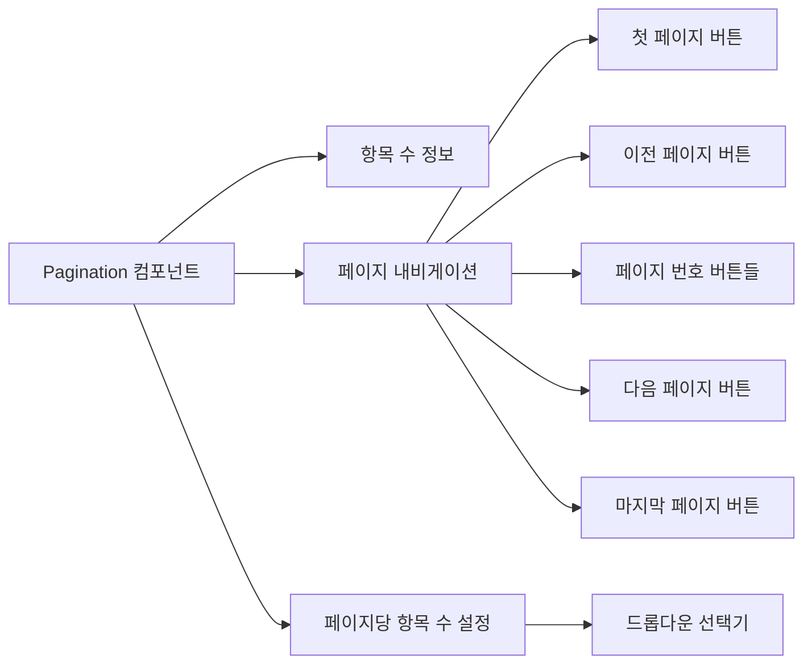

# **📌 PM PRD - 페이지네이션 컴포넌트 (Pagination)**

## **1. 개요**
페이지네이션 컴포넌트는 대량의 데이터나 콘텐츠를 여러 페이지로 나누어 사용자가 효과적으로 탐색할 수 있도록 하는 UI 요소입니다. 주로 데이터 테이블, 검색 결과, 리스트 뷰 등에서 사용되며, 사용자가 현재 위치를 파악하고 다른 페이지로 쉽게 이동할 수 있게 합니다. 이 컴포넌트는 페이지 번호, 이전/다음 버튼, 첫 페이지/마지막 페이지 이동, 페이지당 항목 수 조절 등의 기능을 제공합니다.

## **2. 주요 목표**
- 대량의 데이터를 페이지 단위로 효율적으로 탐색할 수 있는 인터페이스 제공
- 직관적인 페이지 내비게이션으로 사용자 경험 향상
- 현재 페이지와 총 페이지 수를 명확하게 표시하여 컨텍스트 제공
- 페이지당 표시할 항목 수를 사용자가 조절할 수 있는 유연성 제공
- 반응형 디자인으로 다양한 화면 크기에 적응하는 페이지네이션

## **3. 주요 기능 요구사항**
| 기능 | 우선순위 | 설명 |
|------|---------|------|
| 페이지 번호 표시 | 상 | 현재 페이지와 주변 페이지 번호 표시 |
| 첫/마지막 페이지 이동 | 상 | 첫 페이지와 마지막 페이지로 바로 이동하는 버튼 |
| 이전/다음 페이지 이동 | 상 | 이전 페이지와 다음 페이지로 이동하는 버튼 |
| 페이지당 항목 수 설정 | 중 | 페이지당 표시될 항목 수를 선택할 수 있는 드롭다운 |
| 전체 항목 수 표시 | 중 | 전체 데이터 항목 수 및 현재 표시 중인 범위 표시 |
| 모두 보기 옵션 | 중 | 페이지네이션 없이 모든 항목을 한 번에 표시하는 옵션 |
| 페이지 점프 | 하 | 특정 페이지 번호로 직접 이동하는 입력 필드 |

## **4. 사용자 시나리오**
1. **기본 페이지 탐색**: 사용자가 데이터 테이블에서 페이지 번호를 클릭하여 다른 페이지로 이동
2. **빠른 페이지 이동**: 사용자가 첫 페이지/마지막 페이지 버튼을 통해 빠르게 페이지 시작이나 끝으로 이동
3. **데이터 밀도 조정**: 사용자가 페이지당 항목 수를 조절하여 한 화면에 표시되는 데이터 양 조정
4. **전체 항목 보기**: 사용자가 '모두 보기' 옵션을 선택하여 데이터를 페이지 나누기 없이 한 번에 모두 볼 때
5. **반응형 사용**: 모바일 기기에서 사용자가 제한된 화면 공간에서 효율적으로 페이지네이션 사용

## **5. 구현 현황**
| 기능 | 구현 상태 | 비고 |
|------|----------|------|
| 페이지 번호 표시 | ✅ 완료 | 현재 페이지 강조 표시 |
| 첫/마지막 페이지 이동 | ✅ 완료 | 더블 화살표 아이콘 사용 |
| 이전/다음 페이지 이동 | ✅ 완료 | 단일 화살표 아이콘 사용 |
| 페이지당 항목 수 설정 | ✅ 완료 | 드롭다운 선택기 구현 |
| 전체 항목 수 표시 | ✅ 완료 | "총 N개 항목 중 X-Y 표시" 형식 |
| 모두 보기 옵션 | ✅ 완료 | 페이지당 항목 수 드롭다운에 "모두" 옵션 추가 |
| 비활성화 상태 처리 | ✅ 완료 | 첫/마지막 페이지에서 관련 버튼 비활성화 |

---

# **📌 Design PRD - 페이지네이션 컴포넌트 (Pagination)**

## **1. 디자인 컨셉**
- **명확성**: 현재 위치와 탐색 옵션을 직관적으로 인식할 수 있는 디자인
- **효율성**: 최소한의 공간으로 최대한의 네비게이션 기능 제공
- **일관성**: 시스템 전반의 다른 UI 요소와 조화를 이루는 디자인
- **접근성**: 다양한 입력 방식(마우스, 키보드, 터치)에 대응하는 사용자 친화적 인터페이스

## **2. 레이아웃 및 구조**



## **3. 색상 및 스타일 가이드**
- **컨테이너**:
  - 배경: 투명(transparent)
  - 패딩: 위아래 여백(py-2)
  - 정렬: 컴포넌트 양끝 정렬(flex justify-between)
  
- **페이지 번호 버튼**:
  - 기본 스타일: 경계선(border), 둥근 모서리(rounded), 적당한 패딩(h-8 w-8 p-0)
  - 활성 상태: 보라색 배경(bg-purple-600), 흰색 텍스트(text-white)
  - 비활성 상태: 흰색 배경(bg-white), 회색 텍스트(text-gray-500)
  - 호버 상태: 연한 회색 배경(hover:bg-gray-100)
  
- **내비게이션 버튼**:
  - 첫/마지막 페이지: 더블 화살표 아이콘('<<', '>>')
  - 이전/다음 페이지: 단일 화살표 아이콘('<', '>')
  - 비활성화 상태: 연한 회색(text-gray-300), 클릭 불가(cursor-not-allowed)
  
- **페이지당 항목 수 설정**:
  - 라벨: 작은 텍스트(text-sm), 중간 회색(text-gray-500)
  - 선택기: 경계선(border), 둥근 모서리(rounded), 패딩(px-2 py-1)
  - 드롭다운: 흰색 배경(bg-white), 그림자(shadow-md)

## **4. 상태 및 반응**
- **기본 상태**: 모든 버튼 활성화, 현재 페이지 강조
- **첫 페이지**: 첫 페이지 및 이전 페이지 버튼 비활성화
- **마지막 페이지**: 마지막 페이지 및 다음 페이지 버튼 비활성화
- **호버 상태**: 버튼에 마우스 오버 시 배경색 변경으로 상호작용 가능함을 표시
- **포커스 상태**: 키보드 포커스 시 파란색 외곽선으로 접근성 표시

## **5. 반응형 고려사항**
- **모바일 뷰**: 작은 화면에서는 일부 페이지 번호만 표시하고 나머지는 줄임표(...)로 대체
- **콤팩트 모드**: 매우 좁은 화면에서는 페이지당 항목 수 설정 숨김
- **터치 최적화**: 모바일 기기에서 터치 조작이 용이하도록 충분한 버튼 크기와 간격 제공
- **장치별 최적화**: 화면 크기에 따라 표시되는 페이지 번호 수 자동 조정

---

# **📌 Tech PRD - 페이지네이션 컴포넌트 (Pagination)**

## **1. 기술 스택**
- **프레임워크**: Next.js + TypeScript
- **UI 라이브러리**: ShadCN UI의 Button, Select 컴포넌트 활용
- **스타일링**: Tailwind CSS
- **상태 관리**: React 컴포넌트 로컬 상태 및 콜백 패턴

## **2. 컴포넌트 구조**

```typescript
// 페이지네이션 컴포넌트 props 인터페이스
export interface PaginationProps {
  currentPage: number;
  totalItems: number;
  itemsPerPage: number;
  totalPages: number;
  onPageChange: (page: number) => void;
  onItemsPerPageChange?: (itemsPerPage: number) => void;
  itemsPerPageOptions?: number[];
  showItemsPerPage?: boolean;
  className?: string;
  showAllOption?: boolean;
}
```

## **3. 주요 기능 구현**

### **3.1 페이지 번호 및 내비게이션 버튼**
```typescript
export function Pagination({
  currentPage,
  totalItems,
  itemsPerPage,
  totalPages,
  onPageChange,
  onItemsPerPageChange,
  itemsPerPageOptions = [10, 20, 50, 100],
  showItemsPerPage = true,
  className = "",
  showAllOption = true
}: PaginationProps) {
  // 페이지 번호 버튼 렌더링 최적화 (적응형)
  const renderPageNumbers = () => {
    const pageNumbers = [];
    const maxPagesToShow = 5; // 한 번에 표시할 최대 페이지 버튼 수
    
    let startPage = Math.max(1, currentPage - Math.floor(maxPagesToShow / 2));
    let endPage = Math.min(totalPages, startPage + maxPagesToShow - 1);
    
    // 표시할 페이지 수 조정
    if (endPage - startPage + 1 < maxPagesToShow) {
      startPage = Math.max(1, endPage - maxPagesToShow + 1);
    }
    
    // 첫 페이지 표시 + 줄임표
    if (startPage > 1) {
      pageNumbers.push(
        <Button
          key={1}
          variant="outline"
          size="sm"
          onClick={() => onPageChange(1)}
          className="h-8 w-8 p-0 border-gray-200"
        >
          1
        </Button>
      );
      
      if (startPage > 2) {
        pageNumbers.push(
          <div key="ellipsis-start" className="px-2">
            ...
          </div>
        );
      }
    }
    
    // 페이지 번호 버튼 생성
    for (let i = startPage; i <= endPage; i++) {
      pageNumbers.push(
        <Button
          key={i}
          variant={currentPage === i ? "default" : "outline"}
          size="sm"
          onClick={() => onPageChange(i)}
          className={`h-8 w-8 p-0 ${
            currentPage === i 
              ? "bg-purple-600 hover:bg-purple-700" 
              : "border-gray-200"
          }`}
        >
          {i}
        </Button>
      );
    }
    
    // 마지막 페이지 표시 + 줄임표
    if (endPage < totalPages) {
      if (endPage < totalPages - 1) {
        pageNumbers.push(
          <div key="ellipsis-end" className="px-2">
            ...
          </div>
        );
      }
      
      pageNumbers.push(
        <Button
          key={totalPages}
          variant="outline"
          size="sm"
          onClick={() => onPageChange(totalPages)}
          className="h-8 w-8 p-0 border-gray-200"
        >
          {totalPages}
        </Button>
      );
    }
    
    return pageNumbers;
  };
  
  // 페이지 내비게이션 버튼
  return (
    <div className={`flex flex-col sm:flex-row items-center justify-between py-2 ${className}`}>
      {/* 항목 정보 표시 */}
      <div className="text-sm text-gray-500 mb-2 sm:mb-0">
        총 {totalItems}개 항목 중 
        {itemsPerPage === -1 
          ? ` 전체 표시` 
          : ` ${Math.min((currentPage - 1) * itemsPerPage + 1, totalItems)}-${Math.min(currentPage * itemsPerPage, totalItems)} 표시`
        }
      </div>
      
      {/* 페이지 내비게이션 */}
      <div className="flex items-center space-x-2">
        {/* 첫 페이지 버튼 */}
        <Button
          variant="outline"
          size="sm"
          onClick={() => onPageChange(1)}
          disabled={currentPage === 1}
          className="h-8 w-8 p-0 border-gray-200"
        >
          {"<<"}
        </Button>
        
        {/* 이전 페이지 버튼 */}
        <Button
          variant="outline"
          size="sm"
          onClick={() => onPageChange(currentPage - 1)}
          disabled={currentPage === 1}
          className="h-8 w-8 p-0 border-gray-200"
        >
          {"<"}
        </Button>
        
        {/* 페이지 번호 */}
        {renderPageNumbers()}
        
        {/* 다음 페이지 버튼 */}
        <Button
          variant="outline"
          size="sm"
          onClick={() => onPageChange(currentPage + 1)}
          disabled={currentPage === totalPages || totalPages === 0}
          className="h-8 w-8 p-0 border-gray-200"
        >
          {">"}
        </Button>
        
        {/* 마지막 페이지 버튼 */}
        <Button
          variant="outline"
          size="sm"
          onClick={() => onPageChange(totalPages)}
          disabled={currentPage === totalPages || totalPages === 0}
          className="h-8 w-8 p-0 border-gray-200"
        >
          {">>"}
        </Button>
      </div>
      
      {/* 페이지당 항목 수 선택 */}
      {showItemsPerPage && onItemsPerPageChange && (
        <div className="flex items-center mt-2 sm:mt-0 sm:ml-4">
          <span className="text-sm text-gray-500 mr-2">페이지당 항목:</span>
          <Select
            value={String(itemsPerPage)}
            onValueChange={(value) => {
              onItemsPerPageChange(parseInt(value));
              onPageChange(1); // 페이지당 항목 수 변경 시 첫 페이지로 이동
            }}
          >
            <SelectTrigger className="h-8 w-24">
              <SelectValue />
            </SelectTrigger>
            <SelectContent>
              {itemsPerPageOptions.map((option) => (
                <SelectItem key={option} value={String(option)}>
                  {option}
                </SelectItem>
              ))}
              {showAllOption && (
                <SelectItem value="-1">모두</SelectItem>
              )}
            </SelectContent>
          </Select>
        </div>
      )}
    </div>
  );
}
```

### **3.2 페이지 계산 유틸리티**
```typescript
// 상위 컴포넌트에서 사용할 페이지 계산 로직
export function usePagination(totalItems: number, currentPage: number, itemsPerPage: number) {
  // 총 페이지 수 계산
  const totalPages = itemsPerPage > 0 
    ? Math.ceil(totalItems / itemsPerPage) 
    : 1;
    
  // 현재 페이지가 범위를 벗어나지 않도록 조정
  const safeCurrentPage = Math.max(1, Math.min(currentPage, totalPages));
  
  // 현재 페이지에서 표시할 데이터 인덱스 계산
  const startIndex = itemsPerPage > 0 
    ? (safeCurrentPage - 1) * itemsPerPage 
    : 0;
    
  const endIndex = itemsPerPage > 0 
    ? Math.min(startIndex + itemsPerPage, totalItems) 
    : totalItems;
  
  return {
    totalPages,
    safeCurrentPage,
    startIndex,
    endIndex
  };
}
```

## **4. 사용 예시**

```tsx
// 데이터 테이블과 함께 사용하는 예시
export function DataTable({
  data,
  isLoading,
  ...props
}: DataTableProps) {
  const [currentPage, setCurrentPage] = useState(1);
  const [itemsPerPage, setItemsPerPage] = useState(10);
  
  // 페이지네이션 계산
  const { totalPages, startIndex, endIndex } = usePagination(
    data.length,
    currentPage,
    itemsPerPage
  );
  
  // 현재 페이지 데이터
  const currentData = itemsPerPage === -1 
    ? data 
    : data.slice(startIndex, endIndex);
  
  return (
    <div>
      {/* 테이블 컴포넌트 */}
      <Table>
        {/* ... 테이블 헤더 및 바디 ... */}
        <TableBody>
          {currentData.map(item => (
            <TableRow key={item.id}>
              {/* ... 테이블 셀 ... */}
            </TableRow>
          ))}
        </TableBody>
      </Table>
      
      {/* 페이지네이션 컴포넌트 */}
      <Pagination
        currentPage={currentPage}
        totalItems={data.length}
        itemsPerPage={itemsPerPage}
        totalPages={totalPages}
        onPageChange={setCurrentPage}
        onItemsPerPageChange={setItemsPerPage}
        itemsPerPageOptions={[10, 20, 50, 100]}
        showAllOption={true}
      />
    </div>
  );
}
```

## **5. 성능 고려사항**
- **페이지 버튼 최적화**: 데이터 양에 따라 표시되는 페이지 버튼 수 동적 조절
- **메모이제이션**: `useMemo`를 사용한 페이지 계산 결과 캐싱
- **렌더링 최적화**: 불필요한 리렌더링 방지를 위한 콜백 함수 메모이제이션
- **대용량 데이터 처리**: '모두 보기' 옵션 사용 시 가상화 기법 고려
- **레이아웃 계산**: 반응형 UI를 위한 레이아웃 계산은 한 번만 수행

## **6. 확장성**
- **커스텀 렌더러**: 페이지 번호 버튼과 내비게이션 버튼의 커스텀 렌더링 지원
- **다양한 레이아웃**: 세로형, 가로형 등 다양한 레이아웃 옵션 제공 가능
- **무한 스크롤 통합**: 페이지네이션을 무한 스크롤로 전환할 수 있는 옵션 추가 가능
- **URL 동기화**: 페이지 상태를 URL 쿼리 파라미터와 동기화하는 기능 추가 가능
- **서버 사이드 페이지네이션**: API 기반 서버 사이드 페이지네이션 지원 가능

## **7. 접근성 고려사항**
- **키보드 네비게이션**: Tab, Enter, 방향키를 통한 완전한 키보드 접근성
- **ARIA 속성**: 적절한 ARIA 속성 적용으로 스크린 리더 지원
  - `aria-current="page"`: 현재 페이지 표시
  - `aria-disabled="true"`: 비활성화된 버튼 상태 전달
  - `aria-label`: 내비게이션 버튼에 적절한 레이블 제공
- **충분한 색상 대비**: WCAG AA 기준 충족하는 색상 대비
- **포커스 표시**: 키보드 포커스 시 명확한 시각적 표시 