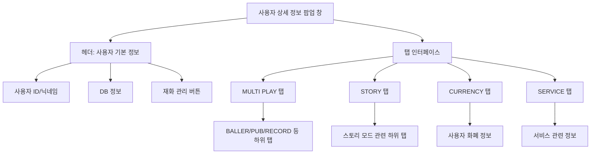

# **📌 PM PRD - 사용자 상세 정보 팝업 (User Details Popup)**

## **1. 개요**
사용자 상세 정보 팝업은 Users 페이지의 Select Users 카드 내에서 선택된 사용자의 세부 정보를 별도의 창에서 조회할 수 있는 기능을 제공합니다. 이 컴포넌트는 새 창에서 사용자 정보를 보다 상세하게 확인하고, 다양한 정보를 탭 형식으로 구조화하여 효율적인 사용자 정보 관리를 지원합니다.

## **2. 주요 목표**
- 선택된 사용자의 모든 관련 정보를 한 눈에 파악할 수 있는 인터페이스 제공
- 별도의 창을 통해 메인 관리 화면과 병행하여 사용자 정보 조회 가능
- 사용자별 정보를 체계적으로 정리하여 효율적인 데이터 탐색 환경 제공
- 다중 DB 환경에서 사용자 정보의 컨텍스트 유지 및 관리 지원

## **3. 주요 기능 요구사항**
| 기능 | 우선순위 | 설명 |
|------|---------|------|
| 새 창 팝업 | 상 | 사용자 정보를 새 브라우저 창에서 표시 |
| 사용자 기본 정보 표시 | 상 | UID, 로그인 ID, 닉네임 등 기본 정보 표시 |
| 탭 기반 정보 구성 | 상 | 멀티플레이/스토리/재화 등 카테고리별 정보 탭 제공 |
| 세션 관리 | 중 | 사용자 정보를 세션 스토리지에 저장하여 컨텍스트 유지 |
| 탭 상태 기억 | 중 | 마지막으로 선택한 탭 상태 저장 및 복원 |
| 창 크기/위치 조정 | 중 | 최적화된 크기와 중앙 정렬된 위치로 팝업 창 열기 |

## **4. 사용자 시나리오**
1. **팝업 열기**: 관리자가 Select Users 카드 내에서 특정 사용자 행의 "PopUp" 버튼 클릭
2. **정보 탐색**: 새 창에서 사용자의 기본 정보 확인 및 탭 선택으로 카테고리별 정보 탐색
3. **멀티태스킹**: 메인 관리 화면과 함께 병행하여 여러 사용자 정보 비교 분석
4. **세션 관리**: 창이 닫히더라도 다시 열면 이전 상태와 컨텍스트 유지

## **5. 구현 현황**
| 기능 | 구현 상태 | 비고 |
|------|----------|------|
| 팝업 창 기능 | ✅ 완료 | 적절한 크기와 위치로 창 생성 |
| 세션 데이터 저장 | ✅ 완료 | sessionStorage를 통한 상태 관리 |
| 사용자 정보 표시 | ✅ 완료 | 기본 정보 및 탭 구조로 표시 |
| 탭 상태 유지 | ✅ 완료 | 탭 선택 상태 저장 및 복원 |
| 페이지 타이틀 | ✅ 완료 | 사용자 ID와 닉네임을 포함한 타이틀 |

---

# **📌 Design PRD - 사용자 상세 정보 팝업 (User Details Popup)**

## **1. 디자인 컨셉**
- **독립성**: 메인 화면과 분리된 별도의 창으로 집중된 작업 환경 제공
- **일관성**: 메인 앱과 동일한 디자인 시스템 유지로 친숙한 UI 경험
- **정보 계층화**: 탭 기반 구조로 방대한 사용자 정보를 논리적으로 구조화

## **2. 레이아웃 및 구조**



## **3. 색상 및 스타일 가이드**
- **창 배경**: 흰색(bg-white)으로 깔끔한 배경 제공
- **헤더 영역**: 연한 회색 배경(bg-gray-50)에 진한 텍스트로 정보 강조
- **탭 스타일**:
  - 활성 탭: 보라색 배경(bg-purple-400)에 흰색 텍스트(text-white)
  - 비활성 탭: 연한 회색 배경에 어두운 텍스트
- **테이블 스타일**: 테두리가 있는 깔끔한 테이블 디자인(border border-gray-200)
- **버튼**: 아웃라인 스타일의 작업 버튼(variant="outline")

## **4. UI 상태**
- **로딩 상태**: 사용자 정보 로드 중 로딩 인디케이터 표시
- **데이터 표시 상태**: 로드된 사용자 정보 표시
- **탭 전환 상태**: 선택된 탭에 따라 내용 변경 및 시각적 피드백
- **에러 상태**: 데이터 로드 실패 시 오류 메시지 표시

## **5. 반응형 고려사항**
- 팝업 창 크기 고정(1000x800px)으로 일관된 레이아웃 유지
- 스크롤 지원으로 많은 양의 데이터도 탐색 가능
- 창 크기 조정 가능(resizable=yes)으로 사용자 화면에 맞게 최적화 지원

---

# **📌 Tech PRD - 사용자 상세 정보 팝업 (User Details Popup)**

## **1. 기술 스택**
- **프레임워크**: Next.js + TypeScript
- **UI 라이브러리**: ShadCN UI (Card, Button, DynamicTabs 등)
- **스타일링**: Tailwind CSS
- **상태 관리**: React useState, useEffect 훅
- **저장소**: sessionStorage

## **2. 컴포넌트 구조**

```typescript
// 사용자 정보 인터페이스
interface SelectedUserInfo {
  user: TableData;
  dbName: string;
}

// UserDetailsPage 컴포넌트 주요 상태
const [userInfo, setUserInfo] = useState<SelectedUserInfo | null>(null);
const [isLoading, setIsLoading] = useState(true);
const [activeTab, setActiveTab] = useState<string | undefined>(undefined);
```

## **3. 주요 기능 구현**

### **3.1 팝업 창 열기**
```typescript
const handleOpenPopup = (userInfo: SelectedUserInfo) => {
  // 사용자 정보를 sessionStorage에 저장
  sessionStorage.setItem('popupUserInfo', JSON.stringify(userInfo));
  
  // employerStorage에도 사용자 정보 저장 (db_name 포함)
  const employerData = {
    ...userInfo.user,
    db_name: userInfo.dbName
  };
  
  sessionStorage.setItem('employerStorage', JSON.stringify(employerData));
  
  // 새 창 열기
  const width = 1000;
  const height = 800;
  const left = (window.screen.width - width) / 2;
  const top = (window.screen.height - height) / 2;
  
  const popup = window.open(
    `/user-details?uid=${encodeURIComponent(String(userInfo.user.uid))}&dbName=${encodeURIComponent(userInfo.dbName)}`, 
    `userDetails_${userInfo.user.uid}`,
    `width=${width},height=${height},left=${left},top=${top},resizable=yes,scrollbars=yes,status=yes`
  );
  
  // 팝업 창에 포커스
  if (popup) {
    popup.focus();
  }
};
```

### **3.2 팝업 창에서 사용자 정보 로드**
```typescript
useEffect(() => {
  const loadUserInfo = () => {
    try {
      setIsLoading(true);
      // sessionStorage에서 사용자 정보 가져오기
      const storedInfo = sessionStorage.getItem('popupUserInfo');
      if (storedInfo) {
        const parsedInfo = JSON.parse(storedInfo);
        setUserInfo(parsedInfo);
        
        // 저장된 탭 상태 불러오기
        const savedTabState = getTabState(String(parsedInfo.user.uid));
        if (savedTabState) {
          setActiveTab(savedTabState);
        }
        
        // 페이지 타이틀 설정
        const nickname = parsedInfo.user.nickname || parsedInfo.user.login_id;
        document.title = `사용자 정보: ${nickname} (${parsedInfo.user.uid})`;
      }
    } catch (error) {
      console.error('사용자 정보 로드 중 오류:', error);
    } finally {
      setIsLoading(false);
    }
  };
  
  loadUserInfo();
}, []);
```

### **3.3 탭 상태 관리**
```typescript
const handleTabChange = (tabId: string) => {
  setActiveTab(tabId);
  
  // 사용자별 탭 상태 저장
  if (userInfo) {
    saveTabState(String(userInfo.user.uid), tabId);
  }
};
```

## **4. 데이터 흐름**

1. **메인 페이지에서 데이터 전달**:
   - 선택된 사용자 정보를 sessionStorage에 저장
   - URL 파라미터로 사용자 UID와 DB 이름 전달

2. **팝업 페이지에서 데이터 수신**:
   - sessionStorage에서 사용자 정보 로드
   - 탭 상태 관리 시스템과 연동하여 이전 상태 복원

3. **사용자 상호작용 처리**:
   - 탭 변경, 정보 탐색 등 사용자 액션 처리
   - 상태 변경 시 sessionStorage에 저장하여 지속성 유지

## **5. 성능 고려사항**
- sessionStorage를 활용하여 창 간 데이터 전달 최적화
- 필요한 데이터만 선택적으로 저장하여 메모리 사용 최소화
- 탭 컨텐츠의 지연 로딩으로 초기 렌더링 속도 향상
- 창 크기 및 위치 최적화로 사용자 경험 개선

## **6. 확장성**
- 다양한 사용자 정보 탭을 유연하게 추가할 수 있는 구조
- 재사용 가능한 DynamicTabs 컴포넌트 활용으로 일관된 UI 제공
- URL 파라미터 기반 라우팅으로 북마크 및 링크 공유 가능성 열어둠
- 다중 창 환경에서도 일관된 상태 관리 가능

## **7. 보안 고려사항**
- sessionStorage 사용으로 브라우저 세션 범위 내에서만 데이터 유지
- 민감한 사용자 정보는 필요한 만큼만 전달하여 노출 최소화
- 팝업 창의 독립적인 컨텍스트로 메인 앱과의 격리 유지