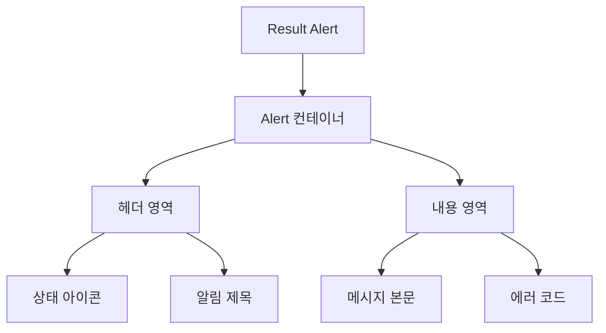

# **📌 PM PRD - 작업 결과 알림 컴포넌트 (Result Alert)**

## **1. 개요**
작업 결과 알림 컴포넌트(Result Alert)는 시스템 작업의 성공 또는 실패 상태를 시각적으로 사용자에게 전달하는 UI 요소입니다. 이 컴포넌트는 다양한 작업(사용자 검색, 데이터 저장, API 호출 등)의 결과를 직관적이고 일관된 방식으로 표시하며, 상태에 따라 적절한 시각적 피드백을 제공합니다.

## **2. 주요 목표**
- 작업 결과의 성공/실패 상태를 명확하게 시각화
- 사용자가 결과 메시지를 빠르게 인지할 수 있는 직관적인 UI 제공
- 오류 발생 시 문제 원인과 해결 방법에 대한 정보 제공
- 다양한 상황과 컨텍스트에서 재사용 가능한 일관된 알림 시스템 구현

## **3. 주요 기능 요구사항**
| 기능 | 우선순위 | 설명 |
|------|---------|------|
| 성공 상태 표시 | 상 | 녹색 아이콘과 배경으로 작업 성공 표시 |
| 실패 상태 표시 | 상 | 빨간색 아이콘과 배경으로 작업 실패 표시 |
| 경고 상태 표시 | 중 | 노란색 아이콘과 배경으로 경고 메시지 표시 |
| 에러 코드 표시 | 중 | 오류 발생 시 관련 에러 코드 정보 제공 |
| 메시지 강조 표시 | 중 | 숫자 등 중요 정보 시각적 강조 처리 |
| 커스텀 제목 설정 | 중 | 상황별 적절한 제목 텍스트 지원 |

## **4. 사용자 시나리오**
1. **작업 성공**: 사용자가 검색이나 데이터 변경 작업을 성공적으로 완료했을 때 확인 메시지 표시
2. **작업 실패**: API 오류나 입력 오류 등으로 작업이 실패했을 때 오류 메시지 및 원인 표시
3. **주의 필요**: 작업은 완료되었으나 사용자의 추가 확인이나 주의가 필요한 경우 경고 메시지 표시
4. **정보 전달**: 작업 결과에 대한 통계나 요약 정보(예: "5명 처리 완료") 표시

## **5. 구현 현황**
| 기능 | 구현 상태 | 비고 |
|------|----------|------|
| 성공 상태 표시 | ✅ 완료 | 녹색 체크 아이콘과 배경 적용 |
| 실패 상태 표시 | ✅ 완료 | 빨간색 X 아이콘과 배경 적용 |
| 경고 상태 표시 | ✅ 완료 | 노란색 경고 아이콘과 배경 적용 |
| 에러 코드 표시 | ✅ 완료 | 별도 에러 코드 섹션 제공 |
| 숫자 강조 표시 | ✅ 완료 | 숫자 부분 굵게 표시 기능 구현 |
| 다양한 메시지 표시 | ✅ 완료 | 줄바꿈 지원 및 메시지 형식 자동 처리 |

---

# **📌 Design PRD - 작업 결과 알림 컴포넌트 (Result Alert)**

## **1. 디자인 컨셉**
- **직관성**: 색상과 아이콘을 통해 즉각적으로 상태를 인식할 수 있는 디자인
- **일관성**: 모든 알림이 동일한 구조와 스타일을 따라 사용자 경험 일관성 유지
- **강조**: 중요 정보는 시각적으로 강조하여 사용자 주의 집중
- **명확성**: 간결하고 명확한 메시지로 정보 전달

## **2. 레이아웃 및 구조**



## **3. 색상 및 스타일 가이드**
- **성공 상태**:
  - 배경: 연한 녹색(bg-green-50)
  - 테두리: 녹색(border-green-200)
  - 텍스트: 진한 녹색(text-green-800)
  - 아이콘: 녹색(text-green-600), CheckCircle2 아이콘
- **실패 상태**:
  - 배경: 연한 빨간색(bg-red-50)
  - 테두리: 빨간색(border-red-200)
  - 텍스트: 진한 빨간색(text-red-800)
  - 아이콘: 빨간색(text-red-600), XCircle 아이콘
- **경고 상태**:
  - 배경: 연한 노란색(bg-yellow-50)
  - 테두리: 노란색(border-yellow-200)
  - 텍스트: 진한 노란색(text-yellow-800)
  - 아이콘: 노란색(text-yellow-600), AlertTriangle 아이콘
- **알림 제목**: 16px, 볼드체
- **메시지 본문**: 기본 폰트, whitespace-pre-line으로 줄바꿈 지원
- **숫자 강조**: 숫자는 18px 볼드체로 강조

## **4. UI 상태**
- **기본 상태**: 결과가 없는 경우 표시하지 않음(null 반환)
- **성공 상태**: 녹색 테마의 알림 메시지 표시
- **실패 상태**: 빨간색 테마의 알림 메시지 표시, 에러 코드 포함
- **경고 상태**: 노란색 테마의 알림 메시지 표시
- **정보 강조**: 메시지 내 숫자를 시각적으로 강조 처리

## **5. 반응형 고려사항**
- 모든 화면 크기에서 적절한 가독성 유지
- 컨테이너 너비에 따라 자동으로 메시지 줄바꿈 조정
- 작은 화면에서도 중요 정보와 아이콘의 가시성 보장

---

# **📌 Tech PRD - 작업 결과 알림 컴포넌트 (Result Alert)**

## **1. 기술 스택**
- **프레임워크**: Next.js + TypeScript
- **UI 라이브러리**: ShadCN UI (Alert, AlertTitle, AlertDescription)
- **스타일링**: Tailwind CSS
- **아이콘**: Lucide React (`CheckCircle2`, `XCircle`, `AlertTriangle`)

## **2. 컴포넌트 구조**

```typescript
// 결과 데이터 인터페이스
export interface ResultData {
  status: 'success' | 'error' | null;
  message: string;
  error?: string;
  type?: 'default' | 'warning' | 'error';
}

// ResultAlert 컴포넌트 속성 정의
interface ResultAlertProps {
  result: ResultData;
  className?: string;
  successTitle?: string;
  errorTitle?: string;
}
```

## **3. 주요 기능 구현**

### **3.1 상태별 스타일 처리**
```typescript
const getAlertStyle = () => {
  if (result.status === 'error') {
    return {
      variant: 'destructive' as const,
      bgColor: 'bg-red-50',
      borderColor: 'border-red-200',
      textColor: 'text-red-800',
      iconColor: 'text-red-600',
      Icon: XCircle
    };
  }
  
  if (result.type === 'warning') {
    return {
      variant: 'default' as const,
      bgColor: 'bg-yellow-50',
      borderColor: 'border-yellow-200',
      textColor: 'text-yellow-800',
      iconColor: 'text-yellow-600',
      Icon: AlertTriangle
    };
  }

  return {
    variant: 'default' as const,
    bgColor: 'bg-green-50',
    borderColor: 'border-green-200',
    textColor: 'text-green-800',
    iconColor: 'text-green-600',
    Icon: CheckCircle2
  };
};
```

### **3.2 숫자 강조 처리**
```typescript
{result.message.split(/(\d+명)/).map((part, index) => {
  if (part.match(/\d+명/)) {
    const number = part.replace('명', '');
    return (
      <span key={index}>
        <span className="text-lg font-bold">{number}</span>
        <span>명</span>
      </span>
    );
  }
  return part;
})}
```

### **3.3 에러 코드 표시**
```typescript
{result.error && (
  <div className="mt-2 text-sm opacity-90">
    에러 코드: {result.error}
  </div>
)}
```

## **4. 조건부 렌더링**

```typescript
export function ResultAlert({ 
  result, 
  className = "", 
  successTitle = "성공", 
  errorTitle = "실패" 
}: ResultAlertProps) {
  if (!result.status) return null;

  // ... 스타일 및 내용 렌더링 ...
}
```

## **5. 성능 고려사항**
- 렌더링 최적화를 위한 조건부 렌더링(null 반환)
- 메시지 내 숫자 탐색을 위한 효율적인 정규식 처리
- 불필요한 리렌더링 방지를 위한 메모이제이션 고려
- 스타일 속성의 효율적인 계산 및 재사용

## **6. 확장성**
- 다양한 상태 유형 추가 가능(현재 success, error, warning 지원)
- 커스텀 제목 지정 기능(successTitle, errorTitle props)
- 추가 스타일 커스터마이징을 위한 className prop 지원
- 다양한 메시지 형식 지원(텍스트, 숫자 강조, 줄바꿈 등)

## **7. 사용 예시**

```tsx
// 성공 메시지 표시
<ResultAlert
  result={{
    status: 'success',
    message: '작업이 완료되었습니다. 총 5명의 사용자가 처리되었습니다.'
  }}
  successTitle="처리 완료"
/>

// 오류 메시지 표시
<ResultAlert
  result={{
    status: 'error',
    message: '작업 처리 중 오류가 발생했습니다.',
    error: 'API_ERROR_500'
  }}
  errorTitle="처리 실패"
/>

// 경고 메시지 표시
<ResultAlert
  result={{
    status: 'success',
    message: '일부 항목만 처리되었습니다.',
    type: 'warning'
  }}
  successTitle="부분 완료"
/>
```