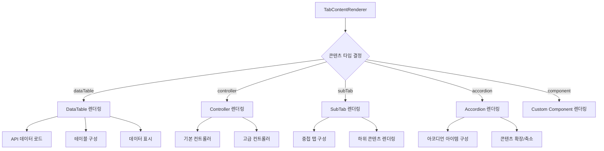

# **📌 PM PRD - 탭 콘텐츠 렌더러 (Tab Content Renderer)**

## **1. 개요**
탭 콘텐츠 렌더러는 동적 탭 컴포넌트(Dynamic Tabs)와 함께 사용되는 유연한 콘텐츠 렌더링 시스템입니다. 이 컴포넌트는 다양한 유형의 콘텐츠(데이터 테이블, 컨트롤러, 아코디언 등)를 선택된 탭에 맞게 동적으로 렌더링합니다. 특히 Users 페이지의 Select Users 카드 내 아코디언에서 다양한 사용자 데이터를 탭 형식으로 효율적으로 표시하는 데 중요한 역할을 합니다.

## **2. 주요 목표**
- 다양한 콘텐츠 유형을 단일 인터페이스로 렌더링하는 통합 시스템 제공
- 선언적 데이터 구조를 통한 콘텐츠 정의로 개발 및 유지보수 간소화
- 런타임에 동적으로 콘텐츠 타입을 결정하여 유연한 UI 구성 지원
- 콘텐츠 타입별 특화된 렌더링 로직 적용으로 최적화된 사용자 경험 제공
- 확장 가능한 구조를 통해 새로운 콘텐츠 유형 쉽게 추가 가능

## **3. 주요 기능 요구사항**
| 기능 | 우선순위 | 설명 |
|------|---------|------|
| 데이터 테이블 렌더링 | 상 | API 엔드포인트를 기반으로 데이터 테이블 자동 렌더링 |
| 컨트롤러 렌더링 | 상 | 화폐 관리 등 다양한 컨트롤 패널 렌더링 |
| 아코디언 렌더링 | 중 | 확장/축소 가능한 아코디언 형태의 콘텐츠 렌더링 |
| 하위 탭 렌더링 | 중 | 중첩된 탭 구조의 콘텐츠 렌더링 |
| 커스텀 컴포넌트 렌더링 | 중 | React 노드 형태의 커스텀 컴포넌트 직접 렌더링 |
| 콘텐츠별 스타일링 | 중 | 콘텐츠 유형에 따른 적절한 스타일 자동 적용 |
| 에러 핸들링 | 중 | 콘텐츠 로딩 실패 시 오류 메시지 표시 |

## **4. 사용자 시나리오**
1. **데이터 테이블 표시**: 관리자가 사용자의 게임 내 통화, 아이템, 플레이 기록 등 데이터 조회
2. **컨트롤 패널 활용**: 관리자가 사용자의 화폐 데이터를 생성, 수정, 삭제하는 컨트롤 패널 사용
3. **중첩 콘텐츠 탐색**: 관리자가 계층적으로 구성된 사용자 데이터를 아코디언이나 하위 탭으로 탐색
4. **데이터 시각화**: 관리자가 차트, 그래프 등 다양한 형태로 시각화된 데이터 확인

## **5. 구현 현황**
| 기능 | 구현 상태 | 비고 |
|------|----------|------|
| 데이터 테이블 렌더링 | ✅ 완료 | API 연동 및 자동 리프레시 지원 |
| 컨트롤러 렌더링 | ✅ 완료 | 기본 및 고급 컨트롤 패널 통합 |
| 아코디언 렌더링 | ✅ 완료 | 확장/축소 상태 관리 구현 |
| 하위 탭 렌더링 | ✅ 완료 | 재귀적 렌더링 구조 적용 |
| 커스텀 컴포넌트 렌더링 | ✅ 완료 | React 노드 직접 렌더링 지원 |
| 에러 핸들링 | ✅ 완료 | 로딩 및 에러 상태 표시 |
| 타입 안전성 | ✅ 완료 | TypeScript를 통한 콘텐츠 타입 검증 |

---

# **📌 Design PRD - 탭 콘텐츠 렌더러 (Tab Content Renderer)**

## **1. 디자인 컨셉**
- **일관성**: 다양한 콘텐츠 유형에도 일관된 UI 경험 제공
- **적응성**: 콘텐츠 유형에 따라 적절한 레이아웃과 스타일 자동 적용
- **명확성**: 콘텐츠 유형별 시각적 구분을 통한 직관적 인터페이스
- **통합성**: 다른 UI 컴포넌트와 자연스럽게 통합되는 디자인

## **2. 레이아웃 및 구조**



## **3. 콘텐츠 유형별 스타일 가이드**
- **데이터 테이블**:
  - 전체 너비 사용(w-full)
  - 테이블 헤더: 연한 회색 배경(bg-gray-50)
  - 테이블 테두리: 얇은 회색 선(border border-gray-200)
  - 페이지네이션: 하단 중앙 정렬
  
- **컨트롤 패널**:
  - 패딩 적용(p-4)
  - 둥근 모서리(rounded-md)
  - 배경색: 연한 회색(bg-gray-100)
  - 버튼 그리드: 균등 간격(gap-2)

- **아코디언**:
  - 헤더: 중간 크기 글씨, 굵은 폰트(text-base font-semibold)
  - 구분선: 얇은 회색(border-t border-gray-200)
  - 콘텐츠 영역 패딩(p-4)
  
- **하위 탭**:
  - 상위 탭보다 작은 크기의 탭 트리거
  - 탭 트리거: 작은 글씨(text-sm)
  - 콘텐츠 상단 여백(mt-2)

## **4. 상태 및 트랜지션**
- **로딩 상태**: 스켈레톤 UI 또는 로딩 스피너 표시
- **오류 상태**: 적절한 오류 메시지와 재시도 버튼 표시
- **빈 데이터 상태**: "데이터가 없습니다" 메시지 및 관련 액션 제안
- **콘텐츠 전환**: 부드러운 페이드 인/아웃 효과(transition-opacity)

## **5. 반응형 고려사항**
- 모바일 화면에서 스크롤 가능한 테이블 지원
- 작은 화면에서 컨트롤 패널 버튼 수직 정렬로 전환
- 화면 크기에 따라 적절한 패딩 및 여백 조정
- 모바일에서 터치 친화적인 UI 요소 크기 적용

---

# **📌 Tech PRD - 탭 콘텐츠 렌더러 (Tab Content Renderer)**

## **1. 기술 스택**
- **프레임워크**: Next.js + TypeScript
- **UI 라이브러리**: ShadCN UI
- **스타일링**: Tailwind CSS
- **상태 관리**: React 훅(useState, useEffect)
- **데이터 페칭**: 커스텀 훅 및 fetch API

## **2. 컴포넌트 구조**

```typescript
// 탭 콘텐츠 정의 인터페이스
export interface TabContent {
  type: 'controller' | 'dataTable' | 'subTab' | 'accordion';
  component?: React.ReactNode;
  props?: Record<string, unknown>;
}

// 탭 콘텐츠 렌더러 속성 정의
export interface TabContentRendererProps {
  content: TabContent;
  className?: string;
}
```

## **3. 주요 기능 구현**

### **3.1 콘텐츠 타입 분석 및 렌더링**
```typescript
export function TabContentRenderer({ content, className = "" }: TabContentRendererProps) {
  // 콘텐츠가 없는 경우
  if (!content) {
    return (
      <div className="p-4 border rounded-md">
        <p className="text-sm text-gray-500">컨텐츠가 없습니다.</p>
      </div>
    );
  }

  // 직접 컴포넌트가 제공된 경우
  if (content.component) {
    return <div className={className}>{content.component}</div>;
  }

  // 콘텐츠 타입에 따른 렌더링
  switch (content.type) {
    case 'dataTable':
      return <DataTableRenderer {...content.props} className={className} />;
    case 'controller':
      return <ControllerRenderer {...content.props} className={className} />;
    case 'subTab':
      return <SubTabRenderer {...content.props} className={className} />;
    case 'accordion':
      return <AccordionRenderer {...content.props} className={className} />;
    default:
      return (
        <div className="p-4 border rounded-md">
          <p className="text-sm text-gray-500">지원되지 않는 콘텐츠 타입입니다.</p>
        </div>
      );
  }
}
```

### **3.2 데이터 테이블 렌더러**
```typescript
function DataTableRenderer({ endpoint, className = "", ...props }: DataTableRendererProps) {
  const [data, setData] = useState<any[]>([]);
  const [isLoading, setIsLoading] = useState<boolean>(true);
  const [error, setError] = useState<string | null>(null);
  
  useEffect(() => {
    const fetchData = async () => {
      setIsLoading(true);
      try {
        const response = await fetch(endpoint);
        if (!response.ok) {
          throw new Error(`데이터를 불러올 수 없습니다: ${response.status}`);
        }
        const result = await response.json();
        setData(result.data || []);
        setError(null);
      } catch (err) {
        setError(err instanceof Error ? err.message : '알 수 없는 오류가 발생했습니다.');
        setData([]);
      } finally {
        setIsLoading(false);
      }
    };
    
    fetchData();
    
    // 라이브 업데이트를 위한 이벤트 리스너
    const handleRefresh = () => fetchData();
    window.addEventListener('refresh-data', handleRefresh);
    
    return () => {
      window.removeEventListener('refresh-data', handleRefresh);
    };
  }, [endpoint]);
  
  // 데이터 테이블 렌더링
  return (
    <DataTable
      data={data}
      isLoading={isLoading}
      error={error}
      className={className}
      {...props}
    />
  );
}
```

### **3.3 컨트롤러 렌더러**
```typescript
function ControllerRenderer({ type = 'basic', className = "", ...props }: ControllerRendererProps) {
  // 컨트롤러 유형에 따른 렌더링
  switch (type) {
    case 'currency':
      return (
        <div className={`p-4 bg-gray-100 rounded-md ${className}`}>
          <DataControlsPanel {...props} />
        </div>
      );
    case 'advanced':
      return (
        <div className={`p-4 bg-gray-100 rounded-md ${className}`}>
          <AdvancedDataControlsPanel {...props} />
        </div>
      );
    default:
      return (
        <div className={`p-4 bg-gray-100 rounded-md ${className}`}>
          <p className="text-sm text-gray-500">지원되지 않는 컨트롤러 유형입니다.</p>
        </div>
      );
  }
}
```

### **3.4 하위 탭 렌더러**
```typescript
function SubTabRenderer({ tabs, className = "", ...props }: SubTabRendererProps) {
  // 재귀적으로 DynamicTabs 컴포넌트 사용
  return (
    <div className={className}>
      <DynamicTabs items={tabs} {...props} />
    </div>
  );
}
```

### **3.5 아코디언 렌더러**
```typescript
function AccordionRenderer({ items, className = "", ...props }: AccordionRendererProps) {
  return (
    <Accordion type="multiple" className={className} {...props}>
      {items.map((item, index) => (
        <AccordionItem key={index} value={`item-${index}`}>
          <AccordionTrigger>{item.title}</AccordionTrigger>
          <AccordionContent>
            {item.content && <TabContentRenderer content={item.content} />}
          </AccordionContent>
        </AccordionItem>
      ))}
    </Accordion>
  );
}
```

## **4. 데이터 흐름**

탭 콘텐츠 렌더러의 데이터 흐름은 다음과 같은 단계로 이루어집니다:

1. **콘텐츠 정의**: `TabContent` 인터페이스를 통해 렌더링할 콘텐츠 정의
2. **타입 결정**: 콘텐츠 타입('dataTable', 'controller', 'subTab', 'accordion')에 따라 렌더링 로직 결정
3. **속성 전달**: 콘텐츠의 props 객체를 통해 필요한 속성값 전달
4. **데이터 로딩**: 데이터 테이블의 경우 API 엔드포인트로부터 데이터 로드
5. **상태 관리**: 로딩, 오류, 데이터 상태 관리 및 UI 업데이트
6. **이벤트 처리**: 리프레시, 클릭, 확장/축소 등 사용자 이벤트 처리
7. **콘텐츠 렌더링**: 결정된 콘텐츠 타입에 맞는 컴포넌트로 최종 UI 렌더링

## **5. 성능 고려사항**
- **지연 로딩**: 화면에 표시되는 탭의 콘텐츠만 로드하여 초기 로딩 속도 개선
- **메모이제이션**: `useMemo`와 `useCallback`을 활용한 불필요한 리렌더링 방지
- **데이터 캐싱**: 동일 엔드포인트 데이터 캐싱으로 중복 요청 최소화
- **효율적 DOM 업데이트**: 가상 DOM 활용한 효율적 UI 업데이트
- **적절한 에러 바운더리**: 특정 콘텐츠 렌더링 오류가 전체 UI에 영향 미치지 않도록 설계

## **6. 확장성**
- **새로운 콘텐츠 타입 추가**: 렌더러 함수와 타입 정의만 추가하면 새 콘텐츠 유형 지원 가능
- **플러그인 시스템**: 외부 플러그인을 통한 커스텀 렌더러 등록 가능성
- **테마 지원**: 다크 모드 등 테마에 따른 스타일 변화 지원
- **국제화 대응**: 다국어 지원을 위한 텍스트 분리 및 번역 시스템 연동 가능성

## **7. 테스트 및 검증**
- **단위 테스트**: 각 렌더러 함수의 독립적인 테스트
- **통합 테스트**: 다양한 콘텐츠 유형 조합에 대한 테스트
- **스냅샷 테스트**: UI 렌더링 일관성 검증
- **접근성 테스트**: 다양한 접근성 요구사항 준수 여부 검증
- **브라우저 호환성 테스트**: 다양한 브라우저 환경에서의 정상 작동 확인 