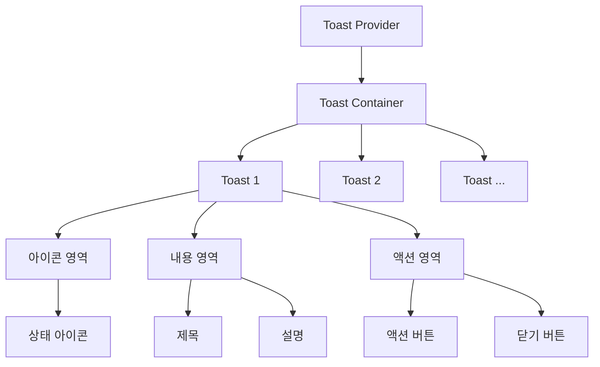

# **📌 PM PRD - 토스트 알림 시스템 (Toast Notification System)**

## **1. 개요**
토스트 알림 시스템은 사용자에게 일시적인 피드백 메시지를 제공하는 UI 컴포넌트입니다. 이 시스템은 작업 완료, 오류 발생, 경고 알림 등 다양한 상황에서 사용자에게 적절한 정보를 비침투적인 방식으로 전달합니다. 앱 전체에서 일관된 알림 경험을 제공하여 사용자 인터랙션의 결과를 명확하게 전달합니다.

## **2. 주요 목표**
- 시스템 전반에 걸쳐 일관된 방식으로 사용자 피드백 제공
- 다양한 유형의 알림(성공, 오류, 경고, 정보)을 시각적으로 구분
- 자동 소멸 기능으로 사용자의 불필요한 액션 최소화
- 여러 알림을 효율적으로 관리하고 표시
- 접근성을 고려한 알림 시스템 구현

## **3. 주요 기능 요구사항**
| 기능 | 우선순위 | 설명 |
|------|---------|------|
| 다양한 알림 유형 | 상 | 성공, 오류, 경고, 정보 등 다양한 알림 유형 지원 |
| 자동 소멸 | 상 | 설정된 시간 후 알림 자동 소멸 |
| 커스텀 지속 시간 | 중 | 알림별 표시 지속 시간 설정 가능 |
| 여러 알림 스택 | 중 | 다수의 알림을 순차적으로 스택 형태로 표시 |
| 액션 버튼 | 중 | 알림에 선택적으로 액션 버튼 추가 가능 |
| 수동 해제 | 중 | 사용자가 직접 닫을 수 있는 기능 |
| 알림 위치 설정 | 하 | 화면의 다양한 위치에 알림 표시 가능 |

## **4. 사용자 시나리오**
1. **작업 성공 알림**: 사용자가 데이터 저장, 업데이트 등 작업 완료 시 성공 토스트 표시
2. **오류 알림**: API 호출 실패, 유효성 검사 오류 등 문제 발생 시 오류 토스트 표시
3. **정보 알림**: 시스템 상태 변경, 중요 정보 알림 등을 정보 토스트로 표시
4. **액션 요구 알림**: 사용자에게 추가 액션이 필요한 경우 액션 버튼이 포함된 토스트 표시

## **5. 구현 현황**
| 기능 | 구현 상태 | 비고 |
|------|----------|------|
| 기본 토스트 UI | ✅ 완료 | ShadCN Toast 컴포넌트 기반 구현 |
| 다양한 알림 유형 | ✅ 완료 | 성공, 오류, 경고, 정보 유형 지원 |
| 자동 소멸 | ✅ 완료 | 기본 3초 후 자동 소멸 |
| 커스텀 지속 시간 | ✅ 완료 | 알림별 지속 시간 설정 가능 |
| 여러 알림 스택 | ✅ 완료 | 최대 5개 알림 동시 표시 지원 |
| 액션 버튼 | ✅ 완료 | 알림에 커스텀 액션 버튼 추가 가능 |
| 수동 해제 | ✅ 완료 | 닫기 버튼으로 알림 해제 가능 |

---

# **📌 Design PRD - 토스트 알림 시스템 (Toast Notification System)**

## **1. 디자인 컨셉**
- **비침투적**: 사용자 작업을 방해하지 않는 알림 표시
- **명확성**: 알림 유형별 시각적 구분으로 중요도와 내용 빠르게 인식
- **일관성**: 시스템 전반에 걸쳐 동일한 디자인 언어 사용
- **간결성**: 핵심 메시지를 간결하게 전달하는 디자인

## **2. 레이아웃 및 구조**



## **3. 색상 및 스타일 가이드**
- **토스트 컨테이너**: 화면 오른쪽 하단에 위치, z-index 높게 설정
- **토스트 기본 스타일**: 
  - 둥근 모서리(rounded-lg)
  - 그림자 효과(shadow-lg)
  - 반투명 배경(bg-white/90 dark:bg-gray-800/90)
  - 너비 자동 조정(min-width: 300px, max-width: 500px)
- **알림 유형별 색상**:
  - 성공: 녹색(bg-green-100, border-l-4 border-green-500)
  - 오류: 빨간색(bg-red-100, border-l-4 border-red-500)
  - 경고: 노란색(bg-yellow-100, border-l-4 border-yellow-500)
  - 정보: 파란색(bg-blue-100, border-l-4 border-blue-500)
- **아이콘**:
  - 성공: CheckCircle (text-green-500)
  - 오류: XCircle (text-red-500)
  - 경고: AlertTriangle (text-yellow-500)
  - 정보: Info (text-blue-500)
- **텍스트 스타일**:
  - 제목: 중간 크기, 굵은 글씨(text-sm font-semibold)
  - 설명: 작은 크기(text-sm)
  - 액션 버튼: 작은 크기, 강조(text-xs font-medium)

## **4. 애니메이션 및 상태**
- **등장 애니메이션**: 오른쪽에서 미끄러져 들어오는 효과(slide-in-from-right)
- **퇴장 애니메이션**: 오른쪽으로 미끄러져 나가는 효과(slide-out-to-right)
- **알림 스택 효과**: 새 알림이 나타나면 기존 알림은 위로 밀려 올라감
- **호버 상태**: 호버 시 불투명도 증가로 강조 효과
- **진행 표시줄**: 하단에 시간 경과에 따라 줄어드는 진행 표시줄(선택적)

## **5. 반응형 고려사항**
- 모바일 화면에서 전체 너비 활용(width: 100%, max-width: 90vw)
- 작은 화면에서는 하단 중앙 위치로 변경
- 텍스트 오버플로우 처리로 다양한 메시지 길이 대응
- 터치 디바이스에서 쉽게 닫을 수 있는 충분한 버튼 크기

---

# **📌 Tech PRD - 토스트 알림 시스템 (Toast Notification System)**

## **1. 기술 스택**
- **프레임워크**: Next.js + TypeScript
- **UI 라이브러리**: ShadCN UI의 Toast 컴포넌트 기반
- **스타일링**: Tailwind CSS
- **아이콘**: Lucide React
- **애니메이션**: TailwindCSS 애니메이션 + CSS 트랜지션

## **2. 컴포넌트 구조**

```typescript
// 토스트 정의 인터페이스
export interface Toast {
  id: string;
  title?: string;
  description?: string;
  action?: React.ReactNode;
  type?: "default" | "success" | "error" | "warning" | "info";
  duration?: number; // 밀리초 단위
  dismissible?: boolean;
}

// 토스트 컨텍스트 인터페이스
export interface ToastContextValue {
  toasts: Toast[];
  addToast: (toast: Omit<Toast, "id">) => void;
  updateToast: (id: string, toast: Partial<Toast>) => void;
  dismissToast: (id: string) => void;
  removeToast: (id: string) => void;
}

// 토스트 훅 반환 타입
export interface UseToast {
  toast: (props: Omit<Toast, "id">) => string;
  dismiss: (id: string) => void;
  success: (props: Omit<Omit<Toast, "id">, "type">) => string;
  error: (props: Omit<Omit<Toast, "id">, "type">) => string;
  warning: (props: Omit<Omit<Toast, "id">, "type">) => string;
  info: (props: Omit<Omit<Toast, "id">, "type">) => string;
}
```

## **3. 주요 기능 구현**

### **3.1 토스트 컨텍스트 및 프로바이더**
```typescript
// 토스트 컨텍스트 생성
export const ToastContext = React.createContext<ToastContextValue | undefined>(
  undefined
);

// 토스트 프로바이더 구현
export function ToastProvider({ children }: { children: React.ReactNode }) {
  const [toasts, setToasts] = React.useState<Toast[]>([]);

  // 새 토스트 추가
  const addToast = useCallback(
    (toast: Omit<Toast, "id">) => {
      const id = uuid();
      setToasts((prev) => [
        ...prev,
        { id, ...toast },
      ]);
      return id;
    },
    []
  );

  // 토스트 업데이트
  const updateToast = useCallback(
    (id: string, toast: Partial<Toast>) => {
      setToasts((prev) =>
        prev.map((t) => (t.id === id ? { ...t, ...toast } : t))
      );
    },
    []
  );

  // 토스트 해제 (타이머 시작)
  const dismissToast = useCallback(
    (id: string) => {
      setToasts((prev) =>
        prev.map((t) =>
          t.id === id ? { ...t, open: false } : t
        )
      );
    },
    []
  );

  // 토스트 완전 제거
  const removeToast = useCallback(
    (id: string) => {
      setToasts((prev) => prev.filter((t) => t.id !== id));
    },
    []
  );

  // 자동 타이머 설정
  useEffect(() => {
    const timers = toasts.map((toast) => {
      if (toast.duration !== Infinity) {
        const timer = setTimeout(() => {
          dismissToast(toast.id);
        }, toast.duration || 3000);
        return { id: toast.id, timer };
      }
      return null;
    }).filter(Boolean);

    return () => {
      timers.forEach((t) => {
        if (t?.timer) clearTimeout(t.timer);
      });
    };
  }, [toasts, dismissToast]);

  return (
    <ToastContext.Provider
      value={{
        toasts,
        addToast,
        updateToast,
        dismissToast,
        removeToast,
      }}
    >
      {children}
      <Toaster />
    </ToastContext.Provider>
  );
}
```

### **3.2 토스트 훅 구현**
```typescript
// useToast 훅
export function useToast(): UseToast {
  const context = React.useContext(ToastContext);
  
  if (!context) {
    throw new Error("useToast must be used within a ToastProvider");
  }
  
  const toast = useCallback(
    (props: Omit<Toast, "id">) => {
      return context.addToast(props);
    },
    [context]
  );
  
  const dismiss = useCallback(
    (id: string) => {
      context.dismissToast(id);
    },
    [context]
  );

  // 성공 토스트 생성
  const success = useCallback(
    (props: Omit<Omit<Toast, "id">, "type">) => {
      return toast({ ...props, type: "success" });
    },
    [toast]
  );

  // 오류 토스트 생성 
  const error = useCallback(
    (props: Omit<Omit<Toast, "id">, "type">) => {
      return toast({ ...props, type: "error" });
    },
    [toast]
  );

  // 경고 토스트 생성
  const warning = useCallback(
    (props: Omit<Omit<Toast, "id">, "type">) => {
      return toast({ ...props, type: "warning" });
    },
    [toast]
  );

  // 정보 토스트 생성
  const info = useCallback(
    (props: Omit<Omit<Toast, "id">, "type">) => {
      return toast({ ...props, type: "info" });
    },
    [toast]
  );

  return {
    toast,
    dismiss,
    success,
    error,
    warning,
    info,
  };
}
```

### **3.3 토스트 UI 컴포넌트**
```typescript
// Toaster 컴포넌트 (토스트 컨테이너)
export function Toaster() {
  const { toasts, removeToast } = useContext(ToastContext);

  return (
    <ToastProvider swipeDirection="right" duration={3000}>
      {toasts.map(({ id, title, description, type, action, ...props }) => {
        // 유형별 아이콘 선택
        const Icon = {
          success: CheckCircle,
          error: XCircle,
          warning: AlertTriangle,
          info: Info,
          default: null,
        }[type || "default"];

        return (
          <Toast
            key={id}
            onOpenChange={(open) => {
              if (!open) removeToast(id);
            }}
            {...props}
          >
            <div className="flex gap-3">
              {Icon && (
                <div className="toast-icon">
                  <Icon className={`h-5 w-5 text-${type}-500`} />
                </div>
              )}
              <div className="toast-content grid gap-1">
                {title && <ToastTitle>{title}</ToastTitle>}
                {description && (
                  <ToastDescription>{description}</ToastDescription>
                )}
              </div>
            </div>
            {action && <ToastAction altText="Action">{action}</ToastAction>}
            <ToastClose />
          </Toast>
        );
      })}
      <ToastViewport />
    </ToastProvider>
  );
}
```

## **4. 사용 예시**

```typescript
// 컴포넌트에서 토스트 사용 예시
export function UserActions() {
  const { success, error, toast } = useToast();
  
  const handleSave = async () => {
    try {
      await saveUserData();
      success({
        title: "저장 완료",
        description: "사용자 데이터가 성공적으로 저장되었습니다."
      });
    } catch (err) {
      error({
        title: "저장 실패",
        description: "사용자 데이터를 저장하는 중 오류가 발생했습니다."
      });
    }
  };
  
  const handleDeleteWithConfirm = () => {
    toast({
      title: "삭제 확인",
      description: "정말로 이 항목을 삭제하시겠습니까?",
      action: (
        <Button
          variant="destructive"
          size="sm"
          onClick={confirmDelete}
        >
          삭제
        </Button>
      ),
      duration: 10000, // 10초 동안 표시
      type: "warning"
    });
  };

  return (
    <div>
      <Button onClick={handleSave}>저장</Button>
      <Button onClick={handleDeleteWithConfirm}>삭제</Button>
    </div>
  );
}
```

## **5. 성능 고려사항**
- 토스트 최대 개수 제한으로 메모리 및 화면 공간 관리 (기본 최대 5개)
- 컴포넌트 메모이제이션을 통한 불필요한 리렌더링 방지
- 타이머 관리를 위한 정리(cleanup) 함수 구현으로 메모리 누수 방지
- 토스트 스택 관리에 최적화된 데이터 구조 사용(배열 조작 최소화)

## **6. 확장성**
- 커스텀 토스트 컴포넌트 지원으로 특수 케이스 대응 가능
- 알림 유형 확장 가능(현재 default, success, error, warning, info 지원)
- 다양한 위치 옵션 추가 가능(현재 기본 우측 하단)
- 액션 버튼 다수 지원으로 복잡한 사용자 인터랙션 처리

## **7. 접근성 고려사항**
- 스크린 리더 지원을 위한 ARIA 속성 추가
- 키보드 네비게이션 지원으로 알림 접근 및 액션 처리 가능
- 고대비 모드 대응을 위한 충분한 색상 대비
- 자동 소멸 알림의 경우 충분한 표시 시간 제공 