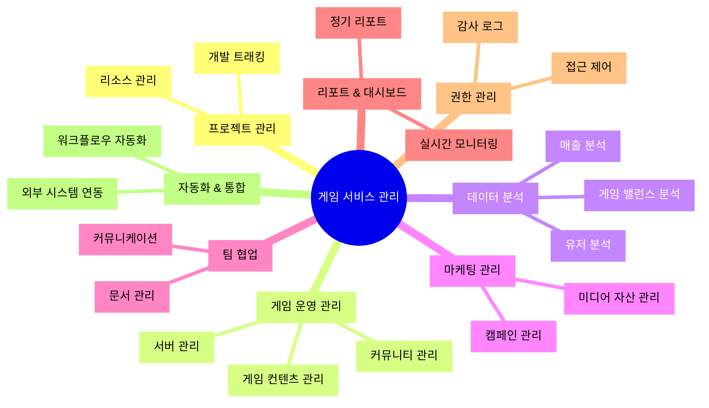

# 게임 서비스 관리 시스템 카테고리 구성

## 1. 프로젝트 관리
### 1.1 개발 트래킹
- 버전 관리 및 릴리즈 계획
- 버그 트래킹 및 수정 현황
- 기능 개발 진행 현황
- 마일스톤 관리
- QA 테스트 현황

### 1.2 리소스 관리
- 개발자 할당 현황
- 작업 우선순위 설정
- 일정 관리 (간트 차트)
- 리소스 사용량 모니터링

## 2. 게임 운영 관리
### 2.1 서버 관리
- 서버 상태 모니터링
- 점검 일정 관리
- 서버 성능 분석
- 장애 대응 현황

### 2.2 게임 컨텐츠 관리
- 이벤트 캘린더
- 패치 노트 관리
- 공지사항 관리
- 게임 데이터 수정 이력

### 2.3 커뮤니티 관리
- 유저 피드백 트래킹
- CS 티켓 관리
- 커뮤니티 이슈 관리
- SNS 컨텐츠 캘린더

## 3. 데이터 분석
### 3.1 유저 분석
- DAU/MAU 트래킹
- 유저 행동 패턴 분석
- 이탈률 분석
- 유저 세그먼트 분석

### 3.2 매출 분석
- 실시간 매출 현황
- 아이템별 판매 현황
- 결제 패턴 분석
- ROI 분석

### 3.3 게임 밸런스 분석
- 아이템 사용 통계
- 캐릭터/클래스 사용 통계
- 게임 난이도 분석
- 컨텐츠 참여율 분석

## 4. 마케팅 관리
### 4.1 캠페인 관리
- 마케팅 캠페인 캘린더
- 프로모션 트래킹
- 광고 성과 분석
- 마케팅 예산 관리

### 4.2 미디어 자산 관리
- 마케팅 소재 관리
- 홍보 영상/이미지 관리
- 브랜드 에셋 관리
- 콘텐츠 제작 현황

## 5. 팀 협업
### 5.1 문서 관리
- 기획/개발 문서
- 회의록
- 가이드라인
- 템플릿

### 5.2 커뮤니케이션
- 팀별 업무 공유
- 실시간 채팅
- 화상 회의
- 알림 센터

## 6. 리포트 & 대시보드
### 6.1 실시간 모니터링
- 서비스 핵심 지표
- 이상 징후 알림
- 실시간 유저 피드백
- 긴급 이슈 현황

### 6.2 정기 리포트
- 일간/주간/월간 리포트
- KPI 트래킹
- 프로젝트 진행 현황
- 운영 효율성 분석

## 7. 권한 관리
### 7.1 접근 제어
- 역할 기반 권한 관리
- 팀별 접근 권한
- 문서 보안 등급
- 작업 이력 관리

### 7.2 감사 로그
- 시스템 접근 로그
- 데이터 변경 이력
- 권한 변경 이력
- 보안 감사 리포트

## 8. 자동화 & 통합
### 8.1 워크플로우 자동화
- 작업 자동 할당
- 알림 자동화
- 리포트 자동 생성
- 데이터 동기화

### 8.2 외부 시스템 연동
- 빌드 시스템 연동
- 모니터링 툴 연동
- CS 시스템 연동
- 결제 시스템 연동 