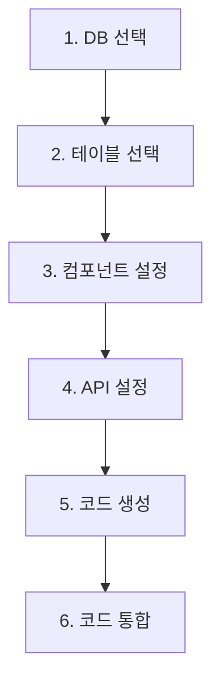

# 코드 제너레이터 PRD

## 1. 제품 개요

### 1.1 목적
코드 제너레이터는 기존 데이터베이스 테이블을 기반으로 CRUD 기능을 가진 웹 컴포넌트 및 API를 자동으로 생성하는 도구입니다. 데이터베이스 테이블 구조를 분석하여 표준화된 패턴의 코드를 자동 생성하므로, 반복적인 개발 작업을 줄이고 개발 속도를 높이는 데 기여합니다.

### 1.2 핵심 가치
- **생산성 향상**: 자동화된 코드 생성으로 CRUD 작업에 대한 개발 시간 단축
- **일관성 보장**: 모든 코드가 동일한 패턴과 아키텍처를 따라 생성됨
- **유지보수 용이성**: 표준화된 코드 구조로 유지보수 및 확장이 용이
- **기존 시스템 활용**: DBConnectionManager와 같은 기존 인프라 활용

## 2. 대상 사용자
- **프로젝트 매니저**: 프로젝트 관리자로서 빠른 기능 프로토타이핑 필요
- **풀스택 개발자**: 백엔드와 프론트엔드 코드를 동시에 개발하는 개발자
- **백엔드 개발자**: 데이터베이스와 API 엔드포인트를 효율적으로 구현하고자 하는 개발자

## 3. 사용자 플로우

1. **DB 선택**: 기존 DBConnectionManager를 통해 접근 가능한 DB 목록 표시
2. **테이블 선택**: 선택한 DB의 테이블에서 코드를 생성할 테이블 선택
3. **컴포넌트 설정**: DataTable 및 DataControlsPanel 설정 구성
4. **API 설정**: API 엔드포인트 및 CRUD 작업 설정
5. **코드 생성**: 설정에 따라 코드 생성 및 저장
6. **코드 통합**: 생성된 코드를 기존 프로젝트에 통합

## 4. 기능 요구사항

| 기능 | 설명 | 난이도 | 우선순위 |
|------|------|--------|----------|
| DB 연결 | 기존 DBConnectionManager 활용하여 DB 선택 | 중 | 상 |
| 테이블 분석 | 선택한 테이블의 스키마 구조 분석 | 중 | 상 |
| 코드 생성 | 데이터 테이블, 컨트롤 패널, API 코드 생성 | 상 | 상 |
| 컴포넌트 설정 | 생성할 컴포넌트 유형 및 옵션 설정 | 중 | 중 |
| 커스텀 포매터 | 특정 필드에 대한 사용자 정의 포맷터 | 중 | 중 |
| 컨트롤 패널 확장 | 테이블별 특화 버튼 정의 기능 | 중 | 중 |
| API 설정 | API 엔드포인트 생성 및 옵션 설정 | 중 | 상 |
| 테스트 코드 생성 | 컴포넌트 및 API에 대한 자동 테스트 생성 | 상 | 중 |
| 코드 저장 | 생성된 코드를 프로젝트 구조에 맞게 저장 | 중 | 상 |
| 자동 타입 생성 | 테이블 스키마 기반 TypeScript 타입 생성 | 중 | 상 |
| 코드 미리보기 | 생성 전 코드 미리보기 기능 | 중 | 중 |
| 백업 생성 | 기존 파일 덮어쓰기 전 백업 생성 | 하 | 중 |

## 5. 화면 구성

코드 제너레이터는 다음과 같은 위자드 형식의 인터페이스로 구성됩니다:

### 5.1 DB 연결 화면
- 기존 DBConnectionManager를 통해 접근 가능한 DB 목록 표시
- 필수적으로 dbName 파라미터를 포함하는 연결 설정
- 연결 테스트 버튼

### 5.2 테이블 선택 화면
- 선택한 DB의 테이블 목록 표시
- 테이블에 대한 기본 정보 (컬럼 수, 주요 컬럼 등) 표시
- 테이블 필터링 기능

### 5.3 컴포넌트 설정 화면
- DataTable 생성 여부 및 옵션 설정
- DataControlsPanel 생성 여부 및 옵션 설정
- 각 컬럼 포맷터 설정 (기본적인 데이터 타입 표시 방식 설정)
- 커스텀 버튼 정의 기능 (테이블 특화 기능을 위한 버튼 구성)

### 5.4 API 설정 화면
- 생성할 API 엔드포인트 선택 (CREATE, READ, UPDATE, DELETE)
- API 경로 설정
- 각 작업별 필드 선택 (어떤 필드를 사용할지 설정)
- dbName 파라미터 처리 설정

### 5.5 코드 생성 및 결과 화면
- 코드 생성 진행 상태
- 생성된 파일 목록 및 경로
- 오류 메시지 (있는 경우)
- 통합 가이드 표시

## 6. 제약 사항 및 고려 사항

### 6.1 제약 사항
- 모든 API 요청은 football_service DB 규칙에 따라 dbName 파라미터를 필수로 포함해야 함
- 생성된 코드는 기존 프로젝트 구조와 일관성을 유지해야 함
- 타사 라이브러리 사용 최소화

### 6.2 보안 고려 사항
- SQL 인젝션 방지를 위한 파라미터화된 쿼리 사용
- 인증/인가 코드 포함

### 6.3 호환성
- Next.js 14 및 App Router와 호환
- TypeScript 5.0 이상 지원
- ShadCN UI 컴포넌트 시스템 활용

## 7. 구현 로드맵

### 7.1 MVP (Minimum Viable Product)
- DB 연결 및 테이블 분석
- 기본 DataTable 컴포넌트 생성
- 기본 CRUD API 생성
- 단순 타입 정의 생성

### 7.2 추가 개선 사항 (2차 개발)
- 고급 컨트롤 패널 기능
- 커스텀 포매터 및 버튼
- 테스트 코드 자동 생성
- 코드 미리보기 기능

### 7.3 최종 릴리스 (3차 개발)
- 통합 테스트 강화
- 커스텀 템플릿 지원
- UI/UX 개선
- 문서 자동 생성

## 8. 성공 지표

- 개발 시간 50% 단축
- 코드 품질 및 일관성 향상
- 개발자 만족도 증가
- 유지보수 비용 감소