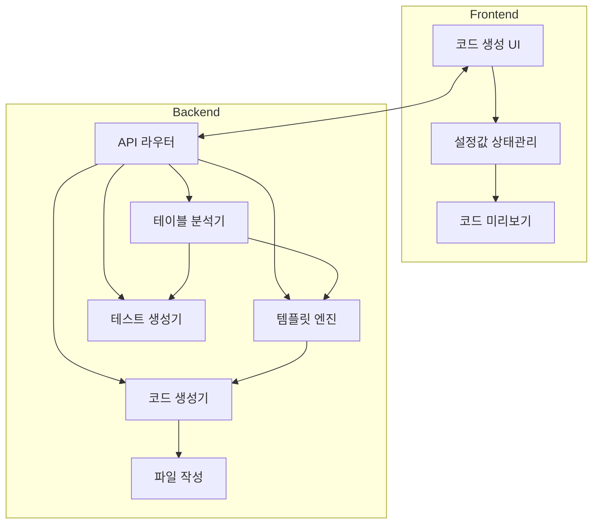
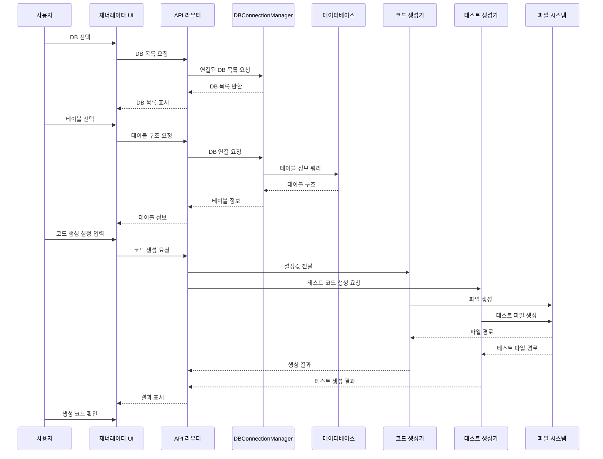

# 코드 제너레이터 기술 명세서

## 1. 시스템 아키텍처

### 1.1 전체 구조



### 1.2 핵심 컴포넌트

- **테이블 분석기**: 기존 DB 연결 시스템(DBConnectionManager)을 활용한 테이블 구조 분석
- **템플릿 엔진**: 코드 템플릿 처리 및 변수 치환
- **코드 생성기**: 템플릿 기반 소스코드 생성
- **테스트 생성기**: 자동 테스트 코드 생성
- **파일 작성기**: 생성된 코드를 파일 시스템에 저장

### 1.3 사용 기술

- **프레임워크**: Next.js 14 (App Router)
- **스타일링**: ShadCN + Tailwind CSS
- **DB 연결**: DBConnectionManager 싱글톤 활용, football_service DB 사용
- **상태 관리**: React Context API
- **템플릿 처리**: 커스텀 템플릿 엔진
- **테스트 도구**: Jest(단위 테스트), Playwright(E2E 테스트)

## 2. 코드 생성 흐름



## 3. 코드 생성 설정값 구조

### 3.1 설정값 스키마

```typescript
interface ICodeGeneratorConfig {
  table: string;             // 테이블 이름
  dbName: string;            // 데이터베이스 이름
  fields: {                  // CRUD 작업별 필드 정의
    create: string[];
    read: string[];
    update: string[];
    delete: string[];
  };
  components: {              // 생성할 컴포넌트 지정
    dataTable: boolean;
    controlPanel: boolean;
    advancedControlPanel: boolean;
  };
  apiOptions: {              // API 생성 옵션
    createRoute: boolean;
    readRoute: boolean;
    updateRoute: boolean;
    deleteRoute: boolean;
  };
  uiOptions: {               // UI 컴포넌트 옵션
    showDataControls: boolean;
    showAdvancedDataControls: boolean;
    customFormatters: Record<string, string>;
    customButtons?: ControlPanelButton[];
  };
  outputPath: {              // 파일 저장 경로
    api: string;
    components: {
      dataTable: string;
      controlPanel: string;
    };
    tests: {
      unit: string;
      e2e: string;
    };
  };
  generateTests: boolean;    // 테스트 코드 자동 생성 여부
}

// 컨트롤 패널 버튼 정의
interface ControlPanelButton {
  id: string;
  label: string;
  icon: string;
  bgColorClass?: string;
  variant?: string;
  onClick: string;
  disabled?: boolean;
}
```

### 3.2 설정값 예시

```json
{
  "table": "users",
  "dbName": "game_db",
  "fields": {
    "create": ["name", "email", "role"],
    "read": ["id", "name", "email", "role", "created_at"],
    "update": ["name", "email", "role"],
    "delete": ["id"]
  },
  "components": {
    "dataTable": true,
    "controlPanel": true,
    "advancedControlPanel": false
  },
  "apiOptions": {
    "createRoute": true,
    "readRoute": true,
    "updateRoute": true,
    "deleteRoute": true
  },
  "uiOptions": {
    "showDataControls": true,
    "showAdvancedDataControls": false,
    "customFormatters": {
      "created_at": "date"
    },
    "customButtons": [
      {
        "id": "export-users",
        "label": "EXPORT",
        "icon": "Download",
        "bgColorClass": "bg-emerald-500 hover:bg-emerald-600 text-white",
        "variant": "default",
        "onClick": "handleExport"
      }
    ]
  },
  "outputPath": {
    "api": "app/api/generated",
    "components": {
      "dataTable": "src/components/table/generated",
      "controlPanel": "src/components/control-panels/generated"
    },
    "tests": {
      "unit": "src/test/unit",
      "e2e": "src/test/e2e"
    }
  },
  "generateTests": true
}
```

## 4. API 명세

### 4.1 API 엔드포인트

#### `/api/generator/analyze-table`
- **Method**: GET
- **Parameters**: `dbName`, `tableName`
- **Response**: 테이블 구조 (컬럼, 타입, 제약조건 등)
- **구현 파일**: `app/api/generator/analyze-table/route.ts`
- **참고**: football_service DB 규칙에 따라 `dbName` 파라미터를 필수로 처리

#### `/api/generator/generate-code`
- **Method**: POST
- **Body**: 코드 생성 설정(ICodeGeneratorConfig)
- **Response**: 생성된 파일 경로 목록
- **구현 파일**: `app/api/generator/generate-code/route.ts`
- **참고**: 모든 생성 API는 football_service DB 규칙 준수

#### `/api/generator/test-api`
- **Method**: POST
- **Body**: `apiPath`, `method`, `data`, `dbName` (필수)
- **Response**: API 테스트 결과
- **구현 파일**: `app/api/generator/test-api/route.ts`
- **참고**: 요청 처리 시 DB 연결 유효성 검증을 우선 수행

### 4.2 API 응답 구조

```typescript
interface IGenerateCodeResponse {
  success: boolean;
  files: {
    api: string[];
    components: string[];
    tests: {
      unit: string[];
      e2e: string[];
    };
  };
  error?: string;
}
```

## 5. 코드 템플릿 시스템

### 5.1 템플릿 디렉토리 구조

```
src/lib/generator/templates/
├── api/
│   ├── create.template.ts
│   ├── read.template.ts
│   ├── update.template.ts
│   └── delete.template.ts
├── components/
│   ├── data-table.template.tsx
│   ├── control-panel.template.tsx
│   └── page.template.tsx
├── tests/
│   ├── unit/
│   │   ├── api.template.test.ts
│   │   └── component.template.test.tsx
│   └── e2e/
│       └── component.template.spec.ts
```

### 5.2 템플릿 변수

템플릿에서 사용되는 주요 변수들:

| 변수명 | 설명 | 예시 |
|--------|------|------|
| `{{tableName}}` | 테이블 이름 | "users" |
| `{{TableName}}` | 대문자 시작 테이블 이름 | "Users" |
| `{{fields}}` | 필드 목록 | ["id", "name", "email"] |
| `{{dbName}}` | 데이터베이스 이름 | "game_db" |
| `{{apiPath}}` | API 경로 | "/api/generated/users" |
| `{{customButtons}}` | 사용자 정의 버튼 목록 | [] |

### 5.3 템플릿 예시 (DataTable)

```tsx
'use client';

import React, { useState, useEffect } from "react";
import { DataTable } from "@/components/ui/data-table";
import { DataControlsPanel } from "@/components/control-panels/currency-control-panel";
import { fetchData, createItem, updateItem, deleteItem } from "@/lib/api/{{tableName}}";
import { I{{TableName}}Data } from '@/types/generated/{{tableName}}.types';
import { IUITableData } from '@/types/table.types';

export default function {{TableName}}Table() {
  const [data, setData] = useState<I{{TableName}}Data[]>([]);
  const [isLoading, setIsLoading] = useState(true);
  
  const loadData = async () => {
    setIsLoading(true);
    try {
      // dbName 파라미터를 필수로 포함
      const result = await fetchData('{{dbName}}');
      setData(result);
    } catch (error) {
      console.error('Error loading data:', error);
    } finally {
      setIsLoading(false);
    }
  };
  
  useEffect(() => {
    loadData();
  }, []);
  
  const handleCreate = async () => {
    // Create implementation
  };
  
  const handleUpdate = async () => {
    // Update implementation
  };
  
  const handleDelete = async () => {
    // Delete implementation
  };
  
  {{#if customButtons}}
  // 커스텀 버튼 핸들러들
  {{#each customButtons}}
  const {{onClick}} = async () => {
    // {{label}} 기능 구현
    console.log('{{label}} 버튼이 클릭되었습니다');
  };
  {{/each}}
  
  // 커스텀 버튼 정의
  const customButtons = [
    {{#each customButtons}}
    {
      id: '{{id}}',
      label: '{{label}}',
      icon: <{{icon}} className="h-3.5 w-3.5 mr-1.5" />,
      bgColorClass: '{{bgColorClass}}',
      variant: '{{variant}}',
      onClick: {{onClick}}
    },
    {{/each}}
  ];
  {{/if}}
  
  return (
    <div className="space-y-4">
      <DataControlsPanel
        onCreateClick={handleCreate}
        onUpdateClick={handleUpdate}
        onDeleteClick={handleDelete}
        onRefreshClick={loadData}
        showDataControls={{{uiOptions.showDataControls}}}
        {{#if customButtons}}
        customButtons={customButtons}
        {{/if}}
      />
      
      <DataTable
        tableName="{{TableName}}"
        data={data}
        isLoading={isLoading}
        dbName="{{dbName}}"
        {{#if customFormatters}}
        customFormatters={{
          {{#each customFormatters}}
          {{@key}}: (value) => formatters.{{this}}(value),
          {{/each}}
        }}
        {{/if}}
      />
    </div>
  );
}
```

### 5.4 API 템플릿 예시 (dbName 처리 강화)

```typescript
// app/api/generated/{{tableName}}/route.ts
import { NextRequest, NextResponse } from 'next/server';
import { DBConnectionManager } from '@/lib/db/db-connection-manager';

// 모든 API 요청에 dbName 파라미터 처리 강화
export async function GET(request: NextRequest) {
  // dbName 파라미터 확인 (필수)
  const { searchParams } = new URL(request.url);
  const dbName = searchParams.get('dbName');
  
  if (!dbName) {
    return NextResponse.json({ 
      error: 'dbName is required' 
    }, { status: 400 });
  }
  
  try {
    // DBConnectionManager 싱글톤 인스턴스 활용
    const pool = await DBConnectionManager.getInstance().getConnection(dbName);
    
    // 쿼리 실행
    const result = await pool.query(
      `SELECT {{#each fields.read}}{{#unless @first}}, {{/unless}}{{this}}{{/each}} FROM {{tableName}}`
    );
    
    return NextResponse.json(result.rows);
  } catch (error) {
    console.error('Error fetching {{tableName}}:', error);
    return NextResponse.json({ 
      error: `Failed to fetch {{tableName}} data: ${error.message}` 
    }, { status: 500 });
  }
}
```

## 6. 핵심 유틸리티 함수

### 6.1 테이블 분석 함수 (DB 연결 통합)

```typescript
// src/lib/generator/db-analyzer.ts
export async function analyzeTableStructure(
  dbName: string, 
  tableName: string
): Promise<TableStructure> {
  // 기존 DBConnectionManager 싱글톤 인스턴스 활용
  // DBConnectionManager는 이미 초기화되어 있는 싱글톤 인스턴스
  const pool = await DBConnectionManager.getInstance().getConnection(dbName);
  
  // 테이블 컬럼 정보 가져오기
  const columnsQuery = `
    SELECT column_name, data_type, is_nullable
    FROM information_schema.columns
    WHERE table_name = $1
    ORDER BY ordinal_position;
  `;
  
  const result = await pool.query(columnsQuery, [tableName]);
  
  return {
    tableName,
    columns: result.rows.map(row => ({
      name: row.column_name,
      type: mapDBTypeToTSType(row.data_type),
      nullable: row.is_nullable === 'YES'
    }))
  };
}
```

### 6.2 테이블별 타입 정의 생성 함수

```typescript
// src/lib/generator/type-generator.ts
export function generateTableTypes(
  tableName: string,
  columns: ColumnInfo[]
): string {
  const typeName = capitalizeFirst(tableName);
  
  // 테이블별 확장 타입 생성
  const typeContent = `
import { IUITableData } from '@/types/table.types';

/**
 * ${typeName} 테이블 데이터 인터페이스
 * IUITableData를 확장하여 타입 안전성 제공
 */
export interface I${typeName}Data extends IUITableData {
${columns.map(col => `  ${col.name}${col.nullable ? '?' : ''}: ${col.type};`).join('\n')}
}
`;

  return typeContent;
}
```

### 6.3 파일 생성 함수 (디렉토리 구조 개선)

```typescript
// src/lib/generator/file-writer.ts
export async function writeGeneratedFile(
  filePath: string, 
  content: string,
  fileCategory: 'api' | 'component' | 'test'
): Promise<boolean> {
  try {
    // 파일 카테고리에 따라 기본 경로 조정
    let basePath = '';
    
    // 디렉토리 생성
    const dirPath = path.dirname(filePath);
    await fs.mkdir(dirPath, { recursive: true });
    
    // 파일이 이미 존재하는지 확인
    const fileExists = await fs.access(filePath)
      .then(() => true)
      .catch(() => false);
    
    if (fileExists) {
      // 백업 생성
      const backupDir = path.join(
        '.generated-backups', 
        new Date().toISOString().replace(/[:\.]/g, '-')
      );
      await fs.mkdir(backupDir, { recursive: true });
      
      const backupPath = path.join(backupDir, path.basename(filePath));
      await fs.copyFile(filePath, backupPath);
    }
    
    // 파일 작성
    await fs.writeFile(filePath, content);
    return true;
  } catch (error) {
    console.error('Error writing file:', error);
    return false;
  }
}
```

## 7. 컴포넌트 연동 전략

### 7.1 컴포넌트 파일 구조 (기존 디렉토리 활용)

DataTable 컴포넌트는 기존 디렉토리 구조를 활용하여 다음과 같이 생성됩니다:

```
src/components/table/generated/[table-name]/
└── index.tsx                # DataTable 컴포넌트

src/components/control-panels/generated/[table-name]/
└── index.tsx                # ControlPanel 컴포넌트 

src/lib/api/generated/
└── [table-name].ts          # API 클라이언트 함수
```

DataTable 컴포넌트는 기본적으로:
- 데이터 요청 및 표시
- 정렬 및 필터링
- 페이지네이션
- 행 선택 기능

### 7.2 DataControlsPanel 연동 (확장성 강화)

생성된 DataControlsPanel은:
- 기본 CRUD 버튼 (CREATE, UPDATE, DELETE)
- 테이블 데이터 새로고침 버튼
- 필요시 고급 컨트롤 기능 (USE ITEM, GET ITEM, SEND ITEM)
- 테이블 특화 기능을 위한 커스텀 버튼 지원

```typescript
// 커스텀 버튼 생성 예제 
const customButtons: ControlPanelButton[] = [
  {
    id: 'export-users',
    label: 'EXPORT',
    icon: <Download className="h-3.5 w-3.5 mr-1.5" />,
    bgColorClass: 'bg-emerald-500 hover:bg-emerald-600 text-white',
    variant: 'default',
    onClick: handleExport
  }
];
```

### 7.3 API 연동 (dbName 파라미터 규칙 준수)

생성된 컴포넌트가 자동으로 API와 연동됩니다:
```typescript
// 예: lib/api/generated/users.ts
import { IUITableData } from '@/types/table.types';
import { IUsersData } from '@/types/generated/users.types';

export async function fetchData(dbName: string) {
  // dbName 파라미터 필수 전달
  if (!dbName) {
    throw new Error('dbName is required');
  }
  
  const response = await fetch(`/api/generated/users?dbName=${dbName}`);
  if (!response.ok) {
    throw new Error('Failed to fetch data');
  }
  return await response.json() as IUsersData[];
}

export async function createItem(dbName: string, data: Partial<IUsersData>) {
  // dbName 파라미터 필수 전달
  if (!dbName) {
    throw new Error('dbName is required');
  }
  
  const response = await fetch(`/api/generated/users?dbName=${dbName}`, {
    method: 'POST',
    headers: {
      'Content-Type': 'application/json',
    },
    body: JSON.stringify(data),
  });
  
  if (!response.ok) {
    throw new Error('Failed to create item');
  }
  
  return await response.json();
}

// ... updateItem, deleteItem 구현
```

### 7.4 타입 시스템 통합

생성된 컴포넌트는 기존 타입 시스템을 확장하여 타입 안전성을 제공합니다:

```typescript
// types/generated/users.types.ts
export interface IUsersData extends IUITableData {
  id: number;
  name: string;
  email: string;
  role: string;
  created_at: Date;
}
```

## 8. 자동 테스트 생성

코드 제너레이터는 생성된 각 컴포넌트 및 API에 대한 테스트 코드도 자동으로 생성합니다:

### 8.1 API 테스트 (Jest)

```typescript
// src/test/unit/api/generated/users.test.ts
import { fetchData, createItem, updateItem, deleteItem } from '@/lib/api/generated/users';

describe('Users API', () => {
  const dbName = 'test_db';
  
  // 모든 테스트는 dbName 파라미터 필수 확인
  test('fetchData requires dbName parameter', async () => {
    await expect(fetchData(null)).rejects.toThrow('dbName is required');
  });
  
  test('fetchData returns user data', async () => {
    // Mock fetch
    global.fetch = jest.fn().mockResolvedValue({
      ok: true,
      json: async () => [{ id: 1, name: 'Test User' }]
    });
    
    const result = await fetchData(dbName);
    expect(result).toHaveLength(1);
    expect(result[0].name).toBe('Test User');
  });
  
  // 추가 CRUD 테스트
});
```

### 8.2 컴포넌트 테스트 (Playwright)

```typescript
// src/test/e2e/generated/users.spec.ts
import { test, expect } from '@playwright/test';

test.describe('Users Component', () => {
  test('displays user data correctly', async ({ page }) => {
    await page.goto('/dashboard/users');
    await expect(page.getByText('Users')).toBeVisible();
    
    // 테이블 로딩 확인
    await expect(page.getByRole('table')).toBeVisible();
    
    // 데이터 행 존재 확인
    await expect(page.getByRole('row')).toHaveCount.greaterThan(1);
  });
  
  test('control panel buttons work', async ({ page }) => {
    await page.goto('/dashboard/users');
    
    // 버튼 존재 확인
    await expect(page.getByText('CREATE')).toBeVisible();
    await expect(page.getByText('UPDATE')).toBeVisible();
    await expect(page.getByText('DELETE')).toBeVisible();
    
    // 버튼 기능 테스트
    await page.getByText('CREATE').click();
    await expect(page.getByText('새 항목 생성')).toBeVisible();
  });
});
```

## 9. 배포 및 통합 가이드

### 9.1 파일 위치 (기존 디렉토리 구조 활용)

생성된 파일들은 다음 경로에 저장됩니다:

- **API 파일**: `app/api/generated/[table-name]/route.ts`
- **API 클라이언트**: `src/lib/api/generated/[table-name].ts`
- **DataTable 컴포넌트**: `src/components/table/generated/[table-name]/index.tsx`
- **ControlPanel 컴포넌트**: `src/components/control-panels/generated/[table-name]/index.tsx`
- **테이블 타입 정의**: `src/types/generated/[table-name].types.ts`
- **테스트 파일**:
  - `src/test/unit/api/generated/[table-name].test.ts`
  - `src/test/e2e/generated/[table-name].spec.ts`

### 9.2 페이지 통합

생성된 컴포넌트는 다음 방식으로 페이지에 통합할 수 있습니다:

```tsx
// app/dashboard/[table-name]/page.tsx
import dynamic from 'next/dynamic';

// 동적 임포트로 생성된 컴포넌트 로드 (기존 디렉토리 구조 활용)
const DynamicTable = dynamic(
  () => import('@/components/table/generated/[table-name]'),
  { ssr: false }
);

const ControlPanel = dynamic(
  () => import('@/components/control-panels/generated/[table-name]'),
  { ssr: false }
);

export default function TablePage() {
  return (
    <div className="container mx-auto py-6">
      <h1 className="text-2xl font-bold mb-6">Table Dashboard</h1>
      <div className="space-y-4">
        <ControlPanel />
        <DynamicTable />
      </div>
    </div>
  );
}
```

### 9.3 API 문서 생성

Swagger 문서는 `/api/docs/generated` 경로에서 확인할 수 있습니다:

- 모든 API는 `dbName` 파라미터 필수 규칙을 문서에 명시합니다.
- API 응답 형식에 생성된 타입 정보가 포함됩니다.

## 10. 확장 및 커스터마이징

### 10.1 템플릿 커스터마이징

사용자 정의 템플릿은 `templates/custom/` 디렉토리에 추가할 수 있습니다.

### 10.2 formatter 확장

커스텀 포매터는 `src/lib/formatters` 디렉토리에 추가 가능합니다:

```typescript
// src/lib/formatters/index.ts
export function dateFormatter(value: string | number | null) {
  if (!value) return '-';
  return new Date(value).toLocaleDateString();
}

export function currencyFormatter(value: string | number | null) {
  if (value === null || value === undefined) return '-';
  return `$${Number(value).toFixed(2)}`;
}

// ... 추가 포매터
```

### 10.3 기존 컴포넌트 확장

기존 컴포넌트 확장 방식:

```typescript
// src/components/control-panels/generated/users/special-actions.tsx
import { ControlPanelButton } from '@/components/control-panels/currency-control-panel';
import { Download, Upload, UserPlus } from 'lucide-react';

// 특정 테이블에 맞는 특화 버튼 정의
export const getUserSpecialButtons = (handlers: Record<string, () => void>): ControlPanelButton[] => [
  {
    id: 'export-users',
    label: 'EXPORT',
    icon: <Download className="h-3.5 w-3.5 mr-1.5" />,
    bgColorClass: 'bg-emerald-500 hover:bg-emerald-600 text-white',
    variant: 'default',
    onClick: handlers.handleExport
  },
  {
    id: 'import-users',
    label: 'IMPORT',
    icon: <Upload className="h-3.5 w-3.5 mr-1.5" />,
    bgColorClass: 'bg-indigo-500 hover:bg-indigo-600 text-white',
    variant: 'default',
    onClick: handlers.handleImport
  },
  {
    id: 'add-admin',
    label: 'ADD ADMIN',
    icon: <UserPlus className="h-3.5 w-3.5 mr-1.5" />,
    bgColorClass: 'bg-purple-500 hover:bg-purple-600 text-white',
    variant: 'default',
    onClick: handlers.handleAddAdmin
  }
];
```