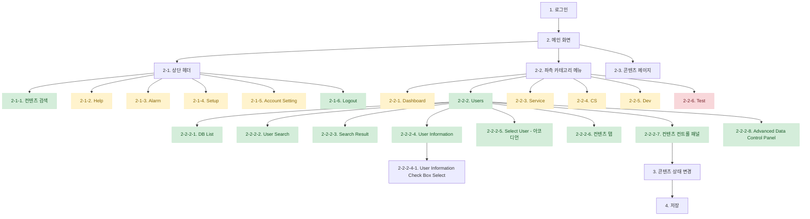

# **Game Service Manager Tool – UI/UX Design Guide** (2024년 3월 업데이트)

---

## **1. 디자인 컨셉 및 원칙**

### **1.1 디자인 철학**

**"빠르고 직관적인 게임 서비스 운영 도구"**

1. **효율성(Efficiency)**: 최소한의 클릭으로 원하는 정보를 찾을 수 있도록 설계
2. **가독성(Readability)**: 대시보드, 표, 필터 기능을 활용하여 데이터 가독성 극대화
3. **일관성(Consistency)**: 공통 UI 컴포넌트, 색상, 아이콘 스타일 통일
4. **안전성(Security & Control)**: 권한 관리, 변경 이력 기록 및 경고 시스템 구축

### **1.2 사용자 경험 목표**

✅ **운영팀이 유저 데이터를 빠르게 검색 및 조작할 수 있도록 최적화** - **구현 완료**  
✅ **대시보드를 통해 실시간으로 주요 데이터를 모니터링 가능** - **구현 중**  
✅ **CS팀과 운영팀이 필요한 정보를 쉽게 찾도록 검색 및 필터 기능 강화** - **구현 완료**  
✅ **접근성 및 가이드라인 준수(A11y), 다크 모드 지원 예정** - **일부 구현**

---

## **2. 사용자 흐름 및 와이어프레임**

### **2.1 전체 사용자 흐름**

**실행 흐름 범례**:
- 구현 완료
- 구현 중
- 구현 예정

---

### **2.2 주요 화면 와이어프레임 리스트**

#### **1️⃣ 로그인 페이지 (구현 완료)**

- **입력 필드**:
    - [✓] 아이디
    - [✓] 비밀번호
- **버튼**:
    - [✓] 로그인

---

#### **2️⃣ 메인 화면 (Main Screen) (구현 완료)**

##### **2-1. 상단 헤더 (구현 완료)**

- [✓] **검색 필드**
- [✓] **Help 아이콘**
- [✓] **알림(Notification) 아이콘**
- [✓] **Setup (설정) 버튼**
- [✓] **Account Setting (계정 설정) 버튼**
- [✓] **Logout (로그아웃) 버튼**

##### **2-2. 좌측 카테고리 메뉴 (구현 완료)**

- [✓] Dashboard
- [✓] Users
- [✓] Service
- [✓] CS
- [✓] Dev
- [✓] Test (서브메뉴 포함)

---

#### **3️⃣ Users 페이지 (User Management Page) (구현 완료)**

##### **2-2-2-1. DB List (구현 완료)**

- [✓] DB 선택 드롭다운 (Combo Box)
- [✓] 현재 선택된 DB 표시

##### **2-2-2-2. User Search (구현 완료)**

- [✓] 검색 키워드 입력 필드
- [✓] 검색 버튼

##### **2-2-2-3. Search Result (구현 완료)**

- [✓] 검색된 유저 리스트 (Table 형식)
    - **컬럼 구성**:
        - [✓] 체크박스 (유저 선택)
        - [✓] 유저 ID (UID)
        - [✓] 로그인 ID (login_id)
        - [✓] 표시 ID (display_id)
        - [✓] 닉네임 (nickname)
        - [✓] 역할 (role)
        - [✓] 국가 인덱스 (nation_index)
        - [✓] 생성일 (created_at)
        - [✓] 업데이트일 (updated_at)
- [✓] 컬럼 필터 기능
- [✓] Rows per Page 설정
- [✓] 페이지네이션

##### **2-2-2-4. User Information (구현 완료)**

- [✓] 유저 기본 정보 테이블
- [✓] 체크박스를 통해 유저 선택

##### **2-2-2-5. Select User - 아코디언 (구현 완료)**

- [✓] 선택된 유저 정보 (아코디언 형식)
- [✓] **컨트롤 버튼**:
    - [✓] Filter
    - [✓] Popup
    - [✓] Remove

##### **2-2-2-6. 컨텐츠 탭 (구현 완료)**

|컨텐츠|기능|상태|
|---|---|---|
|MultiPlay|유저 멀티플레이 기록|구현 완료 (데이터 연동 중)|
|Story|유저 스토리 진행 데이터|구현 완료 (데이터 연동 중)|
|Currency|게임 내 재화 정보|구현 완료|
|Service|유저 서비스 설정|구현 완료 (데이터 연동 중)|
|Baller|유저 선수 관리|구현 완료 (데이터 연동 중)|
|Pub|커뮤니티 공간|구현 완료 (데이터 연동 중)|
|Record|유저 경기 기록|구현 완료 (데이터 연동 중)|
|Shop|유저 상점 구매 내역|구현 완료 (데이터 연동 중)|
|Club|유저 클럽 정보|구현 완료 (데이터 연동 중)|
|SeasonPass|시즌 패스 진행 상태|구현 완료 (데이터 연동 중)|

##### **2-2-2-7. 컨텐츠 컨트롤 패널 (구현 완료)**

- [✓] **Read (새로고침) 버튼**
- [✓] **Create (생성) 버튼**
- [✓] **Update (수정) 버튼**
- [✓] **Delete (삭제) 버튼**

##### **2-2-2-8. Advanced Data Control Panel (구현 완료)**

- [✓] 재화 지급/차감 기능
- [✓] 특정 이벤트 보상 설정

---

## **3. UI 컴포넌트 가이드**

### **3.1 버튼 스타일 (구현 완료)**

|유형|색상|설명|사용법|구현 상태|
|---|---|---|---|---|
|Primary|#7e22ce (purple-700)|주요 액션 버튼|기본 작업|구현 완료|
|Secondary|#f3f4f6 (gray-100)|보조 기능 버튼|취소, 두번째 액션|구현 완료|
|Destructive|#ef4444 (red-500)|위험 작업 버튼|삭제, 비활성화 등|구현 완료|
|Outline|#ffffff (white)|외곽선만 있는 버튼|경계가 약한 액션|구현 완료|
|Ghost|transparent|배경 없는 버튼|문맥상 명확한 작업|구현 완료|
|Link|transparent|링크 스타일 버튼|페이지 이동|구현 완료|

### **3.2 색상 시스템 (구현 완료)**

|색상 그룹|주요 사용 영역|사용 예시|
|---|---|---|
|Purple|주요 브랜드 색상, 헤더, 선택 표시|헤더, 탭, 선택 표시, 액션 버튼|
|Gray|배경, 구분선, 비활성화 상태|배경색, 카드 헤더, 경계선|
|Blue|정보, 링크|정보 버튼, 링크 텍스트|
|Green|성공, 생성|생성 버튼, 성공 메시지|
|Red|오류, 삭제|삭제 버튼, 오류 메시지|
|Amber|경고|경고 메시지, 주의 표시|

---

## **4. 접근성 및 애니메이션 지침**

✅ **접근성(A11y) 강화 (부분 구현됨)**

- [✓] 대비 색상 (AA 등급 이상)
- [✓] 키보드 내비게이션 지원
- [~] 스크린 리더 ARIA 속성 추가 (진행 중)

✅ **애니메이션 효과 (구현 완료)**

- [✓] 버튼 클릭 시 미세한 움푹 효과
- [✓] 페이지 전환 시 페이드 인/아웃 적용
- [✓] 아코디언 확장/축소 애니메이션
- [✓] 로딩 인디케이터 회전 애니메이션

✅ **피드백 및 알림 (구현 완료)**

- [✓] 성공 시 녹색 알림
- [✓] 오류 시 붉은색 경고 표시
- [✓] 로딩 중 표시 및 진행 상태

---

## **5. 기술 스택 및 구현 현황**

### **5.1 프론트엔드 기술 스택**

- **Next.js 15.1.6** (App Router) (구현 완료)
- **TypeScript 5.7.3** (구현 완료)
- **Tailwind CSS 3.4.1** (구현 완료)
- **ShadCN UI** 컴포넌트 (구현 완료)
- **Lucide React 0.473.0** 아이콘 (구현 완료)
- **React 19.0.0** (구현 완료)
- **React Query (Tanstack)** (구현 완료)
- **Zustand 5.0.3** (상태관리) (구현 완료)
- **MySQL2 & PostgreSQL** 데이터베이스 연결 (구현 완료)

### **5.2 구현된 주요 기능**

- [✓] 인증 시스템 (로그인/로그아웃)
- [✓] 메인 레이아웃 (헤더, 사이드바)
- [✓] 유저 검색 기능
- [✓] 유저 정보 조회
- [✓] 유저 데이터 아코디언 뷰
- [✓] 다이나믹 탭 시스템
- [✓] 통화 컨트롤 패널
- [✓] API 디버그 인포메이션
- [✓] 데이터 테이블 컴포넌트
- [✓] 유저 재화 관리 (CRUD)

### **5.3 개발 중인 기능**

- [ ] 대시보드 상세 구현
- [ ] Service 페이지 구현
- [ ] CS 페이지 구현
- [ ] Dev 페이지 구현
- [ ] 사용자 데이터 저장 및 업데이트
- [ ] 다크 모드 지원
- [ ] 유저 관련 데이터 연동 완료
- [ ] 정보 시각화 대시보드 구현

---

## **6. 결론 및 개선 사항**

### **6.1 현재 성취 사항**

- **사용성 및 UI 구현**: 직관적이고 깔끔한 인터페이스 구현 완료
- **확장성 있는 구조**: 새로운 기능 추가가 용이한 컴포넌트 기반 아키텍처 완성
- **데이터 시각화**: 사용자 정보를 효율적으로 표시하는 테이블 및 탭 구현 완료
- **모듈화**: 재사용 가능한 UI 컴포넌트 라이브러리 구축
- **API 연결**: RESTful API를 통한 데이터 연동 구현

### **6.2 향후 개선 사항**

- **데이터 연동 확장**: 더 많은 게임 데이터와의 연동
- **실시간 모니터링**: 대시보드에 실시간 데이터 표시
- **성능 최적화**: 대용량 데이터 처리 개선
- **다국어 지원**: 국제화 기능 구현
- **고급 필터링 기능**: 복잡한 검색 조건 지원

### **6.3 다음 개발 로드맵 (2024년 2분기)**

1. **대시보드 기능 확장** - 실시간 데이터 모니터링 및 시각화
2. **서비스 관리 페이지 구현** - 게임 서비스 컨트롤 패널
3. **CS 관리 시스템 구현** - 티켓 관리 및 응대 기능
4. **데이터 시각화 개선** - 차트, 그래프 추가
5. **데이터 테이블 편집 기능 강화** - 인라인 편집 및 대량 업데이트

이 디자인 가이드는 현재 구현된 기능 및 향후 방향성을 반영하여 지속적으로 업데이트됩니다. 🚀